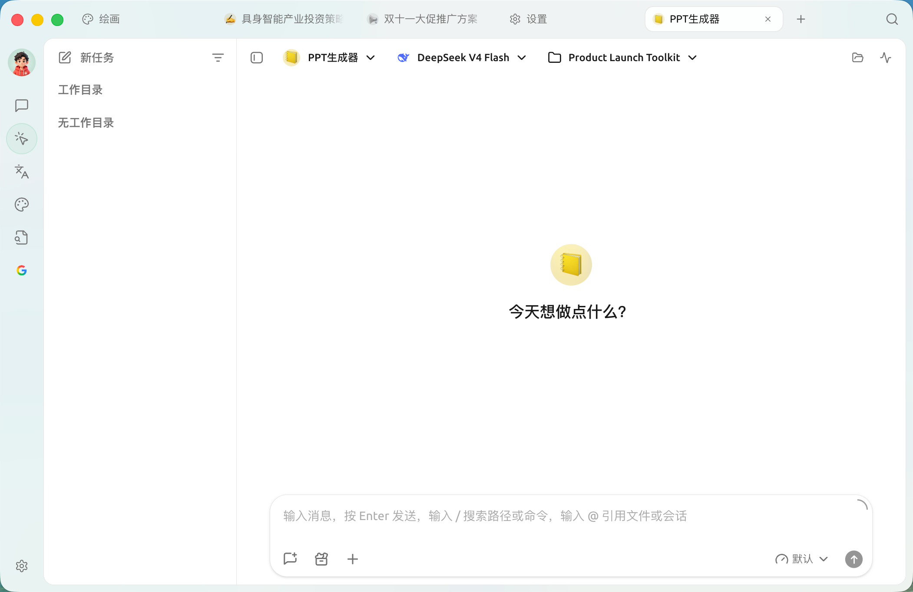

# 工作 / 智能体

**工作**（也叫 **智能体 / Agent**）是 Cherry Studio 里一套能 **自主调用工具、读写文件、跨多步完成任务** 的系统——和"对话助手"（一个角色预设）不是一回事。入口在 **左侧导航栏的【工作】**（不是旧版教程里的顶部标签）。


最省事的用法：先告诉 Agent 你想完成什么，让它自己检查还缺哪些模型 / 工具 / 知识库 / 频道；需要精确控制时再手动调。


<figure><figcaption>
【工作】界面：顶部依次选择智能体、模型与工作目录，在下方输入任务；左侧管理任务与工作目录
</figcaption></figure>

## 它能做什么

* **读写文件**：给它一个 **工作目录**，它就能在里面读、改、生成文件。
* **调用工具**：内置工具，加上你挂载的 [技能](extensions/skills.md) 与 [MCP](extensions/mcp/) 外部工具。
* **多步推理 / 子任务**：拆解目标、派子智能体、跑后台命令。
* **接入自动化**：配合 [频道](automation/channels.md) 派驻到 IM 平台、用 [定时任务](automation/scheduled-heartbeat.md) 定时执行。

## 快速上手

1. 打开【工作】，选一个 Agent；没有就点【添加智能体】，按四步（基础信息 / 人格 / 技能 / 知识库）创建。内置的 **Cherry Assistant** 可直接用。
2. 需要处理本地文件时，选一个 **工作目录**；不涉及文件用默认工作区即可。
3. 用"要交付什么、可用哪些资料、怎样算完成"来描述任务。
4. 在右侧面板看 **状态 / 文件 / 子任务 / 消息流**；开了开发者模式还能看 **调用链**。

## 权限模式

Agent 执行文件 / 命令操作时，可选 **逐次确认 / 自动接受编辑 / 智能批准 / 仅规划 / 完全访问** 五种权限模式，从最谨慎到最放手。无人值守跑任务（如频道、定时任务）时才用更放手的模式。

***

## 想更深入？

完整用法见进阶教程：

* [Agent 工作区](agent-workspace/README.md) —— 从创建到交付的完整工作方式
* [创建 Agent 与模型分工](agent-workspace/create-agent.md)
* [工作目录、任务与文件](agent-workspace/workspaces-tasks-files.md)
* [内置工具、知识库、技能与 MCP](agent-workspace/tools-knowledge-skills-mcp.md)
* [权限、记忆与后台任务](agent-workspace/permissions-memory-background.md)

***

### 获取帮助与提交反馈

如果您在配置或使用过程中遇到任何疑问、Bug 或有功能改进建议，请参考 [反馈与建议](../question-contact/suggestions.md) 中提供的官方渠道。
