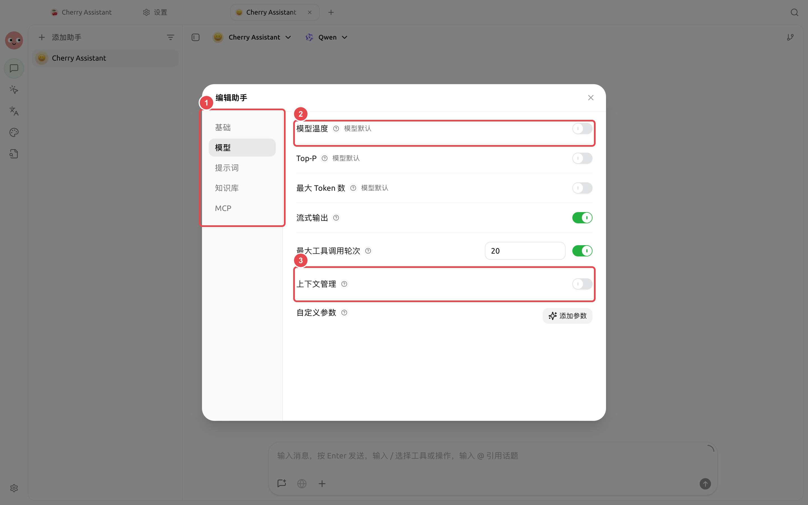
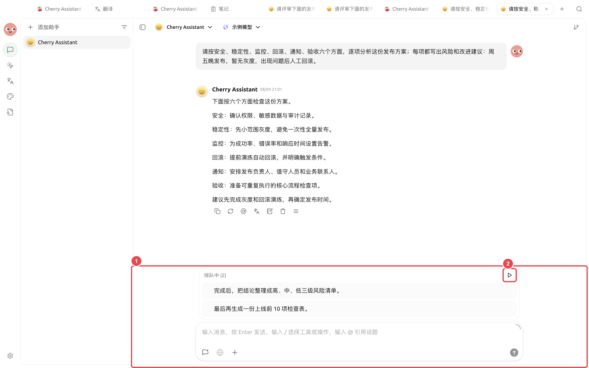

# 长对话、上下文与排队消息

对话越长，模型需要阅读的历史越多。上下文用量接近上限时，较早内容可能无法继续参与回答。与其不断追加一句“继续”，不如定期整理结论和未决问题。

<figure><figcaption>
需要改变回答风格或长对话处理方式时再调整高级设置；不确定时先保留当前值。
</figcaption></figure>

### 管理长对话



#### 1. 观察上下文提示

当界面提示上下文压力变大时，先停止添加大附件，检查哪些历史仍然与当前目标有关。



#### 2. 让模型生成交接摘要

要求它分开列出“已确认事实、当前结论、待解决问题、不能丢失的限制”。这比普通的“总结一下”更适合继续工作。



#### 3. 新开话题继续

把交接摘要和必要文件放进新话题，第一条消息说明接下来只处理哪个目标。原话题保留作参考。



### 调整全局上下文管理

路径：【设置】→【通用】→【上下文管理】。这些设置适用于普通助手对话；单个助手还可以在自身设置中覆盖。

| 配置项 | 产品默认值 | 建议起点 | 作用 | 适用场景 | 注意事项 |
| -------- | -------- | ------- | ------------- | ------------- | --------------- |
| 保留最近消息数 | 不限制 | 先不限制 | 只把最近若干条消息送给模型 | 固定窗口的短任务 | 过小会让模型忘记仍有效的要求 |
| 启用上下文管理 | 开启 | 保持开启 | 管理超长工具结果和历史压缩 | 长对话、工具调用多的任务 | 关闭后大结果更容易挤满上下文 |
| 工具输出截断阈值 | 50000 字符 | 保持默认 | 大结果转存后让模型分段读取 | 网页、日志、长文档工具结果 | 不等于删除原始结果 |
| 自动压缩 | 开启 | 保持开启 | 接近窗口上限时总结较早历史 | 持续多轮工作 | 压缩是摘要，不保证保留每个细节 |
| 压缩模型 | 跟随当前模型 | 先跟随当前模型 | 选择生成历史摘要的模型 | 需要单独控制速度或成本 | 更换模型会增加排错变量 |

【设置】→【默认模型】还提供【模型调用重试】。默认关闭；开启后默认最多尝试 3 次并使用指数退避，还可以按顺序选择回退模型。重试和回退只在模型开始输出前生效，不会把已经生成一半的回答改用另一个模型继续。

### 使用消息队列

模型仍在回复时，可以把下一条要求加入队列。适合追加一个明确的后续动作，例如“完成后再整理成三条结论”。Agent 运行中若要立即纠正当前方向，使用【引导快捷键】；如果需要彻底重来，再停止当前生成并重新说明目标。

<figure><figcaption>
暂停时可以先核对结果；恢复后，排队消息会按照从上到下的顺序继续发送。
</figcaption></figure>

图中：① 当前话题中两条排队消息；② 恢复自动发送。恢复后，消息会按照从上到下的顺序继续发送。


队列不是自动化计划。它只负责当前话题里的后续消息；需要在固定时间运行，请使用【定时任务】。


#### 应用案例：审阅一份长报告

先上传报告并要求按章节列出问题。模型处理时，把“完成后整理风险清单”和“最后生成检查表”依次加入队列。需要先核对第一轮结果时，可以暂停自动发送；确认无误后再恢复。这样不用守在对话前逐条发送，也能避免下一步要求抢在核对之前执行。

为什么模型突然忘了前面说过的要求？

先检查对话是否过长、是否切换了模型，以及关键要求是否只出现过一次。把稳定规则写进当前任务的明确说明；需要长期复用时，交给 Agent 提示词或技能。

为什么模型突然忘了前面说过的要求？

先检查对话是否过长、是否切换了模型，以及关键要求是否只出现过一次。把稳定规则写进当前任务的明确说明；需要长期复用时，交给 Agent 提示词或技能。

