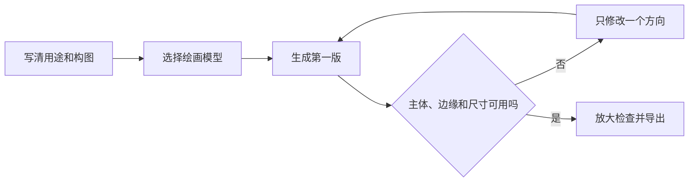

# 图片生成、编辑与增强

【绘画】不仅可以从文字生成图片，也可以使用参考图、编辑指定区域、合并多张图片、复用模板和增强分辨率。先确定图片用途，再选生成或编辑方式。

## 选择合适的起点

| 需求 | 建议方式 |
| ------------ | ------------ |
| 从零制作视觉方向 | 文生图或模板 |
| 保留主体、改变背景或风格 | 上传参考图后编辑 |
| 只改图片中的一部分 | 使用蒙版标出修改区域 |
| 把多个素材合成一张图 | 多图合并，并说明主次关系 |
| 已有图片需要更清晰 | 使用增强/放大功能 |

### 示例：从一句描述到成品

打开【绘画】，选择支持当前任务的图片模型，输入主体、环境、风格、光线、构图和限制条件，然后发送。示例提示词是：

> 晨光下的创意工作台，樱桃红台灯、速写本、相机与一枝樱花，窗外是宁静群山；柔和 3D 插画风，暖色晨光，宽幅构图，无文字。


示例使用【GPT-Image-2 | express】生成宽幅工作台插画。模型、尺寸和可用操作以你当前页面显示为准；看不到的参数不要照搬。


生成后不要立刻离开：先放大检查主体、边缘和多余元素，再从左侧历史切换版本。需要调整时，保留有效描述，只修改一个方向。

<figure><figcaption>
① 左侧保留本次生成的历史缩略图；② 中间显示完整成品；③ 放大检查后再下载、复制或继续编辑。
</figcaption></figure>

## 完成一张可用图片



### 1. 选模型和模式

不同图片模型支持的尺寸、参考图和编辑能力不同。页面没有显示的参数不要凭经验强行填写。



### 2. 写清用途和构图

说明主体、环境、视角、色调、比例、留白和不要出现的内容。要放标题时，通常让模型留白，文字再由设计工具添加。



### 3. 一次只验证一个方向

先生成小批结果，选中最接近的图片再编辑或增强。多次同时生成会增加用量，也不利于判断哪条要求起作用。



### 4. 检查细节后导出

放大检查人物手部、产品结构、文字、品牌标志和边缘。需要商业使用时，再确认素材来源和相应服务条款。



### 在 Agent 中画图

先到【设置】→【默认模型】选择【绘画模型】，再打开 Agent 的【内置工具】确认【生成图片】已启用。之后可以在【工作】里让 Agent 先读文章、提炼视觉方向，再直接生成配图。

<figure><figcaption>
【默认模型】中的【绘画模型】决定 Agent 和相关绘画入口优先使用哪个模型。
</figcaption></figure>

### 应用案例：制作一组品牌活动配图

先在模板中确定统一的色调、镜头和留白规则，生成横版头图。选定方向后，用同一参考图分别制作方形社交图和竖版故事图；产品外观不一致时用局部编辑修正，最终再增强需要投放的版本。整个过程中不让模型生成品牌文字，避免错字和变形。


参考图可能被发送到所选模型服务。客户资料、人像和未公开产品图在上传前，应确认允许使用的服务范围。

