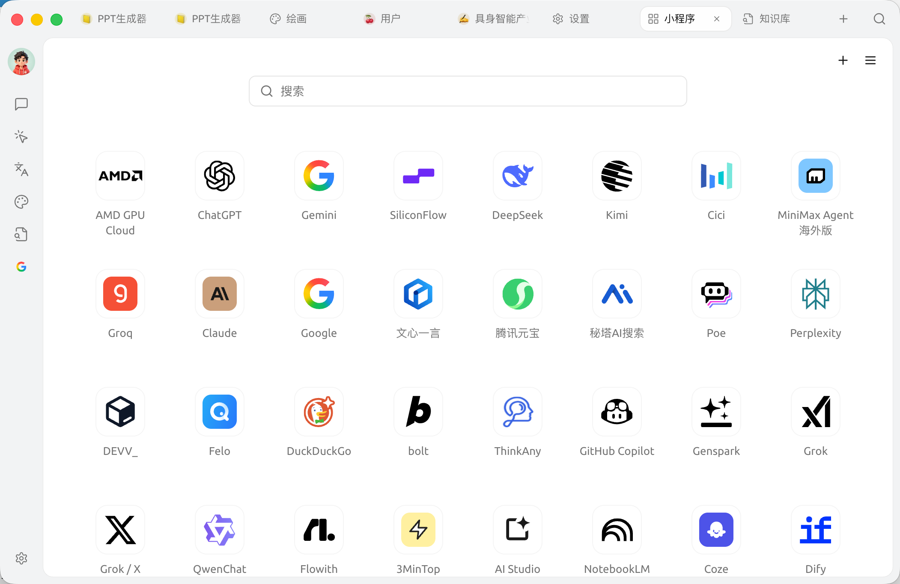
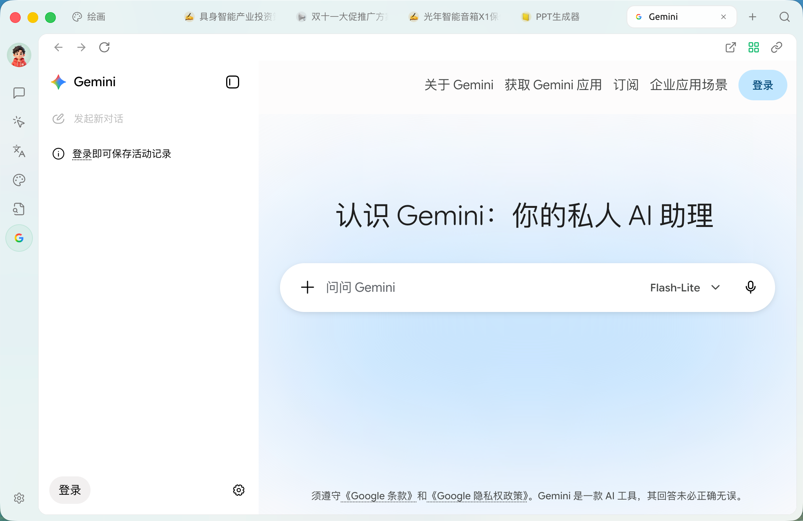

# 小程序

【小程序】让网页服务和本地安装的小工具在 Cherry Studio 中运行。除了打开各家 AI 厂商的网页版，你也可以安装自定义的生成式小程序，让它通过授权接口调用 Cherry Studio 已配置的 AI 模型。

### 先分清两类小程序

| 类型 | 添加方式 | 能否调用 Cherry AI | 适合场景 |
| ----- | ---------------------------- | -------------- | ----------------------------------- |
| 网站 | 填写名称、URL 和 Logo | 不能 | 把常用网站固定到 Cherry Studio，保留各网站自己的登录状态 |
| 本地小程序 | 安装 `.miniapp` 包，或从开发者提供的网址安装 | 可以，在安装时授权 | 自定义 AI 写作、总结、翻译、信息提取和垂直工作流 |


如果你要制作“能调用 Cherry AI 的自定义小程序”，请使用【本地小程序】，而不是只填写 URL 的【网站】。完整教程见 [生成式小程序](generative-mini-apps.md)。


### 进入小程序



### 打开启动台

顶部 Tab 栏点击 `+`，或直接打开【启动台】。



### 进入小程序

点击【小程序】应用图标。



### 选择服务

在小程序网格中选择需要打开的服务。



<figure><figcaption>
小程序网格，内置数十家服务；点右上角 <code>+</code> 可添加任意网页
</figcaption></figure>

页面中部有 **搜索框**；右上角 `+` 用于添加自定义网页，`☰` 打开【小程序显示设置】。

### 小程序显示设置

点右上角 `☰` 打开【小程序显示设置】：

<figure><figcaption>
小程序显示设置：显示管理（显示 / 隐藏两栏，可交换与重置）与使用偏好
</figcaption></figure>

**显示管理**

* **显示 / 隐藏**：左侧是「显示的小程序」、右侧是「隐藏的小程序」，两栏标题右侧显示当前数量；点每项右侧的箭头图标即可在两侧之间移动
* **交换 / 重置**：两个按钮位于两栏上方，**交换** 互换两栏内容，**重置** 恢复默认显示

**使用偏好**

* **小程序区域筛选**（默认 `自动检测`）：根据所在地区过滤不支持的小程序
* **在浏览器中打开新窗口链接**（默认关闭）：新窗口链接改用系统默认浏览器打开
* **打开时检查更新**（默认开启）：每次打开已安装的小程序时检查更新，未经你确认不会应用
* **小程序缓存数量**：设置同时保持活跃状态的小程序的最大数量

### 添加与管理

Cherry Studio 的小程序支持以下操作：

* **添加到启动台**：把常用的小程序加入启动台，方便从 `+` 入口快速打开。可在【小程序显示设置】中管理，或对小程序图标右键选择 **添加到启动台**
* **添加到侧边栏**：把常用的小程序固定到左侧边栏，一键直达；右键小程序图标即可选择 **添加到侧边栏** 或 **从侧边栏移除**
* **保活（Keep Alive）**：让小程序窗口在切走时不立即销毁，再次进入无需重新登录或重新加载
* **添加网站**：点击页面右上角的 `+`，在【网站】中填写名称、URL、Logo，即可加入网格
* **安装本地小程序**：点击页面右上角的 `+`，切换到【本地小程序】，选择 `.miniapp` 包，或填写开发者提供的安装网址。确认权限后完成安装
* **查看本地小程序详情**：右键本地小程序，选择【查看详情】，可管理权限、AI 模型、存储空间、活动日志和更新
* **删除 / 编辑**：网站型小程序可右键编辑或删除；本地小程序可在【查看详情】中卸载

打开某个小程序后，其窗口自带一条工具栏：**后退**、**前进**、**刷新**、**在浏览器中打开**。你还可以切换页内链接是在默认窗口打开，还是在系统浏览器打开。

<figure><figcaption>
小程序窗口工具栏：左侧后退 / 前进 / 刷新，右侧在浏览器中打开、添加到启动台、页内链接打开方式
</figcaption></figure>

### 提示与技巧

* 网站型小程序使用服务的网页版，登录态、Cookie、设置均保存在本地，并与系统浏览器隔离
* 本地小程序运行在独立沙盒中，不能读取其他小程序或电脑上的任意文件；只有你授权的能力可以被调用
* 若某个小程序加载失败，可右键 → 刷新，或检查代理设置（参考 [常规设置](../../../pre-basic/settings/general.md)）

<table data-view="cards"><thead><tr><th></th><th></th><th data-hidden data-card-target data-type="content-ref"></th></tr></thead><tbody><tr><td><strong>生成式小程序</strong></td><td>制作、安装并管理可调用 Cherry AI 的自定义小程序</td><td><a href="generative-mini-apps.md">generative-mini-apps.md</a></td></tr></tbody></table>

如遇问题，请在 [反馈与建议](../../../question-contact/suggestions.md) 中提交反馈。

***

### 获取帮助与提交反馈

如果您在配置或使用过程中遇到任何疑问、Bug 或有功能改进建议，请参考 [反馈与建议](../../../question-contact/suggestions.md) 中提供的官方渠道。
