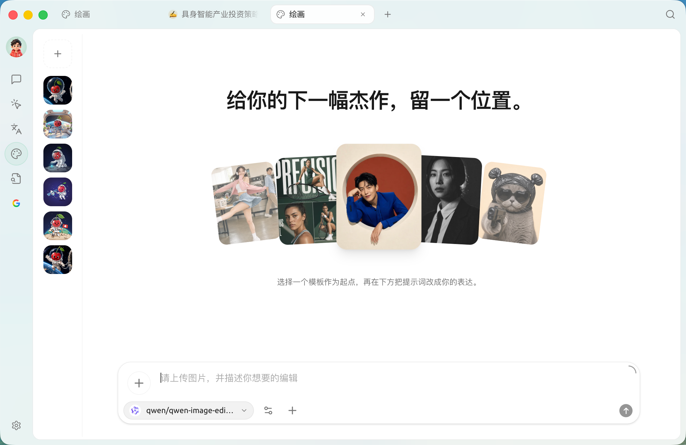
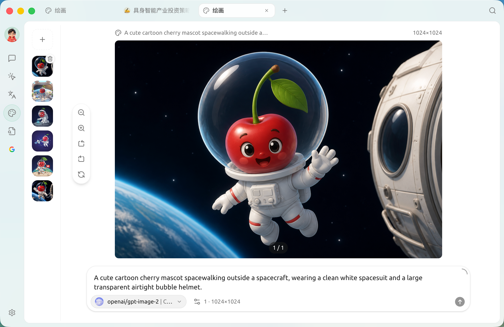
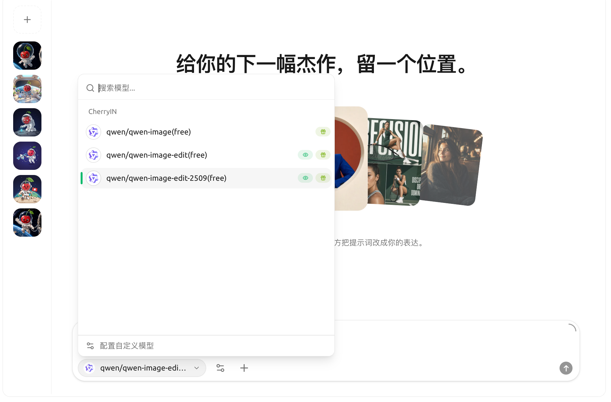

# 绘画

绘画页面是 Cherry Studio 内置的 **文生图工具**：通过文字描述生成图像，效果与 Midjourney / DALL·E 等网页服务类似。**主要优势在于直接复用 Cherry Studio 中已配置的服务商账号**，无需另行注册各家平台。

## 进入绘画

点击顶部标签栏右侧的 **+** 打开【启动台】，再点击【绘画】。

<figure><figcaption><p>绘画页面：左侧是画板列表，中间是画布，底部输入区选择服务商与模型</p></figcaption></figure>

页面主要由这几部分组成：

* **画板列表（左侧）**：纵向排列的画板缩略图，顶部 `+` 可新建画板、切换到新的一组
* **画布（中间）**：居中显示当前生成的图片
* **输入区（底部）**：提示词输入框，一侧提供 **服务商与模型选择** 入口；下方提示当前服务商有没有可用的图像模型，没有时会显示绿色 `去设置` 按钮直接跳到该服务商配置页
* **绘图 / 编辑**：没有单独的切换按钮，**由所选模型决定**——选文生图模型（如 `qwen-image`）就是绘图；选图像编辑模型（如 `qwen-image-edit`）则进入编辑，需先上传图片再描述改动

选择 **图像编辑模型**（如 `qwen-image-edit`）后，输入区会变为“上传图片 + 描述编辑”的模式：

<figure><figcaption><p>选择图像编辑模型后 —— 需要先上传一张图片，再描述如何修改</p></figcaption></figure>

## 当前支持的服务商

Cherry Studio 的绘画功能依赖各家服务商提供的 **图像模型**。在模型下拉里可以看到当前实际可选的全部条目，按服务商分组列出：

<figure><figcaption><p>模型下拉：按服务商分组列出可用的图像模型，底部可“配置自定义模型”</p></figcaption></figure>

按类型大致分为三类：

| 类型 | 服务商 | 说明 |
|---|---|---|
| 国内云服务 | **[硅基流动](../../pre-basic/providers/siliconcloud.md)** | 国内访问最方便，价格便宜，模型选择多 |
| | **[PPIO 派欧云](../../pre-basic/providers/ppio.md)** | 国内云算力服务 |
| | **智谱开放平台** | 国产模型 CogView |
| 聚合网关 | **AiHubMix** | 聚合多家厂商的网关 |
| | **DMXAPI** | 聚合多家厂商的网关 |
| | **TokenFlux** | 海外网关 |
| | **CherryIN** | Cherry 官方网关，统一计费 |
| | **唯一 AI（AiOnly）** | 第三方网关 |
| 自建 / 本地 | **New API** | 自建网关方案，添加后会出现在此列表 |
| | **OVMS** | OpenVINO Model Server，本地推理（仅在 OVMS 已运行时显示） |


任何 **端点类型设为 `图像生成 (OpenAI)`** 的自定义服务商，都会动态出现在这里。后续会陆续接入更多。


## 开始画

1. 在输入区选择已配置的 **服务商与模型**；若提示"暂无可用的图片生成模型"，点击 `去设置` 在该服务商下添加一个端点类型为 **图像生成 (OpenAI)** 的模型
2. 选择一个 **文生图模型**（如 `qwen-image`），在输入框输入 **提示词**（中文/英文都可，越具体越好），例如：
   ```
   一只戴着圆眼镜的橘猫坐在书堆上，复古油画风格，温暖的黄昏光线
   ```
3. 调整参数（尺寸、步数、随机种子等），不确定就用默认
4. 点击 **生成**，等几秒到几十秒（取决于模型）
5. 生成的图会出现在画布上，可下载、收藏，或一键再画一张


不想每次都在输入区选模型？到【设置】→【默认模型】→【绘画模型】指定一个默认的 **图像生成模型**（说明为"图像生成使用的模型"），绘画时便会默认用它。


## 参数怎么填？

参数面板里部分字段右侧带 **ⓘ 信息图标**，鼠标悬停会显示说明（如硅基流动 / Aihubmix / PPIO 等服务商基本都带），但 **不是所有服务商** 都加了 Tooltip——比如智谱、NewAPI 的参数面板就没有提示。看不到说明时，按下面默认值直接试就行。

如果想深入了解：

* **尺寸**：影响细节量与生成时间。日常用 1024x1024 够了
* **步数（Steps）**：模型"打磨"次数。20-30 步通常够用，多了边际收益小
* **CFG / Guidance**：AI 对你提示词的"听话程度"。7-12 比较常用
* **种子（Seed）**：固定种子可让结果可复现；想看同一个提示词随机变化就留空

## 提示与技巧

* **用英文提示词通常效果更好**（绝大多数模型用英文素材训练为主）
* 越具体越好：风格、构图、光线、镜头都写进去
* 想要"参考某张图改"？看你选的服务商是否支持 **img2img**（图生图）
* 一次出 4 张省 4 倍时间：把"批次数"调到 4


绘画功能会随版本扩展。最新支持的服务商以应用内下拉为准。



Gemini 图像模型（如 `gemini-2.5-flash-image`）在配置了 Gemini 兼容的服务商后，可直接在绘画页的模型下拉中选择；新版已统一在绘画页使用，不再支持在对话中生成图片。


***

### 获取帮助与提交反馈

如果您在配置或使用过程中遇到任何疑问、Bug 或有功能改进建议，请参考 [反馈与建议](../../question-contact/suggestions.md) 中提供的官方渠道。
