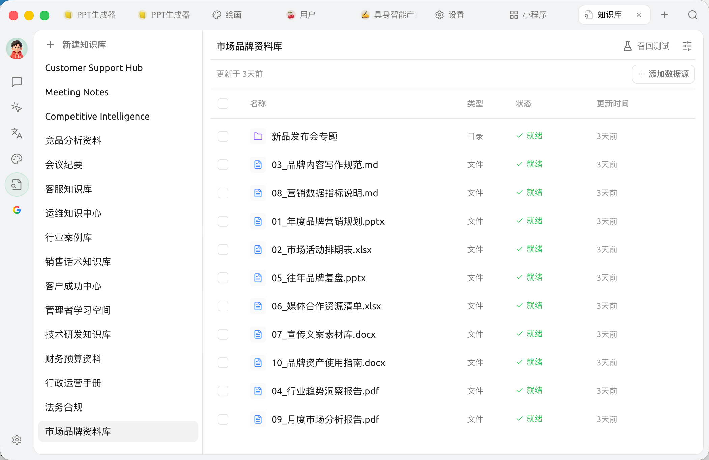

# 知识库

知识库就像给 AI 配一本 **专属参考书**：你把自己的文档、笔记、网址塞进去，之后聊天时让 AI 翻这本书来回答你的问题。

<figure><figcaption>
知识库：左栏是已建知识库列表（顶部 <code>+ 新建知识库</code>），右侧向选中的知识库添加文件 / 笔记 / 目录 / 链接数据源
</figcaption></figure>

## 用知识库能干什么？

举几个真实场景：

* **公司知识助手**：把产品手册、API 文档、内部规范全塞进去，员工问问题时 AI 自动答
* **个人资料管家**：把你历年的工作笔记、读书摘录、邮件存档放进去，问 AI"我去年在哪个 PPT 里提过那个分析框架"
* **学习陪练**：把课件、论文塞进去，让 AI 帮你按章节出题、解答疑惑
* **合同/法规速查**：把法条、合同模板放进去，问 AI 具体条款的应用

## 为什么用知识库，不直接把文件丢给 AI？

直接丢文件的限制：

* 每次提问都要重新上传，麻烦
* 单次对话有长度限制，长文档塞不下
* 跨对话不能复用

**知识库解决了上面所有问题**：上传一次，之后任何对话都可调用，且能从大量资料里"精准抓取相关段落"喂给 AI。

## 怎么用？

* 第一次用：看 [完整知识库教程](../../knowledge-base/knowledge-base.md)
* 想加图片 / 扫描 PDF：先看 [文档预处理](../../knowledge-base/document-preprocessing.md)，让 AI 能"读懂"图片里的文字
* 想了解嵌入模型怎么选：看 [嵌入模型参考](../../knowledge-base/emb-models-info.md)
* 想离线用、不配云端嵌入：可以用内置的 [本地嵌入模型](../../pre-basic/settings/local-models.md)，知识库无需联网即可建索引与检索
* 想了解数据存哪：看 [知识库数据](../../knowledge-base/data.md)

## 与其他能力的组合

* **知识库 + 助手**：给某个助手"挂载"知识库，它就专精这个领域
* **知识库 +** [**智能体**](../../advanced-basic/agent.md)：让智能体在任务过程中自己查知识库
* **知识库 +** [**频道**](../../advanced-basic/automation/channels.md)：把"会查公司文档"的智能体派到飞书群里值班


推荐先阅读 [进阶能力地图](../../advanced-basic/capability-map.md)，了解知识库与智能体、MCP、频道等功能如何协同。


***

### 获取帮助与提交反馈

如果您在配置或使用过程中遇到任何疑问、Bug 或有功能改进建议，请参考 [反馈与建议](../../question-contact/suggestions.md) 中提供的官方渠道。
