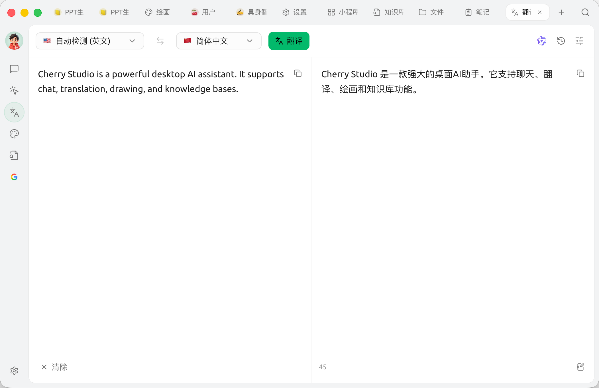
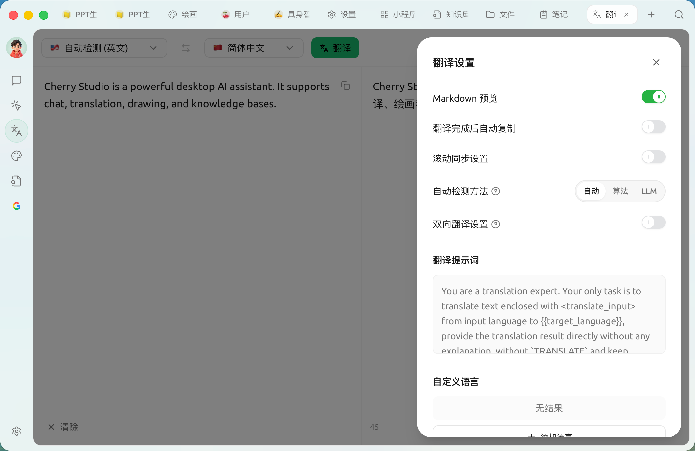

# 翻译

Cherry Studio 的翻译功能为您提供快速、准确的文本翻译服务，支持多种语言之间的互译。

### 界面概览

<figure><figcaption>
翻译页面：左输入、右输出，顶部切换语言与模型
</figcaption></figure>

顶部操作栏分左右两组。

**左侧（语言与翻译）：**（源语言自动检测，无需手动选择）

1. **目标语言下拉**
2. **翻译按钮**：输入框为空或未选择模型时为灰色不可点

**右侧（模型与工具）：**

3. **模型选择**（模型头像）：切换用于翻译的模型
4. **翻译历史**（时钟图标）：打开历史面板，可搜索、按收藏筛选，点任意记录一键回填到输入 / 输出框
5. **设置**（滑块图标）：打开翻译设置面板

输入框（左）支持粘贴文本，也支持 **拖入或点击上传** 文件——文本文件（`.txt` / `.md`）直接读入，图片走 **OCR** 识别，文档（PDF / Word / PPT / Excel 等）直接抽取正文；结果框（右）鼠标移上去出现复制按钮。


拖入图片会先做 OCR 识别文字再翻译；拖入 PDF / Word 等文档会直接抽取正文。图片与文本文件上限 5 MB，文档上限 20 MB。


### 使用步骤

1. **选择目标语言**
2. **输入或粘贴文本** 到左侧框 —— 拖入图片可直接 OCR 识别后翻译
3. 点击 **翻译** 按钮
4. 复制或继续编辑右侧结果

### 翻译设置

点击右上角 **滑块图标** 打开翻译设置面板：

<figure><figcaption>
翻译设置面板
</figcaption></figure>

* **Markdown 预览**：开启后翻译结果按 Markdown 渲染
* **翻译完成后自动复制**：结果生成即复制到剪贴板
* **滚动同步设置**：左右两栏滚动联动
* **自动检测方法**：自动 / 算法（franc 本地）/ LLM——LLM 检测更准但会消耗少量 token
* **双向翻译设置**：开启后只在指定的两种语种之间互译；下方可选语种对
* **翻译提示词**：自定义翻译使用的系统提示词，改动后可一键恢复默认
* **自定义语言**：在内置语言之外添加、编辑或删除语言（填写语言名与语言代码，如 `zh-cn`）

### 常见问题解答 (FAQ)

* **Q: 翻译不准确怎么办？**
  * A: AI 翻译虽然强大，但并非完美。对于专业领域或复杂语境的文本，建议进行人工校对。 您也可以尝试切换不同的模型。
* **Q: 支持哪些语言？**
  * A: Cherry Studio 翻译功能支持多种主流语言，具体支持的语言列表请参考 Cherry Studio 的官方网站或应用内说明。
* **Q: 可以翻译整个文件 / 图片吗？**
  * A: 可以。输入框支持直接 **拖入或点击上传** 图片与文档：图片会通过 OCR 识别后再翻译，PDF / Word / PPT / Excel 等文档会抽取正文后翻译。若文档特别长，也可以进入对话页面，把文档作为附件发给翻译助手处理。
* **Q: 翻译速度慢怎么办？**
  * A: 翻译速度可能受网络连接、文本长度、服务器负载等因素影响。请确保您的网络连接稳定，并耐心等待。

***

### 获取帮助与提交反馈

如果您在配置或使用过程中遇到任何疑问、Bug 或有功能改进建议，请参考 [反馈与建议](../../question-contact/suggestions.md) 中提供的官方渠道。
