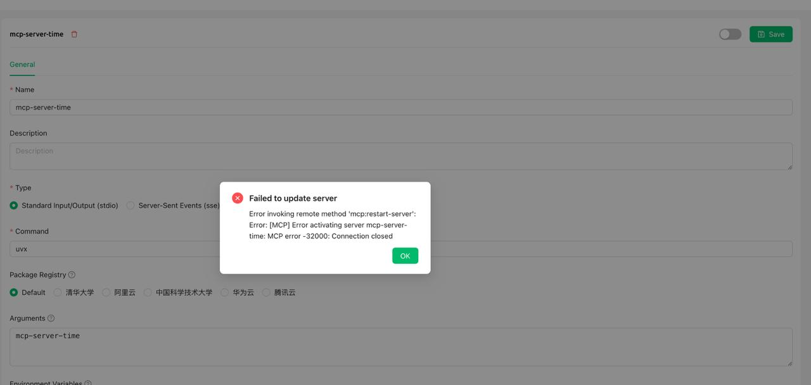

# Foire aux questions



Ce document a été traducido del chino por IA y aún no ha sido revisado.



### 1. mcp-server-time

<figure><figcaption><p>Capture d'écran d'erreur</p></figcaption></figure>

**Solution**  
Dans la colonne "Paramètres", remplissez :

```
mcp-server-time
--local-timezone
<Votre fuseau horaire standard, par exemple : Asia/Shanghai>
```