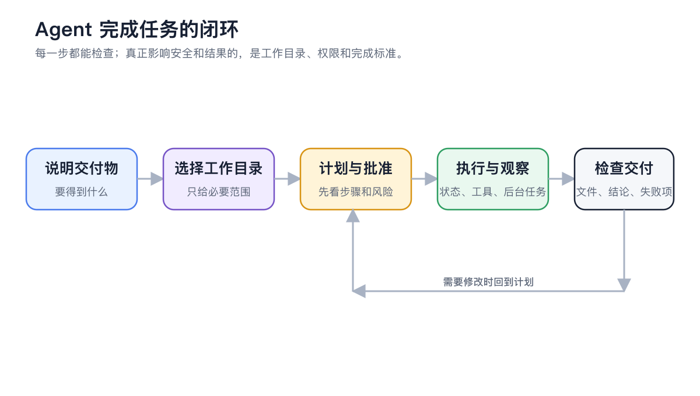

# Agent Workspace

Agents are best suited for tasks with clear objectives that require tools or files and may span multiple steps. The entry point is the **Work** section in the left navigation, not the top tabs found in older tutorials.


The most efficient setup is to first tell the Agent what you want to achieve, then let it check for missing models, tools, knowledge bases, or channels. For precise control, open the Agent editing window or **Settings** to make manual adjustments.


<figure><figcaption></figcaption></figure>

<figure><figcaption></figcaption></figure>

### What Makes Up the Workspace

| Component | Function | When to Pay Attention |
| ----- | ----------------- | ----------------- |
| Agent | Stores role, model, prompts, and capabilities | When repeating similar types of work |
| Task | A continuous work record | Create a separate task for each objective to preserve context |
| Working Directory | The file scope the Agent can directly process | File-based tasks like coding, data organization, or document generation |
| Input Area | Send objectives, attachments, and invoke tools | Initiating tasks or adding requirements |
| Right Panel | View status, files, subtasks, and message flow | Tracking long tasks, checking outputs, or debugging |

### Starting a Task



#### 1. Open **Work** and Select an Agent

If you already have a suitable Agent, select it directly. If not, click **Add Agent**, select the execution mode in **Basic Information**, and then complete the four-step creation process: system prompt, skills, and knowledge base. The execution mode cannot be changed after creation.



#### 2. Select the Working Directory

If you need to process local files, select the directory for this task. If no files are involved, you can use the default workspace created by the app. One task corresponds to one workspace, preventing the Agent from searching across unrelated directories.



#### 3. Describe the Task by Its Outcome

Tell the Agent what to deliver, which resources it can use, what the constraints are, and what constitutes completion. For example:

```
Read the meeting minutes in the current directory, extract decisions, owners, and deadlines, and generate action-items.md. Do not modify the original files.
```



#### 4. Check the Process and Outputs in the Right Panel

**Status** displays active tasks, sub-agents, workflows, and background commands. **Files** allows you to preview and edit text outputs. With developer mode enabled, you can also view the **Call Chain**.



### API Gateway Notice

Agent execution relies on the Cherry Studio API Gateway. If the gateway is not enabled, the app will prompt you to **Enable and Start**. You can also check the port, running status, and local security software blocking in **Settings** → **API Gateway**.


The API Gateway is a runtime dependency for Agents, but this does not mean you should expose the interface to the network. Keep it for local use by default. Only copy the URL and API key if you explicitly need other programs to call it.


### One Agent or Multiple Agents

* Same role and capabilities, but different tasks: Reuse one Agent and create multiple tasks.
* Different roles, resource scopes, or permissions: Split into multiple Agents.
* A single objective requiring parallel research or multi-step collaboration: First let one Agent use sub-agents or workflows; there is no need to manually create many Agents immediately.

### User Case: Organizing Project Materials

A product manager places requirement specifications, interview records, and competitor materials in the same directory. They create a "Requirement Organization" Agent, bind the product knowledge base, and use the **Confirm Each Step** permission. The Agent first reads the materials, then writes the requirement list and pending questions to a new file. The product manager directly revises the text in the **Files** section on the right, while the original materials remain unchanged.

<details>

<summary>Why can't the Agent see the newly bound capabilities?</summary>

Agent edits are saved automatically. Currently generating responses will not be interrupted; changes to models, skills, MCP, and knowledge bases will take effect from the next message. If the capabilities still do not appear, first confirm that the capabilities are enabled, then send a new message.

</details>

<details>

<summary>Will deleting the working directory also delete the files on the disk?</summary>

When deleting a working directory from the task list, only the directory record in Cherry Studio and the task records under that directory are removed. The actual directory on the disk is not deleted. File operations performed by the Agent during task execution are still subject to the selected permission mode.

</details>

<details>

<summary>Will deleting the working directory also delete the files on the disk?</summary>

When deleting a working directory from the task list, only the directory record in Cherry Studio and the task records under that directory are removed. The actual directory on the disk is not deleted. File operations performed by the Agent during task execution are still subject to the selected permission mode.

</details>
