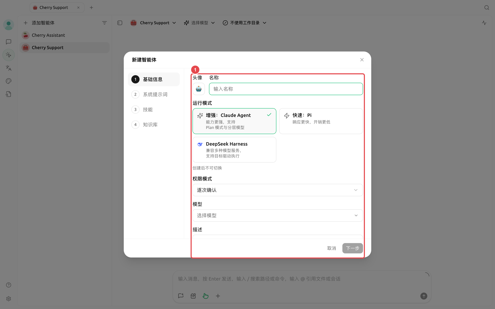
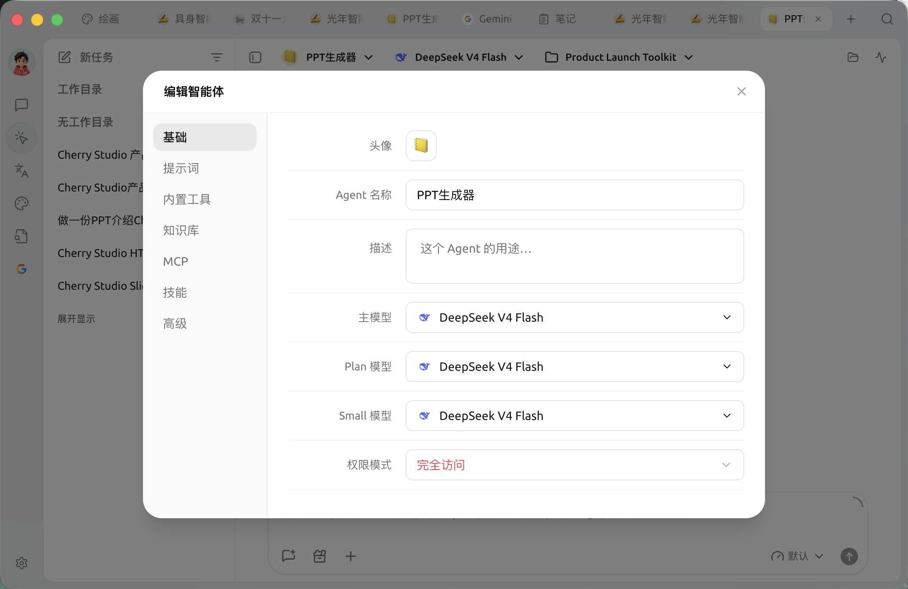

# Creating Agents and Model Roles

Entry point: Left navigation [Work] → [Add Agent].

The creation wizard consists of four steps: [Basic Information], [System Prompt], [Skills], and [Knowledge Base]. The first step also requires selecting a runtime mode. The runtime mode determines the available model roles, permission modes, and certain tools for the Agent. This setting cannot be changed after creation.

<figure><figcaption></figcaption></figure>

### How to Choose a Runtime Mode

| Runtime Mode | Key Features | Model Configuration | Permissions & Limitations |
| ------------------ | ------------------- | -------------------- | ------------------------------------ |
| [Enhanced: Claude Agent] | Full capability set, suitable for complex, multi-step tasks | Main model, Plan model, Small model | Supports all permission modes and heartbeat detection |
| [Fast: Pi] | Fast response, low overhead, suitable for daily file and coding tasks | Main model only | Does not provide [Plan Only]; defaults to [Smart Approval] upon creation |
| [DeepSeek Harness] | Compatible with multiple model services, supports goal-driven execution | Main model only | Does not provide [Smart Approval] or heartbeat detection; supports `/compact`, `/goal` |


The runtime mode cannot be changed after creation. If your goals, model compatibility, or permission requirements change fundamentally, create a new Agent instead of modifying the existing one.


### How to Fill Out the Four Steps



#### 1. Basic Information

Name the Agent after its role or task type, such as "Contract Review" or "Content Planning." First, select the runtime mode, then choose a compatible model from the list on the page. The description is only for identifying the purpose; the main model handles primary reasoning and execution.



#### 2. Write the System Prompt

Clearly define the role, goals, boundaries, and output format. Instead of piling up adjectives, provide actionable rules: list risks first, then quote the original text, and finally provide modification suggestions. If information is insufficient, explicitly mark it; do not guess.



#### 3. Select Skills

Only select skills relevant to this Agent's long-term workflow. Skills can be installed via [Settings] → [Skills], or you can ask the Agent to find and install them later.



#### 4. Bind Knowledge Base

Only bind knowledge bases that the Agent genuinely needs to search. If no knowledge base is bound, knowledge base search and management tools will not appear in the Agent's tool list.



<figure><figcaption>
Select the main model first; configure the Plan model and Small model only if the task genuinely requires planning delegation or lightweight processing. 
</figcaption></figure>

### Continue Configuration After Creation

Open the menu in the Agent list and select Edit to adjust the following:

* [Basic]: View the runtime mode and adjust supported models, permissions, and heartbeat settings for that mode;
* [Prompt]: Role description, processing rules, and behavioral boundaries;
* [Built-in Tools]: Files, search, images, notifications, scheduled tasks, memory, sub-agents, and workflows;
* [Knowledge Base]: Restrict the knowledge bases the Agent can access;
* [MCP]: Bind already connected MCP servers;
* [Skills]: Select installed skills;
* [Advanced]: Set environment variables for tools that genuinely require them.


The current editing window automatically saves changes. If there is unsaved content before closing the window, the application will complete the save first; if saving fails, the window remains open and displays an error.


### Recommended Starting Points

| Configuration Item | Product Default | Suggested Start | Function | Applicable Scenarios | Notes |
| --------------- | ----------------------------- | ----------------------- | -------------- | ------------------ | ---------------------------------- |
| Runtime Mode | [Enhanced: Claude Agent] | Use [Enhanced: Claude Agent] if unsure | Determines model roles, permissions, and tool scope | All Agents | Cannot be switched after creation |
| Main Model | Model selected during creation | Choose a model verified to call tools stably | Primary reasoning and execution | All Agents | The selector filters incompatible models based on runtime mode |
| Plan / Small Model | Same as main model | Keep consistent with the main model initially | Task decomposition, simple judgments, and formatting | [Enhanced: Claude Agent] only | Pi and DeepSeek Harness do not display these fields |
| Permission Mode | Claude/DSH: [Confirm Each Time]; Pi: [Smart Approval] | Prefer [Confirm Each Time] for real project directories | Determines if tools require approval | File, terminal, and network tasks | [Full Access] may delete files or access the network |
| Heartbeat Detection | Enabled initially for supported runtime modes, 30-minute interval | Disable if no continuous tasks | Allows the Agent to periodically check work | Claude Agent, Pi | DeepSeek Harness does not provide heartbeat detection; use scheduled tasks for fixed times |

### User Case: Contract Review Agent

Create a "Contract Review" Agent. Select a verified model as the main model. In the prompt, require output in the format of "Risk Clauses, Original Text Location, Impact, Suggestions." Bind the company policy knowledge base and keep permissions set to [Confirm Each Time]. Create a new task for each contract and select the corresponding file directory to avoid mixing different client materials in the same context.

Why didn't I see the full MCP and permission settings during creation? 

The creation wizard only retains common steps. After creation, open the Agent editing window to continue configuring [Basic], [Built-in Tools], [Knowledge Base], [MCP], [Skills], and [Advanced]; specific tabs vary based on runtime mode capabilities.

