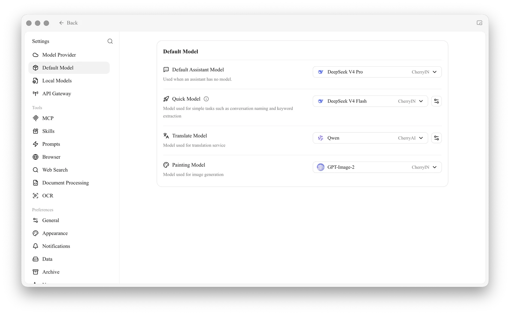
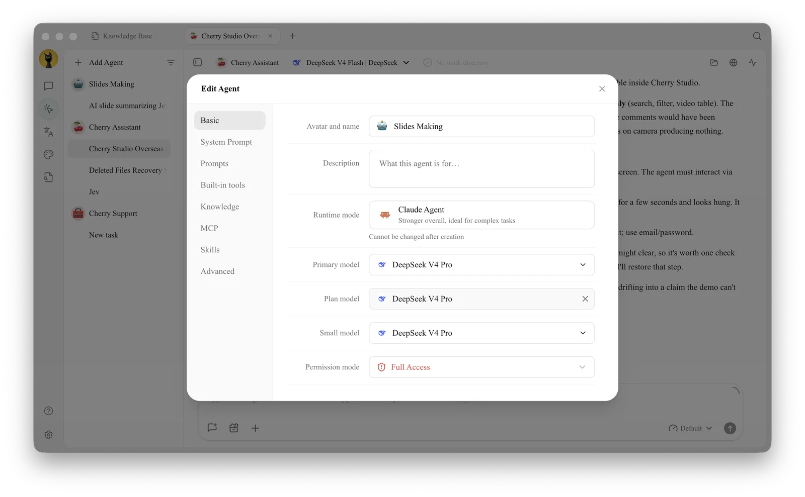

# Model Roles and Agent Image Generation

Cherry Studio picks models in three places: the global **Default Model** settings, the **model roles** of each Agent, and the **Painting Model** used when an Agent generates images. Knowing which setting controls which task saves you from changing the wrong one.

## Where Each Model Is Set

| Setting | Where | What it controls |
| --- | --- | --- |
| Default Assistant Model | Settings → Default Model | Assistants that have no model of their own |
| Quick Model | Settings → Default Model | Light background tasks, such as naming conversations and extracting search keywords |
| Translate Model | Settings → Default Model | The Translation page and message translation |
| Painting Model | Settings → Default Model | Image generation, including the Agent's **Generate Image** tool |
| Primary model | Edit Agent → Basic | The Agent's main reasoning and execution |
| Plan model | Edit Agent → Basic | Breaking a task into steps (Claude Agent runtime only) |
| Small model | Edit Agent → Basic | Quick judgments and formatting (Claude Agent runtime only) |

<figure><figcaption>
Settings → Default Model → Painting Model sets the model used for image generation
</figcaption></figure>

See [Default Model Settings](../../cherrystudio/preview/settings/default-models.md) for how to choose each global default.

## Agent Model Roles

Open **Work**, select an Agent, and choose **Edit** → **Basic**:

* **Primary model**: does most of the work. Choose a model that calls tools reliably.
* **Plan model** and **Small model**: start with the same model as the primary. Change them only when you want planning or lightweight steps handled by a different (often cheaper) model.

The Pi runtime uses the primary model only, so it does not show the Plan and Small fields. The runtime mode is chosen when the Agent is created and cannot be changed later; see [Creating Agents and Model Roles](create-agent.md).

<figure><figcaption>
Model roles are set per Agent in Edit Agent → Basic
</figcaption></figure>

## Generating Images in an Agent



### 1. Set the Painting Model

In **Settings → Default Model**, choose an image model you have already configured as the **Painting Model**, and make sure it works on the [Paintings](../knowledge-content/painting-workflow.md) page first.



### 2. Turn on Generate Image

In **Edit Agent → Built-in tools**, check that **Generate Image** (in the **Media** group) is on.



### 3. Describe the Image

Ask the Agent for the image in the conversation, including subject, style, size, and where the file should be saved. Generate one sample first and confirm the direction before asking for a batch.




Image generation is often billed per image. Keep a permission mode that asks before acting when an Agent may generate many images.


The Agent says it can't generate images. What should I check?

Make sure a Painting Model is set in Settings → Default Model and works on the Paintings page, and that Generate Image is turned on in the Agent's Built-in tools. Then send a new message so the Agent picks up the change.

Why don't I see the Plan model and Small model fields?

They are only available for Agents that use the Claude Agent runtime. Pi Agents use the primary model for everything.

