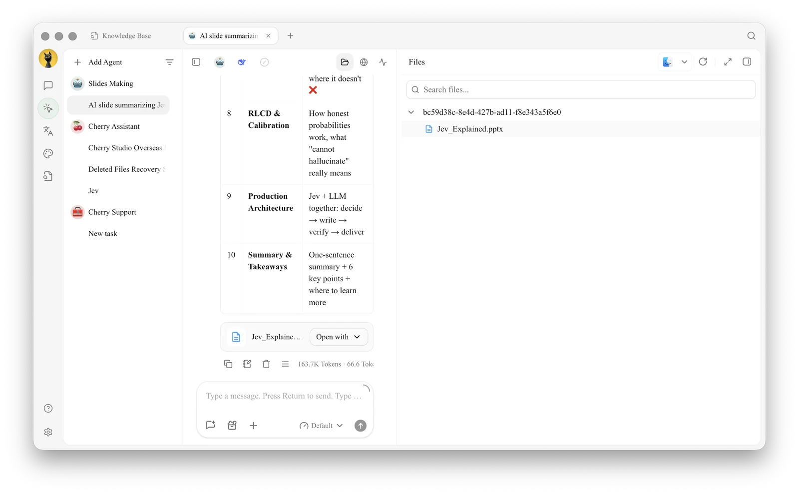
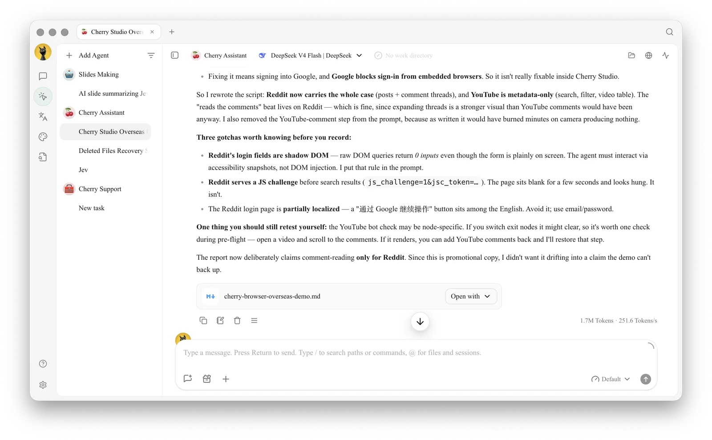

# Working Directory, Tasks, and Files

Which files cannot be edited directly?

Binary files, non-UTF-8 text, and large files are available for preview or opening in an external application only. They can still be processed by Agent tools, but may not be modifiable in the built-in editor.

<figure><figcaption>
Open the Files panel to browse and search the files in the working directory
</figcaption></figure>

<figure><figcaption></figcaption></figure>
