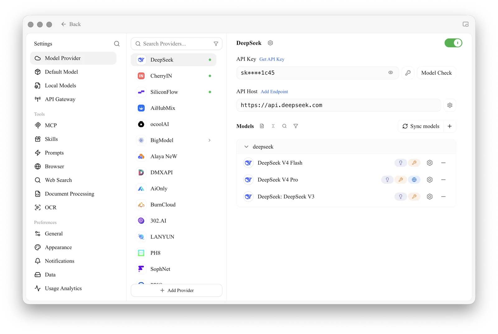
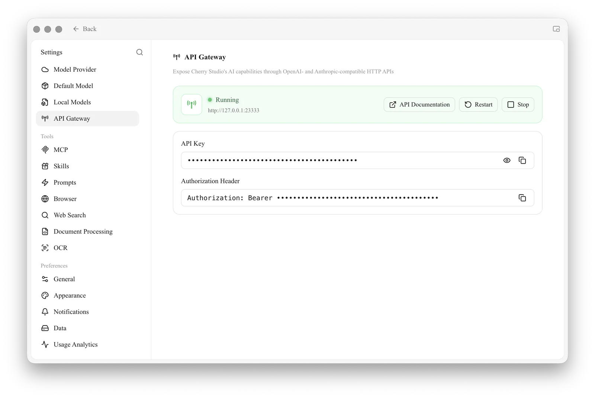
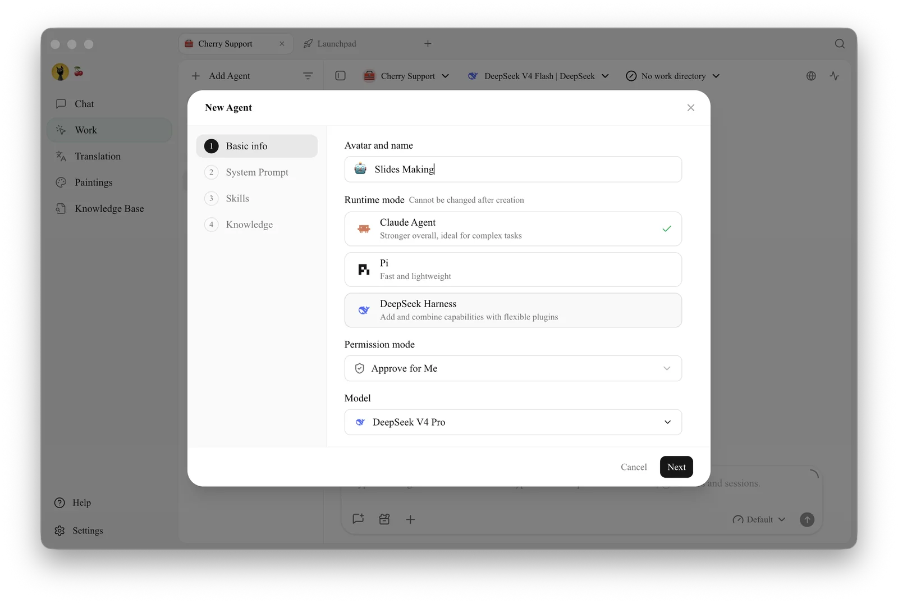
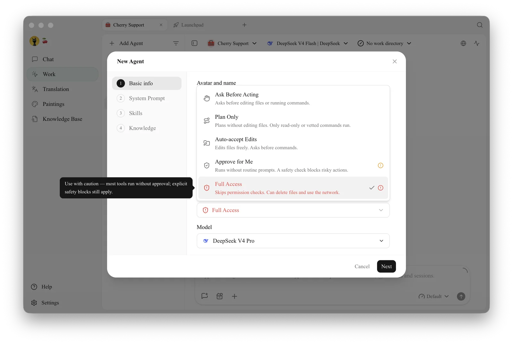
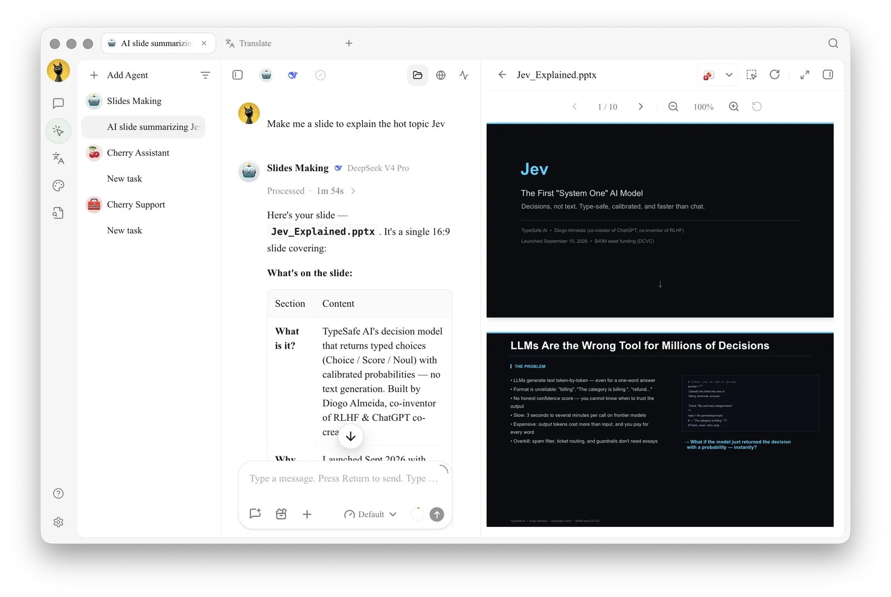

# Cherry Agent Usage Tutorial

Cherry Studio v1.7.0.alpha introduced Agent, allowing you to use Cherry Agent within Cherry Studio. This tutorial will guide you through the complete setup and launch process.

### 1. Create an Anthropic-type Provider

Any service provider supporting Anthropic endpoints can be used. Taking CherryIn as an example, create a new Agent provider, fill in the key and address, and add any model.


Agent mode consumes a large number of tokens, please pay attention to token usage.



Users subscribed to Claude Code can also fill in the key and URL to get the model.


<figure><figcaption></figcaption></figure>

### 2. Enable API Server

<figure><figcaption></figcaption></figure>

### 3. Create an Agent

<figure><figcaption></figcaption></figure>

Right-clicking on an Agent allows you to enter the editing interface to edit the Agent's permissions and available tools or mcp services.

<figure><figcaption></figcaption></figure>

### Results Display

<figure><figcaption></figcaption></figure>