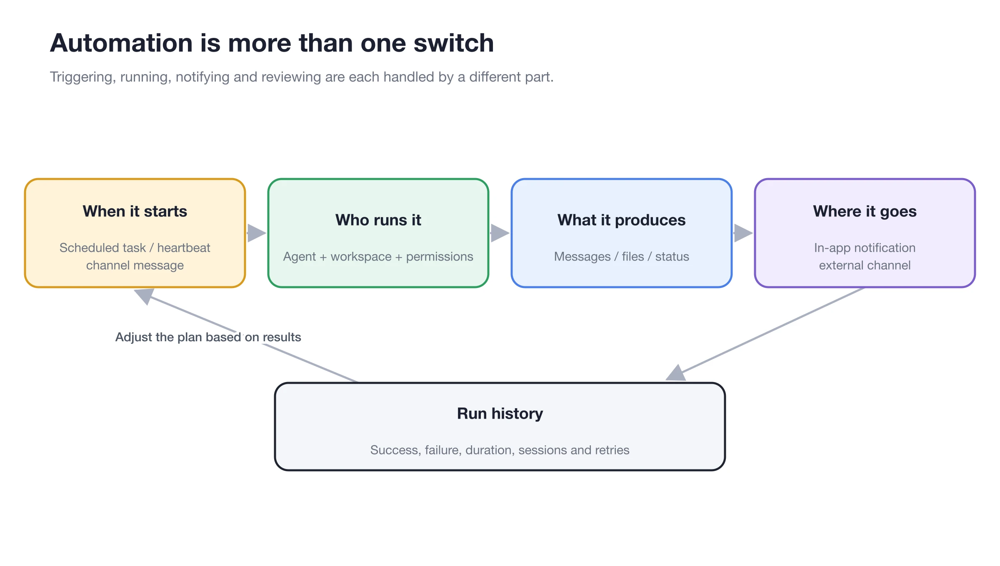

# Scheduled Tasks, Heartbeats, and Run History

What should I do if a task runs but the channel does not receive a message?

First, check the [Run History] to confirm whether the Agent succeeded. If the task succeeded, verify the channel receiving target. If the task failed, click [View Session] to inspect model, permission, workspace, and tool errors.

<figure><figcaption></figcaption></figure>

<figure><figcaption></figcaption></figure>
