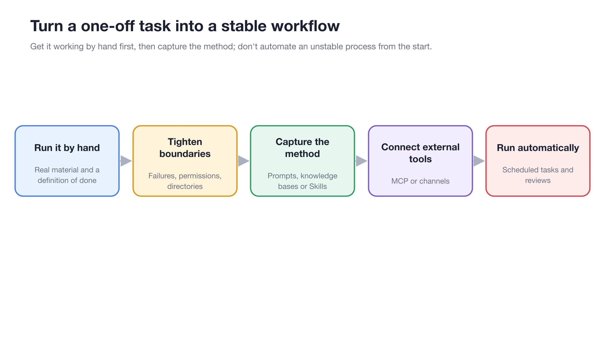

# Application Cases

These cases demonstrate how to combine conversations, Agents, knowledge bases, notes, image generation, translation, channels, scheduled tasks, and multi-window workflows into processes that deliver real results. The configurations in these cases are starting points; adjust them based on data sensitivity, usage volume, and team policies.

<figure><figcaption>
First, run the process manually with real materials, then gradually add knowledge bases, skills, MCP, channels, and scheduled tasks. 
</figcaption></figure>

## Selecting a Case

<table data-view="cards"><thead><tr><th></th><th></th><th data-hidden data-card-target data-type="content-ref"></th></tr></thead><tbody><tr><td><strong>Multi-Model Research Review</strong></td><td>Internal materials, external sources, and conflict verification</td><td><a href="research-review.md">research-review.md</a></td></tr><tr><td><strong>Long Document Review</strong></td><td>Check by section and generate a revised draft</td><td><a href="long-document-review.md">long-document-review.md</a></td></tr><tr><td><strong>Agent Project File Delivery</strong></td><td>Control directories, permissions, and output scope</td><td><a href="project-delivery.md">project-delivery.md</a></td></tr><tr><td><strong>Brand Image Kit</strong></td><td>From visual direction to multi-size final images</td><td><a href="brand-image-kit.md">brand-image-kit.md</a></td></tr><tr><td><strong>Private Knowledge Base QA</strong></td><td>Limit source scope and refuse guessing</td><td><a href="private-knowledge-qa.md">private-knowledge-qa.md</a></td></tr><tr><td><strong>Notes to Weekly Report</strong></td><td>From daily records to a verifiable weekly report</td><td><a href="notes-weekly-report.md">notes-weekly-report.md</a></td></tr><tr><td><strong>Multilingual Material Organization</strong></td><td>Terminology, OCR, documents, and consistency checks</td><td><a href="multilingual-materials.md">multilingual-materials.md</a></td></tr><tr><td><strong>Channels and Scheduled Daily Reports</strong></td><td>Agents, channels, schedules, and run logs</td><td><a href="automated-daily-report.md">automated-daily-report.md</a></td></tr><tr><td><strong>Multi-Window Research Workbench</strong></td><td>Keep materials, comparisons, and active tasks visible simultaneously</td><td><a href="multi-window-research.md">multi-window-research.md</a></td></tr></tbody></table>

## General Setup Order

<figure><figcaption>
These cases are not isolated settings but complete workflows covering input, execution, review, and delivery. 
</figcaption></figure>

## Choosing a Case by Task

| Your Task | Recommended Case | Key Capabilities |
| ----------- | -------------- | -------------- |
| Compare perspectives and preserve the research process | [Multi-Model Research Review] | Conversations, branches, notes |
| Review large volumes of material and output feedback | [Long Document Review] | Agent, working directory, files |
| Deliver project documents and artifacts | [Agent Project File Delivery] | Agent, state, files |
| Generate a set of stylistically consistent images | [Brand Image Kit] | Agent image generation, image templates |
| Answer only based on internal materials | [Private Knowledge Base QA] | Knowledge base, retrieval testing, Agent |
| Organize weekly reports from scattered notes | [Notes to Weekly Report] | Notes, Agent, files |
| Organize multilingual files | [Multilingual Material Organization] | Translation, Agent, working directory |
| Send fixed reports on a schedule | [Channels and Scheduled Daily Reports] | Agent, channels, scheduled tasks |
| Monitor materials and long-running tasks simultaneously | [Multi-Window Research Workbench] | Tabs, multi-window, global search |



### 1. Define the Deliverable

Specify the final file, table, image, or message required, and define the criteria for completion.



### 2. Run Manually in [Work]

Verify that the model, prompts, working directory, and materials are sufficient. Check each operation that requires approval.



### 3. Solidify Only Stable Parts

Turn repeated steps into skills, store long-term materials in the knowledge base, and keep temporary requirements in task prompts.



### 4. Add External Connections and Automation Last

After completing one manual acceptance test, integrate MCP, channels, or scheduled tasks, and retain a manual fallback entry for failures.


