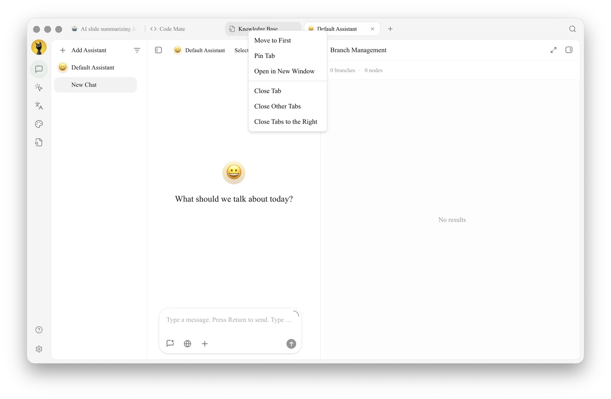

# Multi-Window Research Workbench

Researchers need to keep reference materials and model comparisons visible while an Agent organizes files and generates reports. Splitting research tasks into independent windows allows the main window to continue searching for information without interrupting the Agent's state.

## Recommended Layout

*   Main window: Keep reference conversations and global search;
*   Independent window: Open the research Agent task and pin it to the top;
*   Second tab: Open the knowledge base or notes to verify original sources at any time.

<figure><figcaption>
The main window retains multi-model comparisons, while the independent window continues running the research Agent. 
</figcaption></figure>

## Workflow



### 1. Compare research questions in [Chat]

Use multi-model comparison to identify consensus, conflicts, and items requiring verification. Do not rush to generate the final report.



### 2. Prepare directories for the research Agent

Separate raw materials from output directories, bind relevant knowledge bases, and require external information to retain links.



### 3. Split the task into an independent window

Right-click the Agent tab and select [Open in New Window]. Use window pinning if needed. The main window continues searching for information without interrupting the Agent's state.



### 4. Summarize and review

Check the report in the [Files] panel on the right side of the Agent, and open the original conversation in the main window to verify conflicts. Only retain conclusions that can be traced back to sources or references.



<figure><figcaption>
Split the Agent task into an independent window from the tab menu. 
</figcaption></figure>

## Recommended Combinations and Completion Criteria

| Window | Suggested Content |
| ----- | --------------------------------- |
| Main window | Reference conversations, global search, and notes |
| Independent window | One running Agent task |
| Pinned tab | Most frequently used knowledge base or task for the project |
| Completion criteria | Sources, task status, and final notes correspond to each other; windows are retracted or closed after the task ends |

This setup is suitable for research requiring continuous observation of long-running tasks. It is not recommended to open many windows simultaneously just to "look more professional."


Multi-window only changes the display location; it does not create new accounts or isolated spaces. Data and permissions for the same task remain identical.

