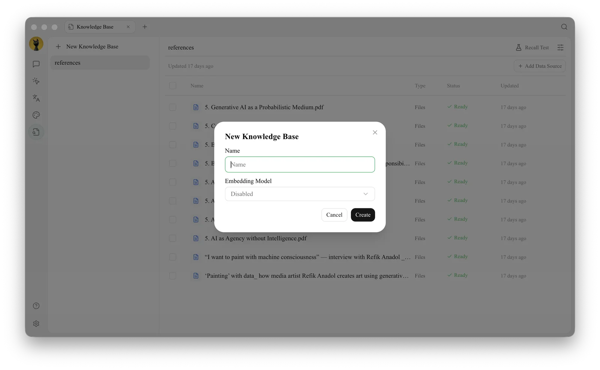
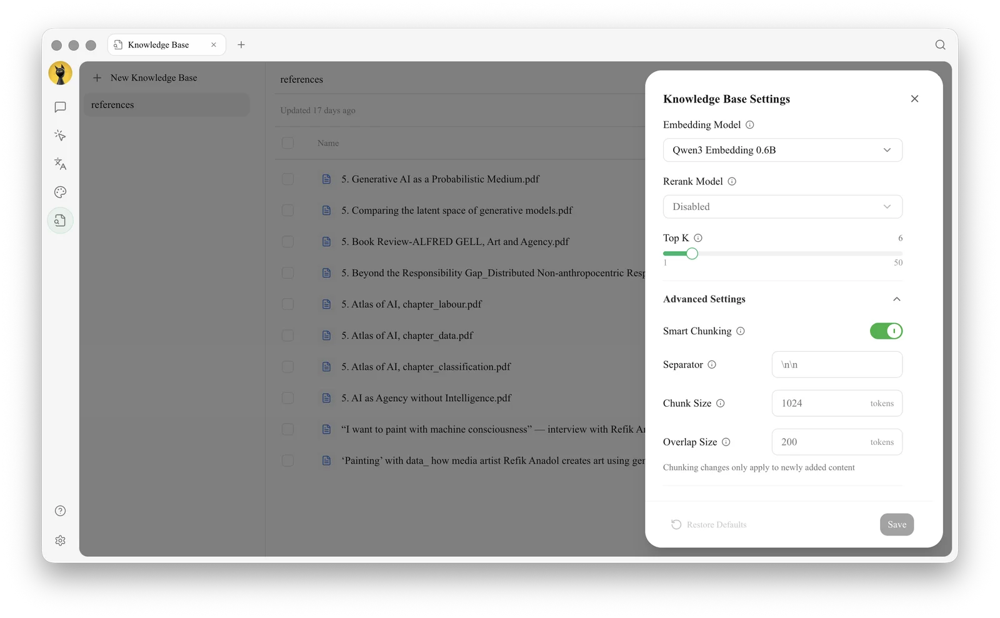
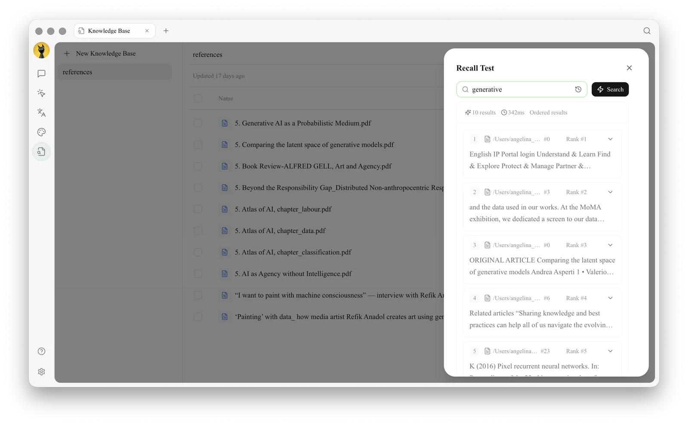

# Private Knowledge Base Q&A

The HR team wants colleagues to query current policies, but does not want the Agent to fill in answers using general knowledge. This case combines document scope, retrieval testing, and response rules; when content is not found, the Agent should explicitly state so.

<figure><figcaption><p>Create a separate knowledge base for a single topic to avoid mixing current and outdated materials. </p></figcaption></figure>

<figure><figcaption><p>Only adjust RAG settings based on document structure if retrieval results are unstable. </p></figcaption></figure>

<figure><figcaption><p>① Test with real questions; ② Verify returned documents, original text snippets, and relevance. Only when this is stable should the knowledge base be handed over to the Agent. </p></figcaption></figure>

## Workflow



### 1. Create a Single-Topic Knowledge Base

Group current materials together and remove duplicates and outdated versions. Clearly state the topic and effective scope in filenames.



### 2. Perform Retrieval Testing with Real Questions

Test at least easily confused clauses, colloquial phrasing, and questions without answers. Adjust materials or RAG settings until returned snippets are stable.



### 3. Create a Dedicated Agent

Bind only this knowledge base and require in the prompt: "Prioritize citing materials; state 'not found' if missing; do not fill in policies using general knowledge." Keep permissions to the minimum scope.



### 4. Start with Limited Scope

Use it first for internal lookups, not as a direct replacement for approvals or professional judgment. Collect incorrect answers and return to materials and retrieval testing for correction.



## Example Question Rules

```
When answering, state the conclusion first, then cite the source name and relevant paragraphs. If sources conflict, list the conflicts without making a choice for us. If the knowledge base has no answer, explicitly state "Not found in current materials".
```

## Recommended Combinations and Completion Criteria

| Item | Recommended Practice |
| ----- | --------------------------- |
| Knowledge Base | One set of materials per topic; remove duplicates and outdated versions |
| Retrieval Testing | Test standard phrasing, colloquial phrasing, and questions without answers simultaneously |
| Agent | Bind only required knowledge bases; require citing materials and no filling in |
| Completion Criteria | Correct paragraphs can be found; conflicting materials are listed; explicitly state "not found" when no answer exists |


Content in the private knowledge base will be processed by the embedding and conversation models you select. Before use, confirm the confidentiality requirements and service scope of the materials, and do not import keys or account credentials as knowledge materials.

