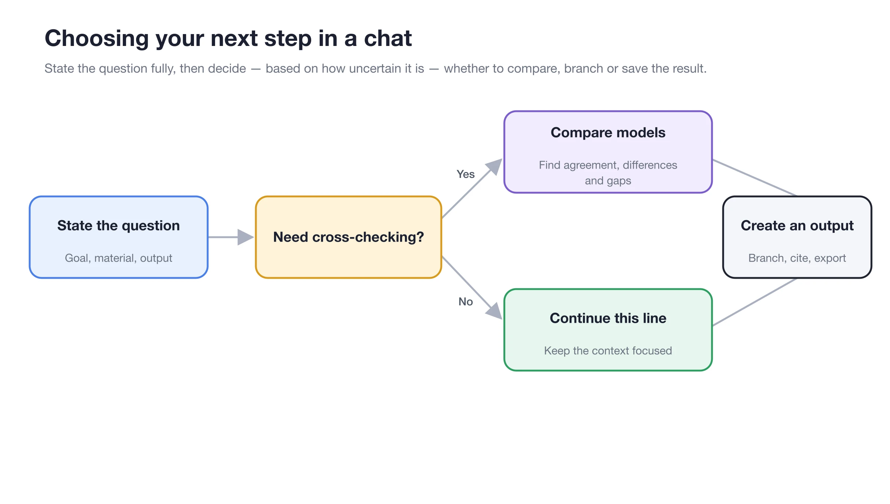

# Advanced Chat

【Chat】is designed for organizing thoughts while you interact. Beyond single-model Q&A, you can compare multiple models side-by-side, create branches from any message, manage long conversation contexts, and continue using files, images, code, and citations from replies as artifacts.


If a task requires continuous local file read/write, multiple tool calls, or long-running execution, use the Agent in 【Work】 instead. Chat is better suited for discussion, comparison, and finalizing drafts, while Agent is better suited for execution.


<figure><figcaption>
Write your question and output requirements completely first; add model comparison or message branches only when cross-validation is needed. 
</figcaption></figure>

## Choose Capabilities by Goal

| Goal | Recommended Approach |
| ------------- | --------------------- |
| Compare perspectives from different models | Select multiple models in the input area and send the same question |
| Preserve the original discussion while exploring another path | Create a branch from a key message |
| Continue a very long discussion | Check context usage; summarize and start a new topic if necessary |
| Queue the next question for later | Use the message queue to avoid interrupting the current reply |
| Continue processing files or code in a reply | Open the artifact preview, then download, copy, or continue in a new task |

<figure><figcaption>
The model selector allows you to choose one or more models for the same question. 
</figcaption></figure>

## Recommended Order



### 1. Write the Question Completely

Specify the goal, materials, constraints, and desired output format. Multiple models only amplify differences in the original question; they do not automatically fill in missing information.



### 2. Decide Whether Comparison Is Needed

Select multiple models only when you need different perspectives. For daily Q&A, stick to a single model for a clearer interface and easier usage control.



### 3. Consolidate Valid Conclusions

Save reusable materials to notes or the knowledge base; hand off work that requires further execution to the Agent, attaching the confirmed conclusions.



<table data-view="cards"><thead><tr><th></th><th></th><th data-hidden data-card-target data-type="content-ref"></th></tr></thead><tbody><tr><td><strong>Multi-Model Comparison and Message Branches </strong></td><td>Compare answers while preserving exploration paths </td><td><a href="model-compare-branches.md">model-compare-branches.md </a></td></tr><tr><td><strong>Long Conversations, Context, and Queued Messages </strong></td><td>Keep long conversations clear and controllable </td><td><a href="context-queue.md">context-queue.md </a></td></tr><tr><td><strong>Artifacts, Citations, and Export </strong></td><td>Review and take away truly useful results </td><td><a href="artifacts-export.md">artifacts-export.md </a></td></tr></tbody></table>
