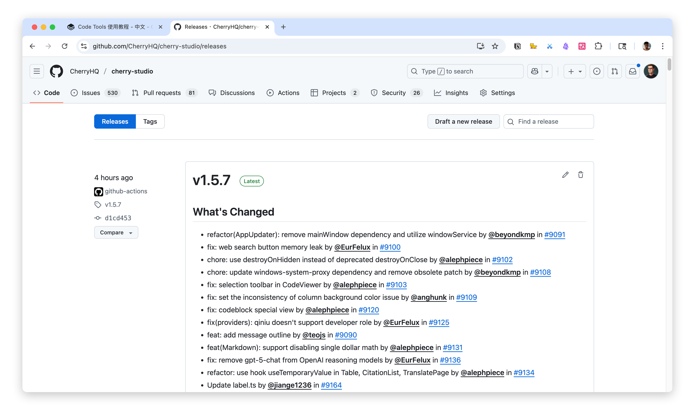
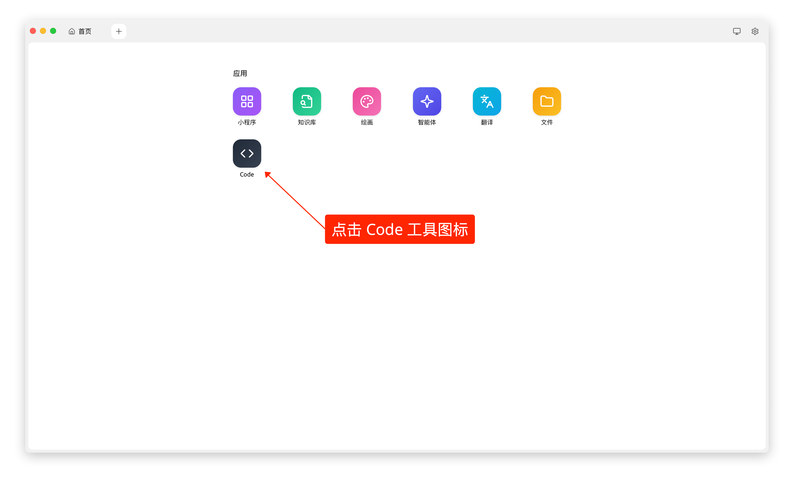
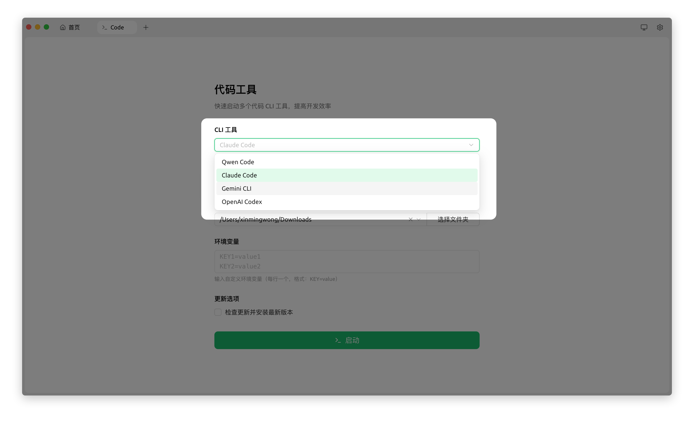
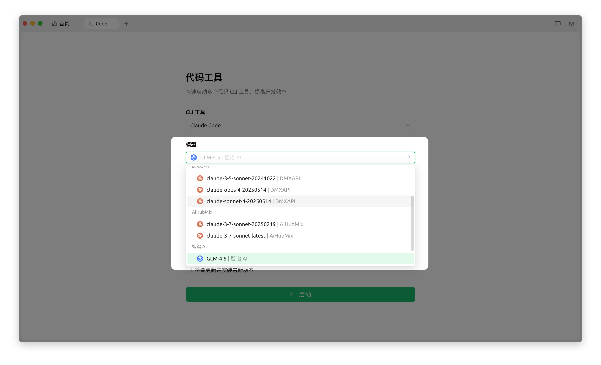
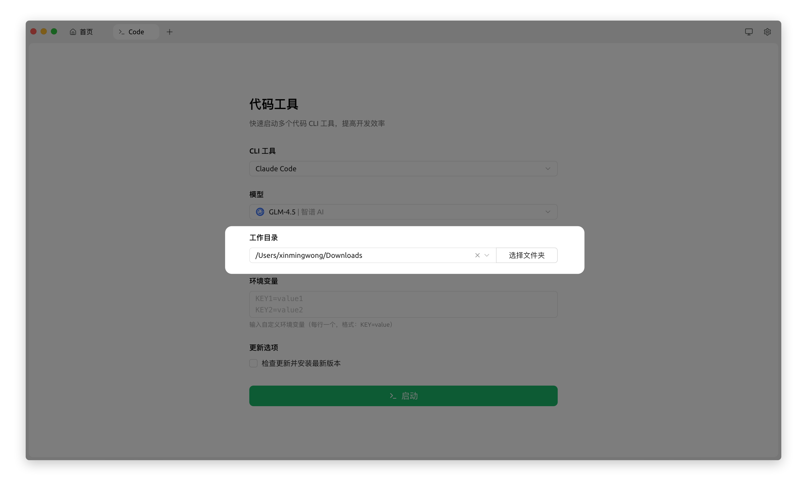
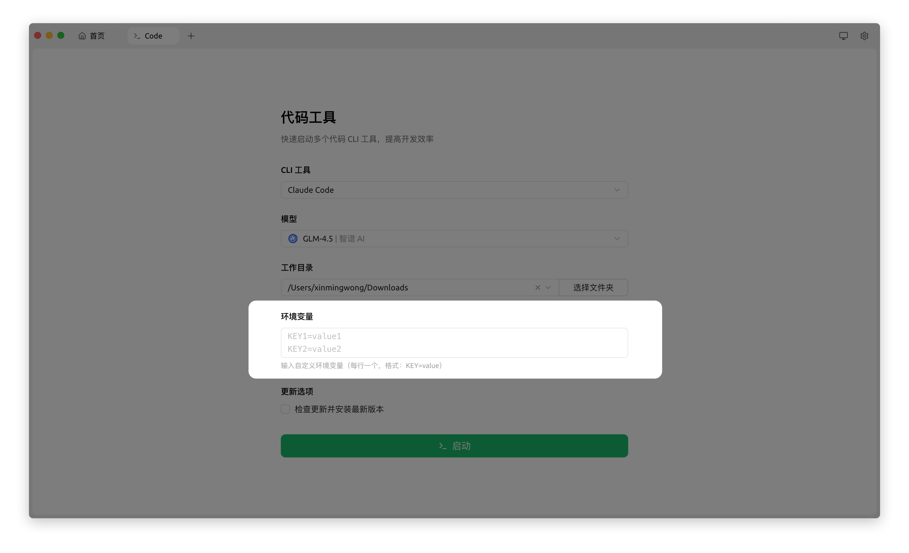
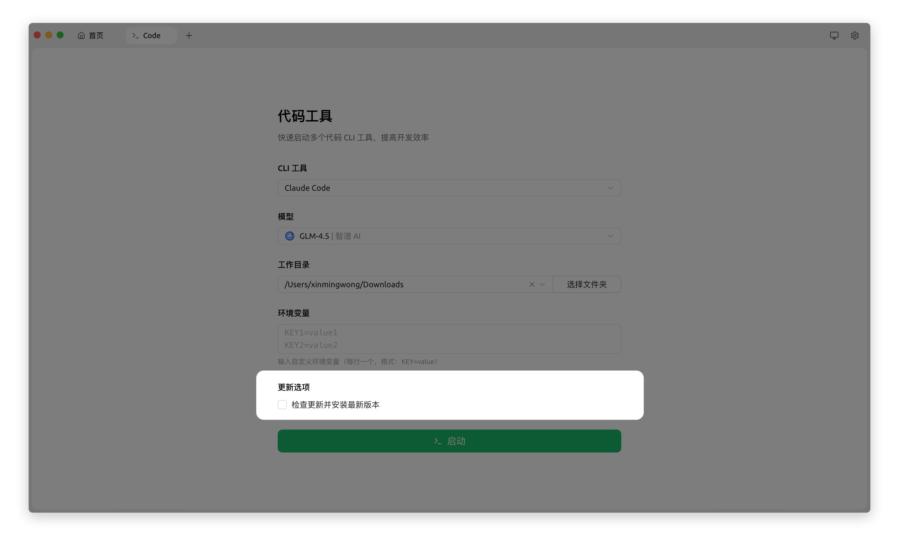
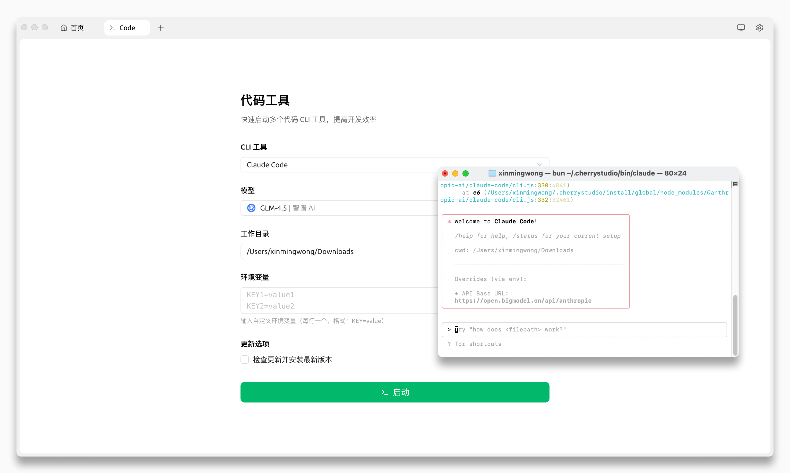

# Code Tools Usage Guide

Cherry Studio v1.5.7 introduces an easy-to-use and powerful Code Agent feature, allowing you to directly launch and manage various AI programming agents. This tutorial will guide you through the complete setup and launch process.

***

### Steps

#### 1. Upgrade Cherry Studio

First, please ensure your Cherry Studio has been upgraded to **v1.5.7** or a higher version. You can go to [GitHub Releases](https://github.com/CherryHQ/cherry-studio/releases) or the official website to download the latest version.

<figure><figcaption></figcaption></figure>

#### 2. Adjust Navigation Bar Position

To facilitate the use of the top tab feature, we recommend adjusting the navigation bar to the top.

*   Path: `Settings` -> `Display Settings` -> `Navigation Bar Settings`
*   Set the "Navigation Bar Position" option to **`Top`**.

<figure><figcaption></figcaption></figure>

#### 3. Create New Tab

Click the "+" icon at the top of the interface to create a new blank tab.

<figure><figcaption></figcaption></figure>

#### 4. Open Code Agent Functionality

In the newly created tab, click the `Code` (or `</>`) icon to enter the Code Agent configuration interface.

<figure><figcaption></figcaption></figure>

#### 5. Select CLI Tool

Based on your needs and API Key, select a Code Agent tool to use. Currently, the following are supported:

*   **Claude Code**
*   **Gemini CLI**
*   **Qwen Code**
*   **OpenAI Codex**

<figure><figcaption></figcaption></figure>

#### 6. Select Model for Agent Invocation

In the model dropdown list, select a model compatible with your chosen CLI tool. _(For detailed model compatibility instructions, please refer to "Important Notes" below)_

<figure><figcaption></figcaption></figure>

#### 7. Specify Working Directory

Click the "Select Directory" button to specify a working directory for the Agent. The Agent will have access to all files and subdirectories within this directory, allowing it to understand the project context, read files, and execute code.

<figure><figcaption></figcaption></figure>

#### 8. Set Environment Variables

*   **Automatic Configuration**: Your selections in Step 6 (Model) and Step 7 (Working Directory) will automatically generate the corresponding environment variables.
*   **Custom Addition**: If your Agent or project requires other specific environment variables (e.g., `PROXY_URL`, etc.), you can add them custom in this area.

<figure><figcaption></figcaption></figure>

#### 9. Update Options

*   **Built-in Executables**: Cherry Studio has integrated the executable files for all the Code Agents listed above, allowing you to use them directly without an internet connection in most cases.
*   **Automatic Updates**: If you want the Agent to always stay up-to-date, you can check the **`Check for updates and install the latest version`** option. When checked, the program will connect to the internet to check and update the Agent tool every time it starts.

<figure><figcaption></figcaption></figure>

#### 10. Launch Agent

Once all configurations are complete, click the **`Launch`** button. Cherry Studio will automatically call your system's built-in Terminal tool, load all environment variables into it, and then run your selected Code Agent. You can now interact with the AI Agent in the popped-up terminal window.

<figure><figcaption></figcaption></figure>

***

### Important Notes

1.  **Model Compatibility Instructions**:
    *   **Claude Code**: Requires selecting models that support the Anthropic API Endpoint format. Currently, officially supported models include:
        *   Claude series models
        *   DeepSeek V3.1 (Official API Platform)
        *   Kimi K2 (Official API Platform)
        *   Zhipu GLM 4.5 (Official API Platform)
        *   **Note**: Many current third-party service providers (such as One API, New API, etc.) mainly support the OpenAI Chat Completions format for DeepSeek, Kimi, and GLM API interfaces, which may not be directly compatible with Claude Code. Adaptation by service providers is required.
    *   **Gemini CLI**: Requires selecting Google's Gemini series models.
    *   **Qwen Code**: Supports models with the OpenAI Chat Completions API format. It is highly recommended to use the **`Qwen3 Coder`** series models for optimal code generation results.
    *   **OpenAI Codex**: Supports GPT series models (e.g., `gpt-4o`, `gpt-5`, etc.).
2.  **Dependencies and Environment Conflicts**:
    *   Cherry Studio integrates an independent Node.js runtime environment, Code Agent executables, and environment variable configurations, aiming to provide a clean, out-of-the-box environment.
    *   If you encounter dependency conflicts or unusual errors when launching the Agent, consider temporarily **uninstalling or disabling related dependencies already installed on your system** (e.g., globally installed Node.js or specific toolchains) to rule out conflicts.
3.  **API Token Consumption Warning**:
    *   **Code Agent consumes a very large amount of API Tokens**. When handling complex tasks, the Agent may generate numerous requests for thinking, planning, and code generation, leading to rapid Token consumption.
    *   Please be sure to **act within your means** based on your API quota and budget, and closely monitor Token usage to prevent budget overruns.

We hope this tutorial helps you quickly get started with Cherry Studio's powerful Code Agent functionality!