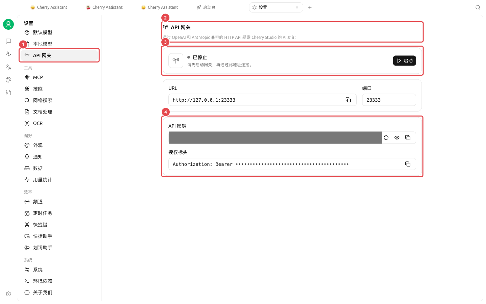

# Development and Diagnostics

This set of features is for users who need to manage coding CLIs, allow other local programs to call models, or troubleshoot request issues. Developer mode is not required for daily chat or content work.

### Two Entry Points

| Entry Point | Purpose | Verify Before Use |
| ----------------- | ---------------------------- | -------------- |
| Launchpad [Code Mate] | Install, configure, and launch common coding CLIs | Installation source, model connection, and working directory |
| [Settings] → [API Gateway] | Provide a compatible API to local programs; also a runtime dependency for Agent | Status, port, and key security |
| [Settings] → [General] → [Developer Mode] | Inspect the call chain to locate model and tool errors | Logs may contain sensitive content |

<figure><figcaption>
The API Gateway page centrally displays runtime status, address, port, and credentials. 
</figcaption></figure>


API Gateway keys and request content in the call chain may involve sensitive information. In screenshots, Issues, and group chats, share only necessary fragments with sensitive data redacted.


<table data-view="cards"><thead><tr><th></th><th></th><th data-hidden data-card-target data-type="content-ref"></th></tr></thead><tbody><tr><td><strong>API Gateway</strong></td><td>Understanding Agent Dependencies and Local API Calls</td><td><a href="api-gateway.md">api-gateway.md</a></td></tr><tr><td><strong>Call Chain and Developer Mode</strong></td><td>Reproducing and Locating a Specific Request</td><td><a href="trace.md">trace.md</a></td></tr></tbody></table>
