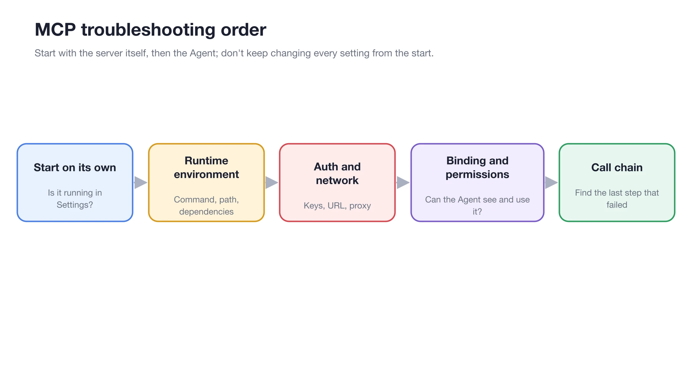

# Trace and Developer Mode

Trace is used to inspect model requests, tool calls, and MCP interactions within a conversation or Agent task. It is suitable for troubleshooting and performance analysis, but is not required for everyday chat.

<figure><figcaption>
When troubleshooting MCP calls, first verify the server and authentication, then use the trace to determine whether the request reached the Agent and tool execution stages. 
</figcaption></figure>

### How to Enable



#### 1. Open [Settings] → [General]

Enable [Enable Developer Mode] in the [Developer Mode] section.



#### 2. Restart Cherry Studio

Developer mode takes effect after a restart. Confirm the status of any running Agent tasks before restarting.



#### 3. Reproduce the Issue

Resend a minimal test message, keeping only the necessary models and tools to reduce unrelated calls.



#### 4. Open the Trace

Go to [Trace] in the right-side panel of the conversation or Agent. Select a node to view input, output, duration, and status. For Agent tasks, you can also see the Agent name, actions, and the number of tool calls.



### How to Read Common Nodes

| Node | Key Checks | Common Issues |
| -------- | ------------------ | ---------------- |
| Model Request | Model, input, output, Token, and status | Provider errors, context too long, empty output |
| Tool Call | Tool name, parameters, result | Parameter errors, permission waits, abnormal tool returns |
| MCP Call | Service name, connection type, input, and output | Server disconnection, authentication failure, remote errors |
| Agent Execution | Agent, actions, tool count, and status | Subtask failure, workflow not completed |
| HTTP Request | Method, URL, status, and response | Incorrect address, network or authentication issues |


Traces may contain prompts, file contents, request headers, and tool parameters. Before sharing screenshots or exporting information, you must remove API Keys, Authorization, Cookies, email addresses, local paths, and business data.


### User Case: MCP Tool Returns Empty Result

First, confirm the server is normal on the MCP settings page, then have the Agent call only one tool. If the trace shows the request reached the server but the output is empty, the issue is likely in server-side data or parameters, rather than the Agent not being bound. If there is no MCP node at all, go back to the Agent [MCP] settings to check the binding.

Why can't I see the trace after enabling it? 

Confirm that you have restarted the application and initiated a new request after the restart. Historical messages generated before enabling this feature will not automatically populate trace data.

Why can't I see the trace after enabling it? 

Confirm that you have restarted the application and initiated a new request after the restart. Historical messages generated before enabling this feature will not automatically populate trace data.

