# Call Chain Usage Instructions

## Feature Introduction

The call chain (also known as "trace") provides users with insight into conversations, helping them understand the specific performance of models, knowledge bases, MCP, web search, etc., during a conversation. It is an observability tool implemented based on [OpenTelemetry](https://opentelemetry.io/docs/languages/js/), which visualizes data by collecting, storing, and processing it on the client side, providing a quantitative evaluation basis for problem localization and performance optimization.

Each conversation corresponds to a trace data, and a trace consists of multiple spans. Each span corresponds to a processing logic in Cherry Studio, such as calling a model session, calling MCP, calling a knowledge base, or calling web search. Traces are displayed in a tree structure, with spans as tree nodes. The main data includes time consumption and token usage, and in the span details, specific inputs and outputs can also be viewed.

## Enable Trace

By default, after Cherry Studio is installed, Trace is hidden. It needs to be enabled in "Settings" - "General Settings" - "Developer Mode", as shown in the figure below:

<figure>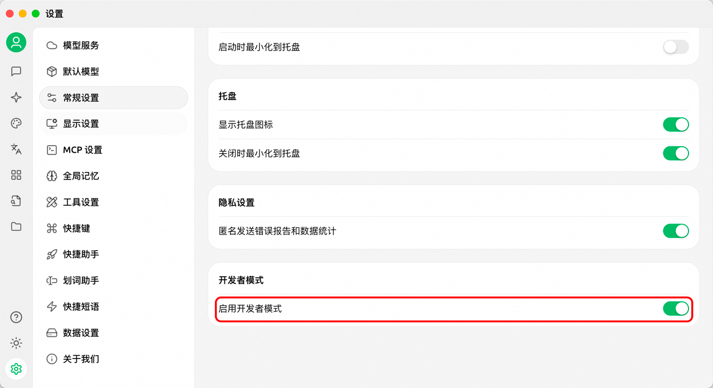<figcaption></figcaption></figure>

And no Trace records will be generated for previous sessions; Trace records will only be generated after new questions and answers. The generated records are stored locally. To thoroughly clear Trace, you can clear it via "Settings" - "Data Settings" - "Data Directory" - "Clear Cache", or by manually deleting files under `~/.cherrystudio/trace`, as shown in the figure below:

<figure>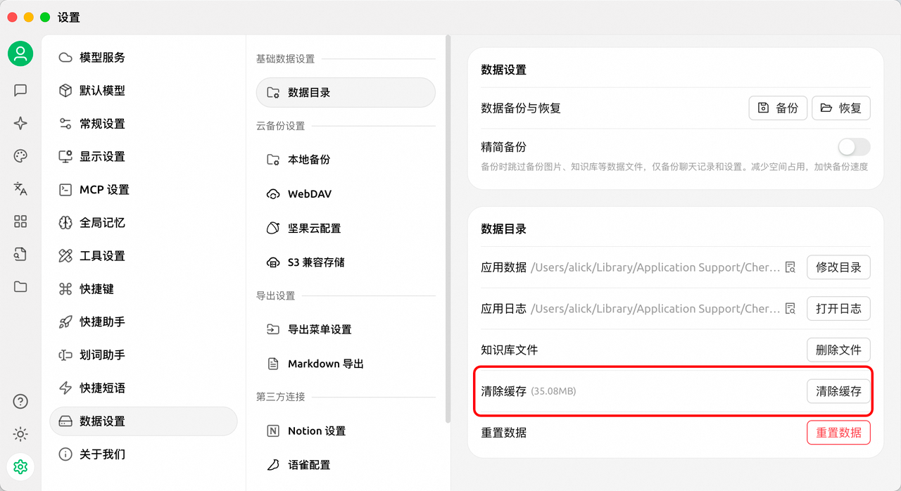<figcaption></figcaption></figure>

## Scenario Introduction

### View Full Link

Click the call chain in the Cherry Studio dialog box to view the full link data of the call chain. Whether the model, web search, knowledge base, or MCP was called during the conversation, the full link call data can be viewed in the call chain window.

<figure>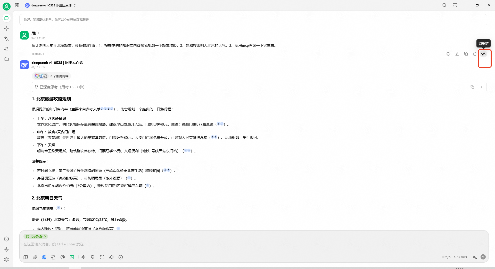<figcaption></figcaption></figure>

<figure>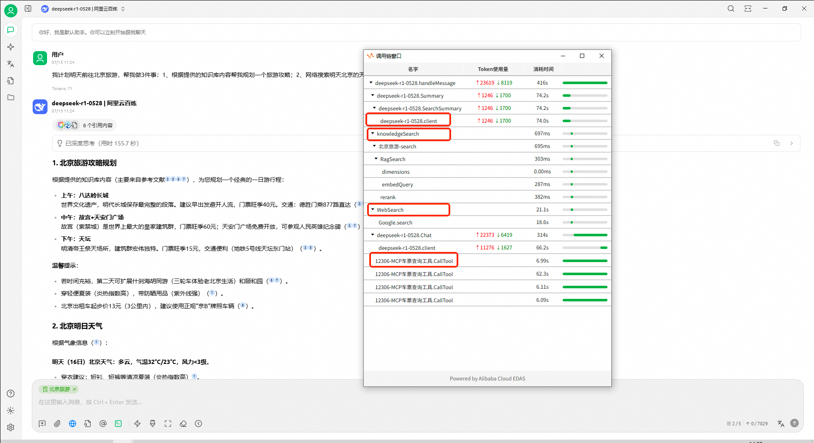<figcaption></figcaption></figure>

### View Model in Link

If you want to view the details of the model in the call chain, you can click on the model call node to view its input and output details.

<figure>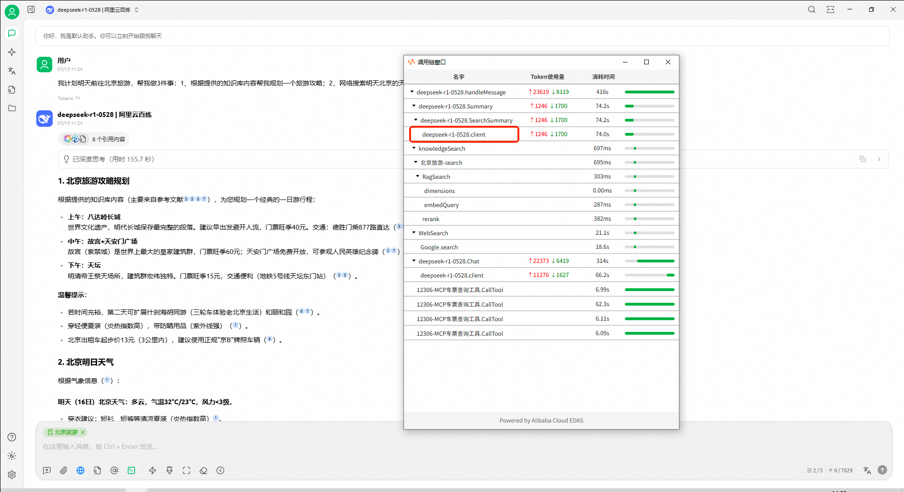<figcaption></figcaption></figure>

<figure>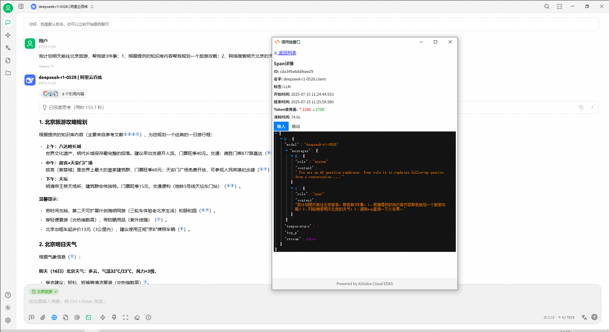<figcaption></figcaption></figure>

<figure>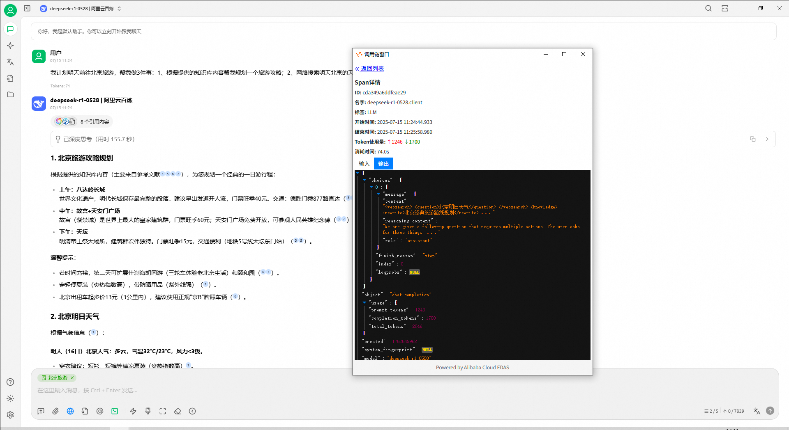<figcaption></figcaption></figure>

### View Web Search in Link

If you want to view the details of the web search in the call chain, you can click on the web search call node to view its input and output details. In the details, you can see the question queried by the web search and its returned results.

<figure><figcaption></figcaption></figure>

<figure>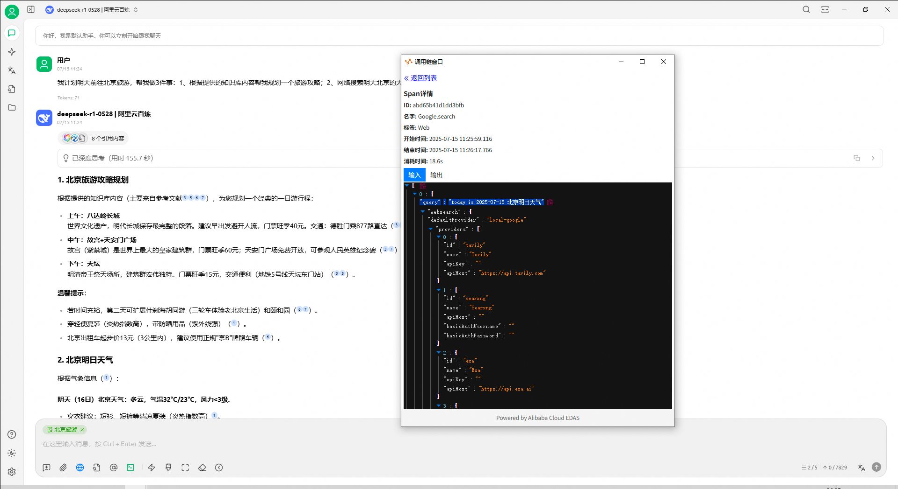<figcaption></figcaption></figure>

<figure>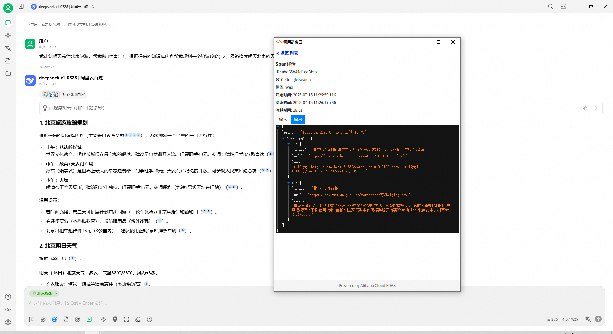<figcaption></figcaption></figure>

### View Knowledge Base in Link

If you want to view the details of the knowledge base in the call chain, you can click on the knowledge base call node to view its input and output details. In the details, you can see the question queried by the knowledge base and its returned answer.

<figure>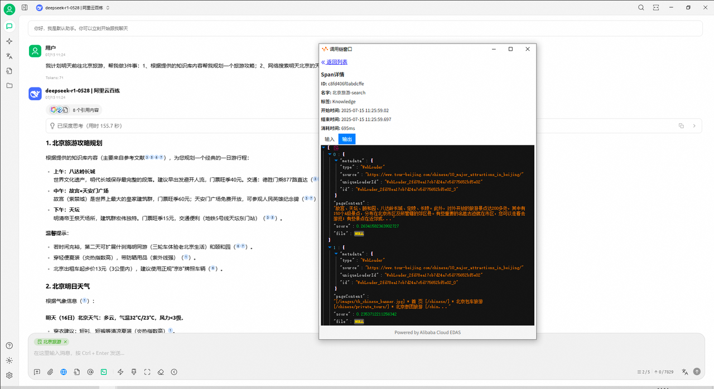<figcaption></figcaption></figure>

### View MCP Call in Link

If you want to view the details of MCP in the call chain, you can click on the MCP call node to view its input and output details. In the details, you can see the parameters passed to this MCP Server tool and the tool's return value.

<figure>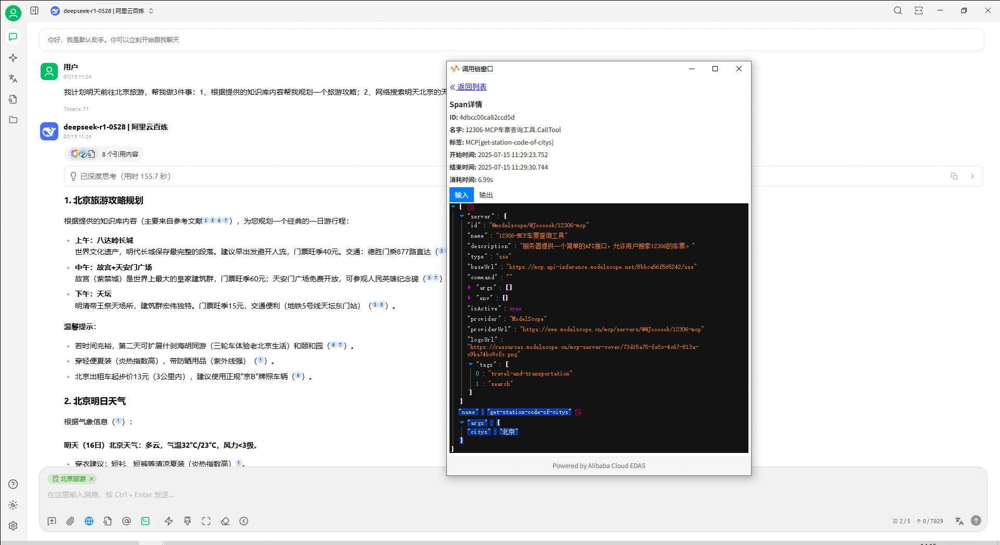<figcaption></figcaption></figure>

<figure>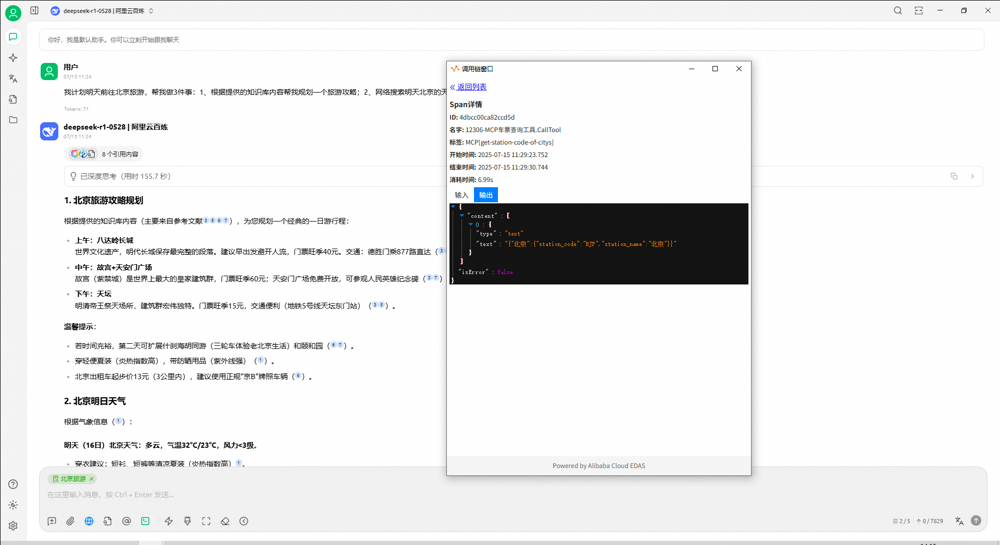<figcaption></figcaption></figure>

## Questions and Suggestions

This feature is provided by the Alibaba Cloud [EDAS](https://www.aliyun.com/product/edas) team. If you have any questions or suggestions, please join the DingTalk group (Group ID: 21958624) to communicate with the developers in depth.