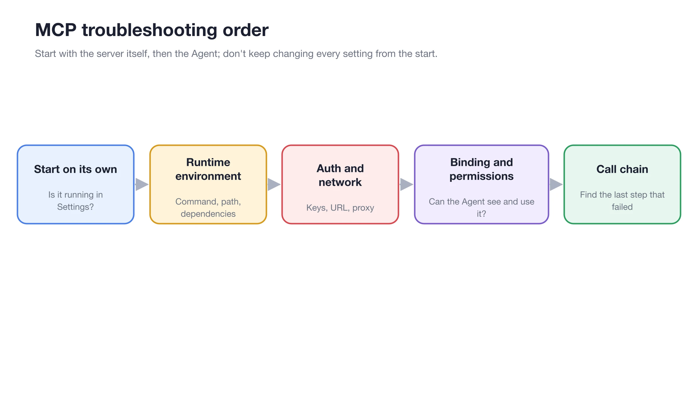

# MCP Troubleshooting

When an MCP server doesn't work, check it in order: first the server on its own, then the Agent that uses it. Changing several settings at once makes it hard to tell what fixed, or broke, things.

<figure><figcaption>
Work through the steps from left to right
</figcaption></figure>

## Troubleshooting Order



### 1. Does the Server Start on Its Own?

Open **Settings → MCP → MCP Servers** and check that the server is enabled and its status is normal. If it isn't, open the server details and read the logs before changing anything.



### 2. Runtime Environment

For local servers, check the command, arguments and paths exactly as the provider documents them. Many servers need `uv` or `bun`; if the logs say a command is not found, install it in [Settings → Dependencies](../../../pre-basic/settings/env-dependencies.md).



### 3. Authentication and Network

Check that API keys and other environment variables are filled in and still valid, and that the URL of a remote server is reachable. If you use a proxy, make sure it allows the server's address.



### 4. Binding and Permissions

Open **Work → Agent menu → Edit → MCP** and confirm the server is enabled for this Agent. Check that the tools you need are not turned off and that no permission request is waiting for approval. After changing the Agent configuration, send a new message so it loads the new tools.



### 5. Call Chain

If the tool is called but the result is wrong, find the last step that worked: look at the parameters the Agent sent and compare them with the tool's description and required parameters in the server details.



## Common Symptoms

| Symptom | Likely cause | What to check |
| --- | --- | --- |
| Server won't start | Wrong command or missing runtime | Logs, command and arguments, Settings → Dependencies |
| `command not found` (uv, bun, npx) | Runtime not installed | Install it in Settings → Dependencies |
| 401 or 403 errors | Missing or expired key | Environment variables and the provider's account |
| Timeouts | Remote server unreachable | URL, network and proxy |
| Server is connected, but the Agent can't find its tools | Not bound to this Agent, or tools disabled | Edit Agent → MCP, then send a new message |
| Agent calls the tool with the wrong input | Parameters misunderstood | Tool description and required parameters in the server details |


Do not paste API keys or full logs containing secrets into conversations, screenshots or public issues. Mask them first.


Should I delete and re-add the server?

First, check the logs and fix issues one by one. Only delete and recreate the server if the configuration is severely corrupted and the source can be re-obtained. Before deleting, save a copy of the configuration that does not contain secrets.

The server works in another app but not in Cherry Studio. Why?

The two apps may run it with different commands, paths or environment variables. Copy the exact configuration from the working app, then check that the runtime it relies on is available in Settings → Dependencies.

