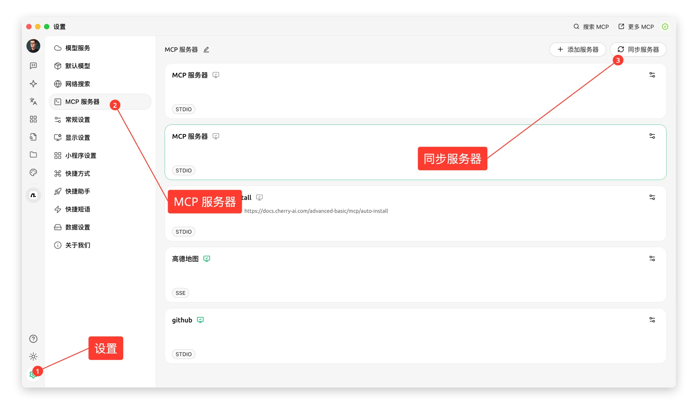
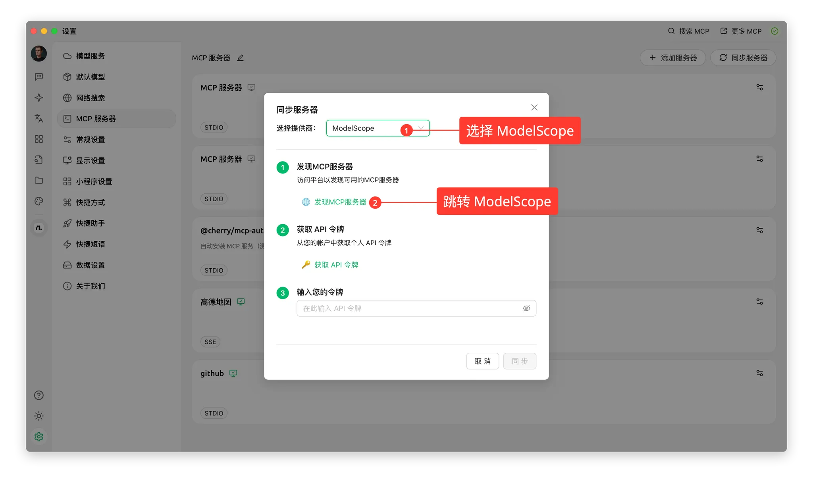
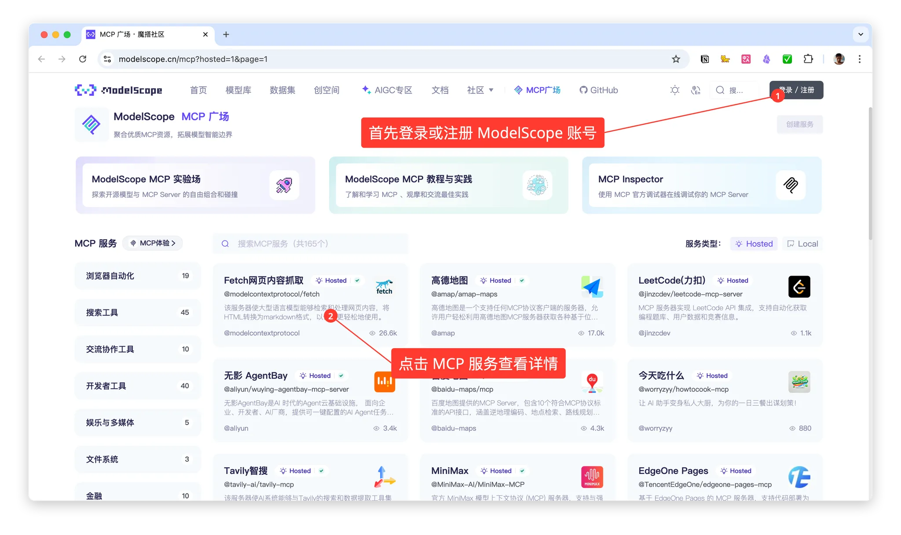
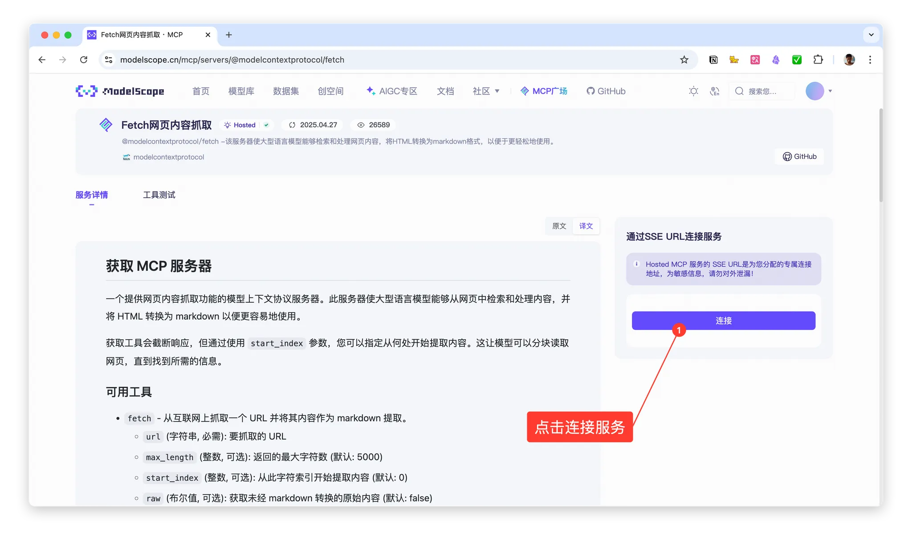
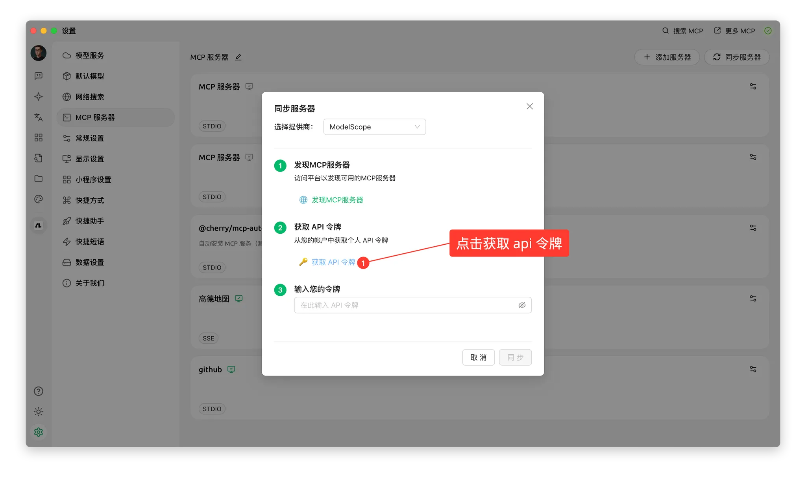
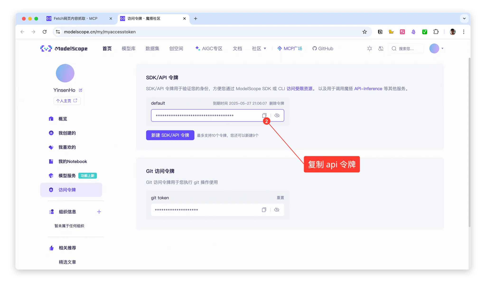
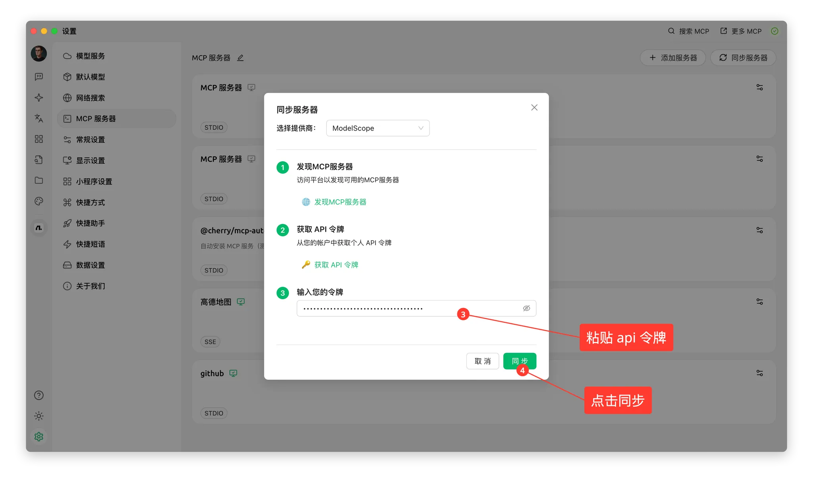
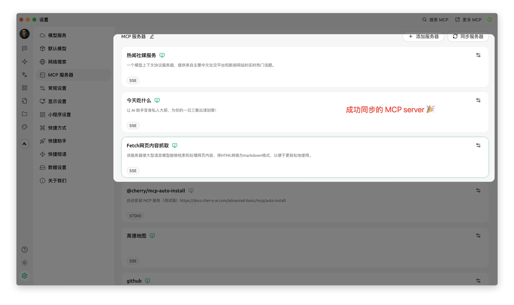
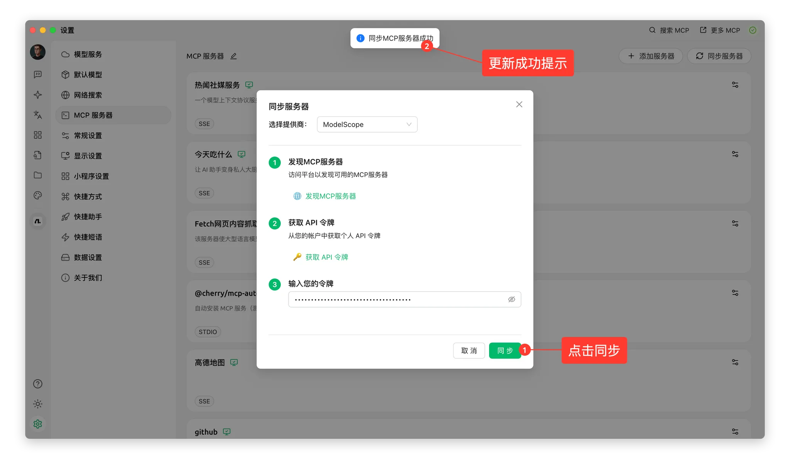

# Add ModelScope MCP Server


This document was translated from Chinese by AI and has not yet been reviewed.


> ModelScope MCP Server requires Cherry Studio to be upgraded to v1.2.9 or higher.

In version v1.2.9, Cherry Studio officially partnered with ModelScope Magic Tower, greatly simplifying the steps for adding an MCP server and avoiding configuration errors. Moreover, a vast number of MCP servers can be discovered in the ModelScope community. Follow the operating steps below to see how to synchronize ModelScope's MCP servers in Cherry Studio.

## Operating Steps

### Synchronization Entry:

Click on "MCP Server Settings" in Settings, then select `Synchronize Servers`.

<figure><figcaption></figcaption></figure>

### Discover MCP Services:

Select ModelScope and browse to discover MCP services.

<figure><figcaption></figcaption></figure>

### View MCP Server Details

Register and log in to ModelScope, then view the MCP service details;

<figure><figcaption></figcaption></figure>

### Connect to Server

In the MCP service details, select "Connect Service";

<figure><figcaption></figcaption></figure>

### Apply for and Copy-Paste API Token

Click "Get API Token" in Cherry Studio to jump to the ModelScope official website, copy the API token, and then return to Cherry Studio to paste it.

<figure><figcaption></figcaption></figure>

<figure><figcaption></figcaption></figure>

<figure><figcaption></figcaption></figure>

### Successfully Synchronized

In the Cherry Studio MCP server list, you can see the MCP service connected by ModelScope and invoke it in conversations.

<figure><figcaption></figcaption></figure>

### Incremental Updates

For newly connected MCP servers on the ModelScope website in the future, simply click `Synchronize Servers` to perform an incremental addition of MCP servers.

<figure><figcaption></figcaption></figure>

By following the above steps, you have successfully mastered how to conveniently synchronize ModelScope's MCP servers in Cherry Studio. The entire configuration process is not only greatly simplified, effectively avoiding the tediousness and potential errors of manual configuration, but also allows you to easily access the massive MCP server resources provided by the ModelScope community.

Start exploring and using these powerful MCP services to bring more convenience and possibilities to your Cherry Studio experience!