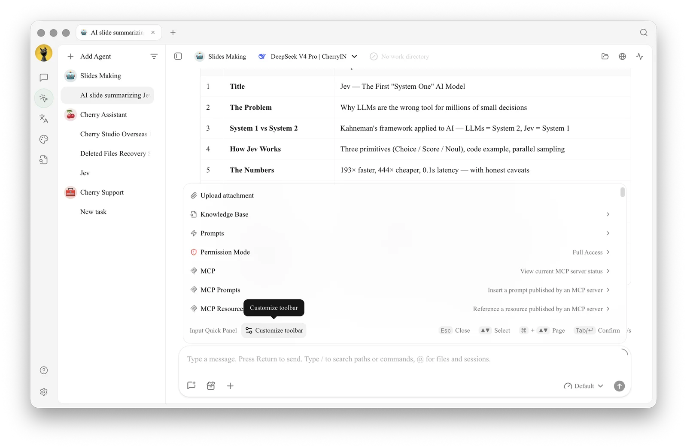
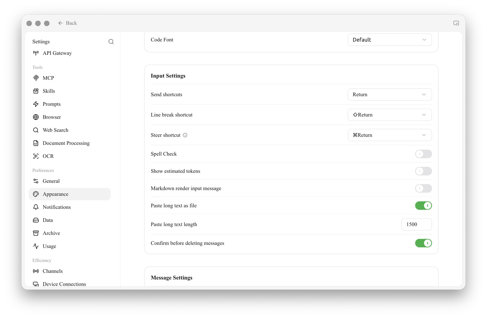

# Input Toolbar and Efficiency Tools

The input box is where most work starts. Besides typing, it gives quick access to attachments, knowledge bases, prompts, MCP and permissions, and you can tune its shortcuts to match how you work.

## Quick Access From the Input Box

| Action | What it does |
| --- | --- |
| Type `/` | Open tools and actions (in an Agent, it also searches paths and commands) |
| Type `@` | Reference other topics in Chat, or files and sessions in an Agent |
| Click **+** | Open the **Input Quick Panel** |

The Input Quick Panel lists what is available in the current conversation, such as **Upload attachment**, **Knowledge Base**, **Prompts**, **Permission Mode** (in an Agent), **MCP**, **MCP Prompts** and **MCP Resources**. Use the arrow keys to move, <kbd>Tab</kbd> or <kbd>Return</kbd> to confirm, and <kbd>Esc</kbd> to close.

<figure><figcaption>
The Input Quick Panel, with Customize toolbar at the bottom
</figcaption></figure>

## Customize the Toolbar

Click **Customize toolbar** at the bottom of the Input Quick Panel to pin the tools you use most to the toolbar under the input box, so they are one click away.

The Chat, Agent, Quick Assistant, and Drawing pages support different tools, and the pinned layouts for Chat and Agent are saved separately.

## Input Settings

Open **Settings → Appearance → Input Settings** to adjust how the input box behaves:

| Setting | Default | What it does |
| --- | --- | --- |
| Send shortcuts | <kbd>Return</kbd> | The key that sends a message |
| Line break shortcut | <kbd>Shift</kbd> + <kbd>Return</kbd> | The key that starts a new line |
| Steer shortcut | <kbd>Cmd</kbd> + <kbd>Return</kbd> | Sends a message that redirects an Agent while it is still running |
| Spell Check | Off | Underlines spelling mistakes in the input box |
| Show estimated tokens | Off | Shows an estimate of the tokens your message will use |
| Markdown render input message | Off | Renders Markdown in messages you send |
| Paste long text as file | On | Pastes long text as an attachment instead of filling the input box |
| Paste long text length | 1500 | The character count above which pasted text becomes a file |
| Confirm before deleting messages | On | Asks before a message is deleted |

<figure><figcaption>
Settings → Appearance → Input Settings
</figcaption></figure>


If you often paste logs or long documents, keep **Paste long text as file** on: the conversation stays readable and the content is still sent to the model.


Why do pinned tools not appear in another input area?

The Chat, Agent, Quick Assistant, and Drawing pages support different tools. The pinned layouts for Chat and Agent are saved separately. Open [Customize toolbar] again in the target input area.

What is the difference between the steer shortcut and the message queue?

The steer shortcut changes the direction of an Agent that is already running. The [message queue](../chat/context-queue.md) holds your next request and sends it after the current reply finishes.

