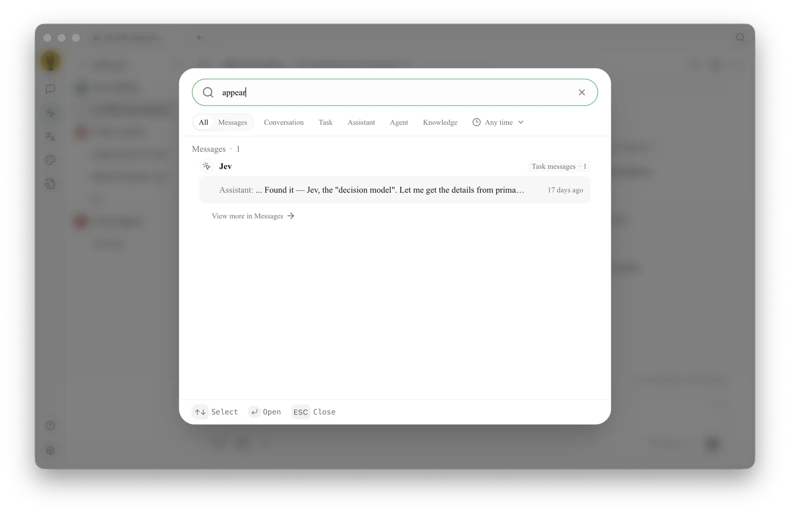

# Global Search

Global Search lets you find messages, conversations, tasks, assistants, Agents, and knowledge bases from a single entry point. It is ideal for when you remember the content but not where it is located.

<figure><figcaption>
Start with distinctive keywords, then narrow the results by type (such as conversations or knowledge bases) and update time. 
</figcaption></figure>

## Usage



### 1. Click the search button at the top of the window

You can also view or modify the corresponding shortcut in [Settings] → [Shortcuts].



### 2. Enter distinctive keywords

Prioritize project names, person names, file topics, or phrases from conclusions. Entering common words like "settings" or "report" usually yields too many results.



### 3. Narrow the search scope

Switch to [Messages] or use the [Conversation], [Task], [Assistant], [Agent], or [Knowledge] tabs, then narrow the time range with [Any time].



### 4. Open the result to continue working

Search takes you back to the corresponding content. Check the type before opening to avoid confusing assistants with Agent tasks of the same name.



### Use Case: Retrieving Last Month's Client Conclusion

Search for the client project name, then narrow the type to [Messages] and limit the update time. Once you find the conclusion, open the original conversation and check for any subsequent revisions. If you need to use the conclusion for a new task, copy the confirmed summary rather than relying on scattered fragments from memory in a new conversation.

Why can't I find file contents on the disk? 

Global Search primarily finds content already saved in Cherry Studio. Files on the disk must first be processed through the Agent working directory, knowledge base, or notes workflow before they can be found via the corresponding entry points.

