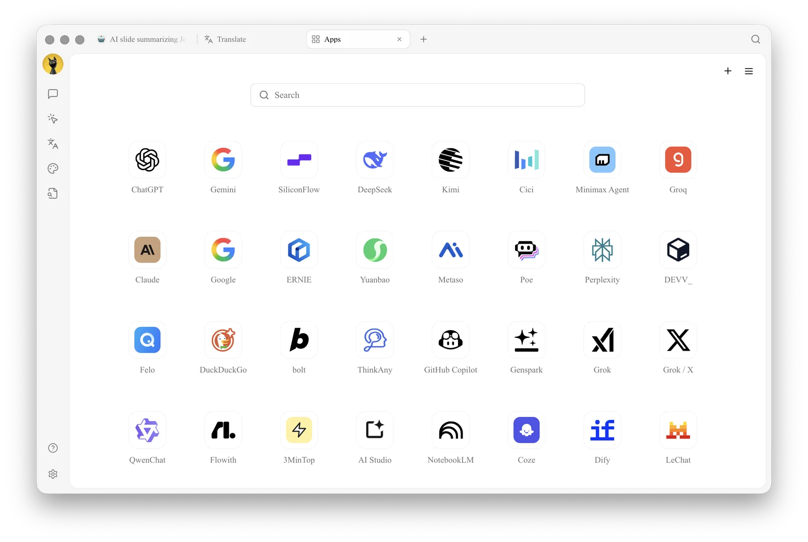
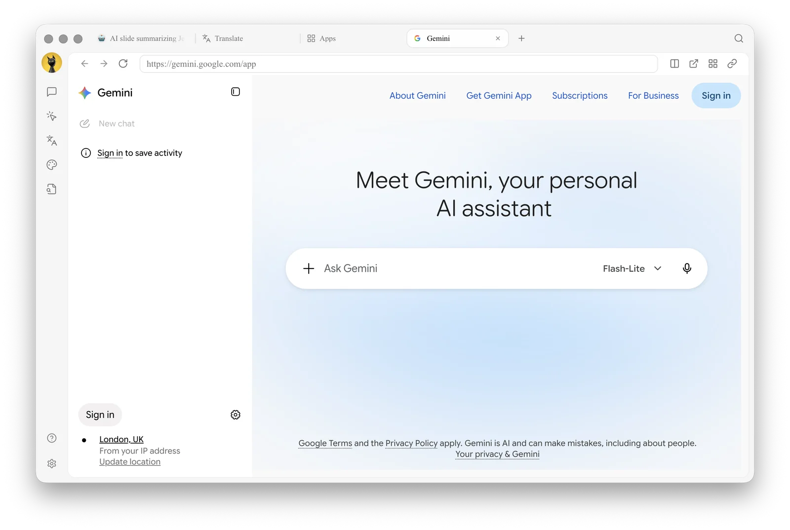

# Mini Apps

【Mini Apps】enable web services and locally installed utilities to run within Cherry Studio. In addition to opening web interfaces from various AI providers, you can install custom generative mini apps that call AI models configured in Cherry Studio through authorized APIs.

### Distinguish Between Two Types of Mini Apps

| Type | How to Add | Can Call Cherry AI | Use Cases |
| ----- | ---------------------------- | -------------- | ----------------------------------- |
| Website | Enter name, URL, and Logo | No | Pin frequently used websites to Cherry Studio, preserving each site's own login state |
| Local Mini App | Install `.miniapp` package, or install from a developer-provided URL | Yes, with authorization during installation | Custom AI writing, summarization, translation, information extraction, and vertical workflows |


If you want to create a "custom mini app that can call Cherry AI," use 【Local Mini App】 rather than just entering a URL in 【Website】. See the full tutorial at [Generative Mini Apps](generative-mini-apps.md).


### Access Mini Apps



### Open the Launcher

Click `+` in the top Tab bar, or open 【Launcher】 directly.



### Enter Mini Apps

Click the 【Mini Apps】 app icon.



### Select a Service

Select the service you want to open from the mini app grid.



<figure><figcaption>
Mini app grid, built-in with dozens of services; click <code>+</code> in the top right to add any webpage
</figcaption></figure>

There is a **search box** in the middle of the page; `+` in the top right is used to add custom webpages, and `☰` opens 【Mini App Display Settings】.

### Settings

In 【Settings】→【Mini Apps】, you can make the following adjustments:

* **Show / Hide Mini Apps**: Drag mini apps left or right into two areas to control visibility
* **Sort Mini Apps**: Drag up or down to sort mini apps
* **Mini App Area Filtering**: Automatically hide mini apps you cannot access based on your selection
* **Mini App Cache Count**: If the number of simultaneously open mini apps exceeds this count, some mini apps will enter an inactive state

### Add and Manage

Cherry Studio mini apps support the following operations:

* **Add to Launcher**: Add frequently used mini apps to the Launcher for quick access from the `+` entry. Manage in 【Settings】→【Mini Apps】, or right-click a mini app icon and select **Add to Launcher**
* **Add to Sidebar**: Pin frequently used mini apps to the left sidebar for one-click access; right-click a mini app icon to select **Add to Sidebar** or **Remove from Sidebar**
* **Keep Alive**: Prevent the mini app window from being destroyed immediately when switching away, so you don't need to log in or reload again when returning
* **Add Website**: Click `+` in the top right of the page, enter the name, URL, and Logo in 【Website】, and it will be added to the grid
* **Install Local Mini App**: Click `+` in the top right of the page, switch to 【Local Mini App】, select the `.miniapp` package, or enter the installation URL provided by the developer. Complete the installation after confirming permissions
* **View Local Mini App Details**: Right-click a local mini app and select 【View Details】 to manage permissions, AI models, storage space, activity logs, and updates
* **Delete / Edit**: Website-type mini apps can be edited or deleted via right-click; local mini apps can be uninstalled in 【View Details】

After opening a mini app, its window includes a toolbar: **Back**, **Forward**, **Refresh**, **Open in Browser**. You can also switch whether in-page links open in the default window or in the system browser.

<figure><figcaption>
Mini app window toolbar: Back / Forward / Refresh on the left, Open in Browser, Add to Launcher, and in-page link opening method on the right
</figcaption></figure>

### Tips and Tricks

* Website-type mini apps use the service's web version; login state, Cookies, and settings are saved locally and isolated from the system browser
* Local mini apps run in an independent sandbox and cannot read files from other mini apps or anywhere on your computer; only authorized capabilities can be invoked
* If a mini app fails to load, right-click → Refresh, or check proxy settings (see [General Settings](../../../pre-basic/settings/general.md))

<table data-view="cards"><thead><tr><th></th><th></th><th data-hidden data-card-target data-type="content-ref"></th></tr></thead><tbody><tr><td><strong>Generative Mini Apps</strong></td><td>Create, install, and manage custom mini apps that can call Cherry AI</td><td><a href="generative-mini-apps.md">generative-mini-apps.md</a></td></tr></tbody></table>

If you encounter any issues, please submit feedback via [Feedback and Suggestions](../../../question-contact/suggestions.md).

***

### Get Help and Submit Feedback

If you have any questions, bugs, or feature improvement suggestions during configuration or usage, please refer to the official channels provided in [Feedback and Suggestions](../../../question-contact/suggestions.md).
