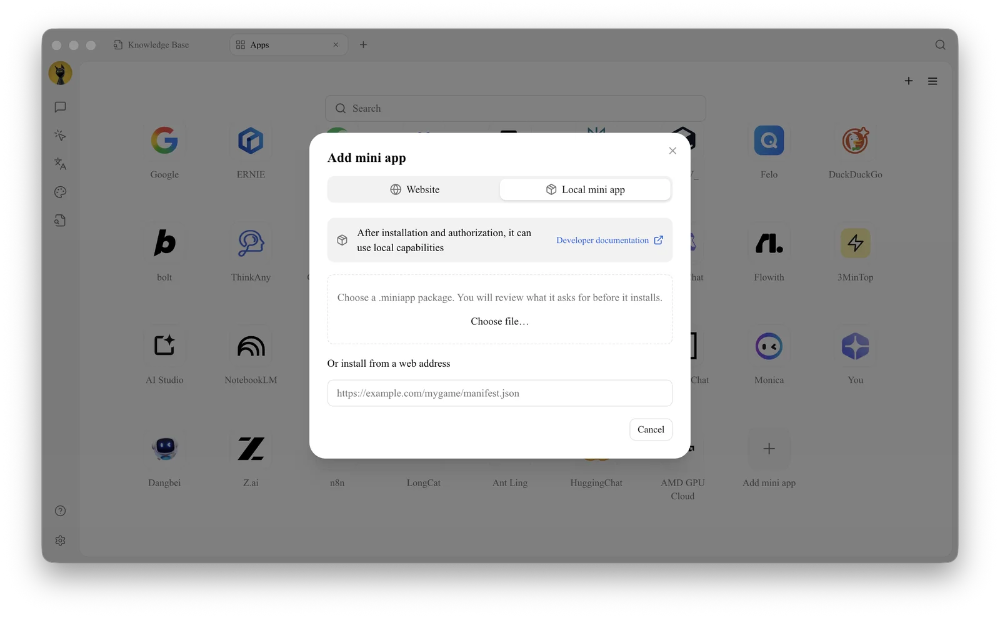

# Generative Mini Apps

Generative Mini Apps are local web apps that run inside Cherry Studio's [Mini Apps](README.md). Unlike website mini apps, which simply open a URL, a generative mini app is installed from a `.miniapp` package and — with your permission — can call the AI models you have configured in Cherry Studio, turning a general model into a dedicated writing, extraction or learning tool.

## Install a Generative Mini App

1. Open **Apps**, then click the **Add mini app** tile at the end of the grid (or `+` in the top-right corner) and switch to **Local mini app**.
2. Drag in a `.miniapp` package or click **Choose file…**. If the developer provides an HTTPS installation URL, paste it under **Or install from a web address** instead.

<figure><figcaption>
Local mini apps can be installed from a file or a URL
</figcaption></figure>

3. Review the name, description and requested permissions, then click **Install**. Only install mini apps from sources you trust, and check that the permissions match what the app is for.
4. The mini app appears in the **Apps** grid; click its icon to run it.


To manage an installed mini app — permissions, AI models, storage or updates — right-click it in the **Apps** grid and choose **View Details**.


***

### Get Help and Submit Feedback

If you have any questions, bugs, or feature suggestions during configuration or use, please use the official channels listed in [Feedback and Suggestions](../../../question-contact/suggestions.md).
