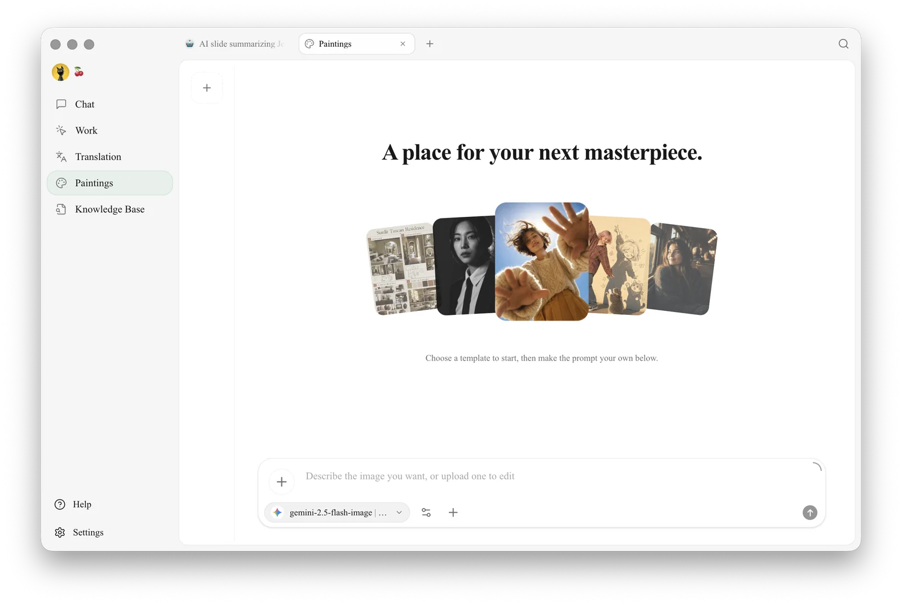
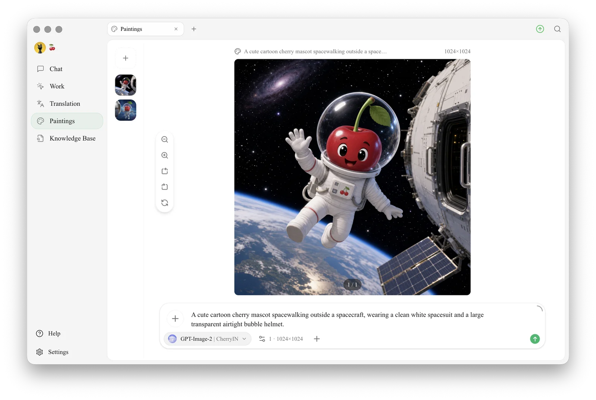
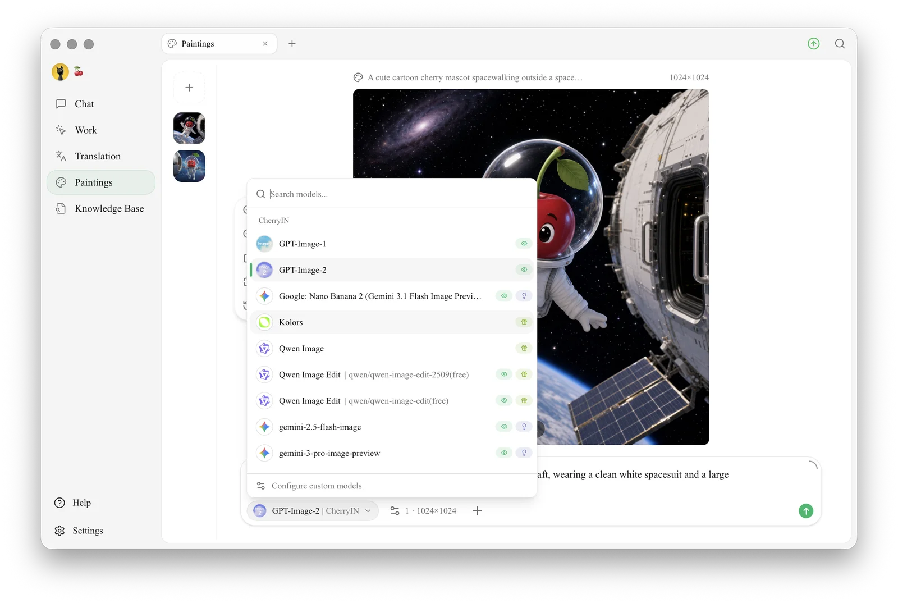

# Painting

The Paintings page is Cherry Studio's built-in **text-to-image tool**: describe what you want in words and get an image back, much like web services such as Midjourney or DALL·E. **Its main advantage is that it reuses the provider accounts you have already configured in Cherry Studio**, so you don't need to sign up for each platform separately.

## Open Paintings

Click **+** on the right side of the top tab bar to open the **Launchpad**, then click **Paintings**.

<figure><figcaption><p>The Paintings page: the canvas list on the left, the canvas in the middle (templates to start from when empty), and the input area at the bottom with the model selector</p></figcaption></figure>

The page consists of these parts:

* **Canvas list (left)**: thumbnails of your canvases, arranged vertically. Click `+` at the top to create a new canvas and switch to a new group
* **Canvas (middle)**: shows the image currently being generated
* **Input area (bottom)**: the prompt box, with a **provider and model selector** on one side. Below it, a hint tells you whether the current provider has any image models available; if not, a green `Go to Settings` button takes you straight to that provider's configuration page
* **Generate / Edit**: there is no separate toggle — **the selected model decides**. Choose a text-to-image model (such as `qwen-image`) to generate; choose an image-editing model (such as `qwen-image-edit`) to edit, which means uploading an image first and then describing the changes

<figure><figcaption><p>A generated image on the canvas; the input area shows the prompt, the model (here GPT-Image-2 | CherryIN) and the image count and size</p></figcaption></figure>

After you select an **image-editing model** (such as `qwen-image-edit`), the input area switches to an "upload an image + describe the edit" mode.

## Supported Providers

Painting in Cherry Studio relies on the **image models** offered by each provider. The model dropdown lists every option currently available to you, grouped by provider:

<figure><figcaption><p>The model dropdown lists available image models by provider, with a search box at the top and "Configure custom models" at the bottom</p></figcaption></figure>

They fall roughly into three groups:

| Type | Provider | Notes |
|---|---|---|
| Cloud services in China | **[SiliconFlow](../../pre-basic/providers/siliconcloud.md)** | Easiest to access from mainland China, low prices, wide model choice |
| | **PPIO** | Cloud compute service in China |
| | **Zhipu Open Platform** | Chinese model CogView |
| Aggregation gateways | **AiHubMix** | Gateway aggregating multiple vendors |
| | **DMXAPI** | Gateway aggregating multiple vendors |
| | **TokenFlux** | Overseas gateway |
| | **CherryIN** | Cherry's official gateway with unified billing |
| | **AiOnly** | Third-party gateway |
| Self-hosted / local | **New API** | Self-hosted gateway; appears in this list once added |
| | **OVMS** | OpenVINO Model Server for local inference (shown only while OVMS is running) |


Any custom provider whose **endpoint type is set to `Image Generation (OpenAI)`** appears here automatically. More providers will be added over time.


## Start Painting

1. Select a configured **provider and model** in the input area. If you see "No image generation models available", click `Go to Settings` and add a model with the endpoint type **Image Generation (OpenAI)** under that provider
2. Choose a **text-to-image model** (such as `qwen-image`) and type a **prompt** in the input box (Chinese or English both work — the more specific, the better), for example:
   ```
   An orange cat wearing round glasses sitting on a pile of books, vintage oil painting style, warm dusk light
   ```
3. Adjust the parameters (size, steps, seed, etc.). If you're unsure, keep the defaults
4. Click **Generate** and wait a few seconds to a few tens of seconds, depending on the model
5. The generated image appears on the canvas, where you can download it, favorite it, or generate another one with one click


Don't want to pick a model in the input area every time? Go to **Settings → Default Model → Painting Model** and set a default **image generation model** (described as "the model used for image generation"). Paintings will then use it by default.


## How to Fill In the Parameters

Some fields in the parameter panel have an **ⓘ info icon** on the right; hover over it to see an explanation (providers such as SiliconFlow, AiHubMix and PPIO mostly have these). However, **not every provider** includes tooltips — the Zhipu and NewAPI panels, for example, have none. If there's no explanation, just try the defaults below.

If you want to go deeper:

* **Size**: affects the amount of detail and the generation time. 1024x1024 is enough for everyday use
* **Steps**: how many times the model "refines" the image. 20–30 steps is usually enough; more gives diminishing returns
* **CFG / Guidance**: how closely the AI follows your prompt. 7–12 is a common range
* **Seed**: a fixed seed makes results reproducible; leave it empty to see random variations of the same prompt

## Tips and Tricks

* **English prompts usually work better** (most models are trained mainly on English data)
* Be specific: include the style, composition, lighting and camera angle
* Want to "edit based on a reference image"? Check whether your provider supports **img2img** (image-to-image)
* Generate 4 images at once to save time: set the "batch count" to 4


The Paintings feature expands with each release. The dropdown in the app always shows the currently supported providers.



Gemini image models (such as `gemini-2.5-flash-image`) can be selected directly in the Paintings model dropdown once a Gemini-compatible provider is configured. You can also generate images with them in a regular chat.


***

### Get Help and Submit Feedback

If you have any questions, bugs, or feature suggestions during configuration or use, please use the official channels listed in [Feedback and Suggestions](../../question-contact/suggestions.md).
