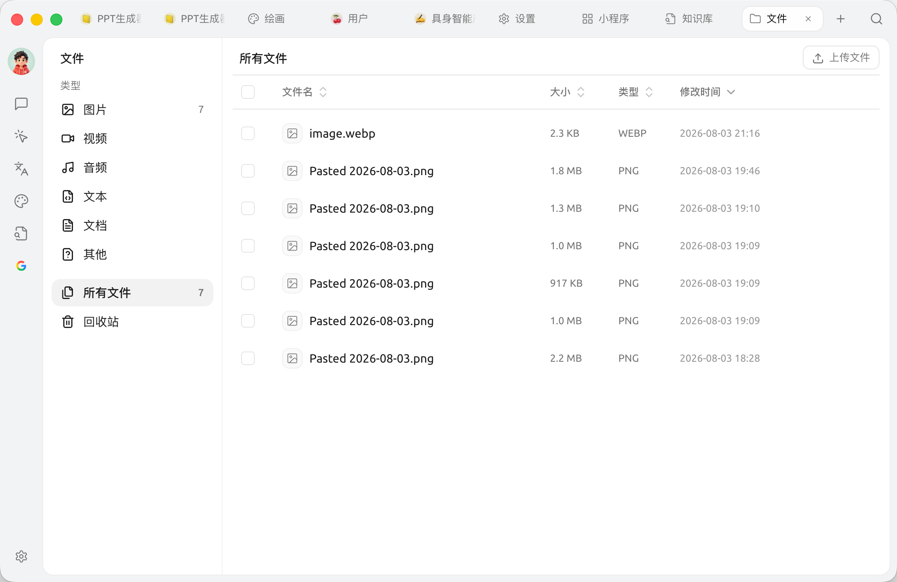
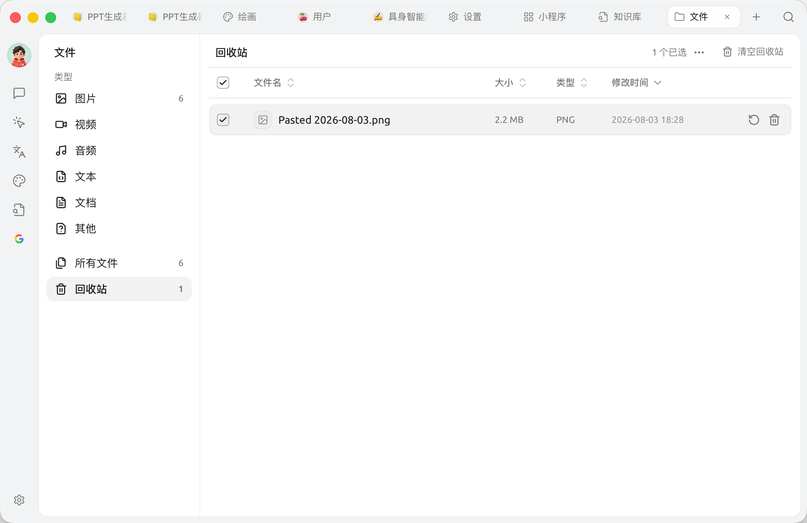

# Files

The Files page is Cherry Studio's **central attachment store**. Images, PDFs and documents you drag into chats, images generated in Paintings, and materials imported into knowledge bases can all be viewed and managed here in one place.

Think of it as the "My Computer" inside Cherry Studio.

## Open the Files Page

Click `+` in the top tab bar → **Launchpad** → **Files**.

<figure><figcaption>
The Files page: categories by type on the left, sorting and select all / multi-select at the top
</figcaption></figure>

## What You Can Do Here

* **Filter by type**: the left side groups files by type — `Documents`, `Images`, `Text`, `Audio`, `Video`, `Other` and `All Files`
* **Sort**: the top bar sorts by `File Name`, `Size`, `Type` or `Modified Time`
* **Batch actions**: use the `Select All` checkbox in the top right together with the `⋯` menu to delete in bulk
* **Upload**: drag files straight onto the page, or click `Upload File`
* **Preview**: click a file to preview it (images, PDFs and other supported formats)
* **Rename**: right-click → Rename
* **Delete**: right-click → Delete. Deleted files go to the **Trash** first (see below)
* **Show in folder**: right-click → **Open Containing Folder** (Finder on macOS, File Explorer on Windows)


If a file is marked as **Missing**, its original local file has been moved or deleted. For such files you can only locate them or remove the record from the library.


## Trash

A deleted file doesn't disappear right away — it goes to the **Trash** first. In the Trash you can:

* **Restore**: put an accidentally deleted file back where it was
* **Delete permanently**: remove a single file for good
* **Empty Trash**: permanently remove everything in the Trash at once

<figure><figcaption>
Trash: restore, delete permanently, or empty everything
</figcaption></figure>


**Permanent deletion cannot be undone.** Deleting a file also removes its references from every related message, so double-check before you do it.


## Where Are Files Stored?

Cherry Studio stores all attachments in the local app data directory:

* **macOS**: `~/Library/Application Support/CherryStudio`
* **Windows**: `%APPDATA%\CherryStudio`
* **Linux**: `~/.config/CherryStudio`

Want to move it to another drive? See [Change Storage Location](../../../../pre-basic/personalization-settings/storage.md).

## Tips and Tricks

* Old conversations and knowledge bases accumulate files over time; clearing them out here now and then can free up a lot of disk space
* For important files, also back them up to cloud storage (WebDAV, S3, etc.) — see [Data Settings](../../../../pre-basic/data-settings)
* Garbled file names? This is usually an encoding issue when dragging files in from elsewhere; rename the file before using it

***

### Get Help and Submit Feedback

If you have any questions, bugs, or feature suggestions during configuration or use, please use the official channels listed in [Feedback and Suggestions](../../../../question-contact/suggestions.md).
