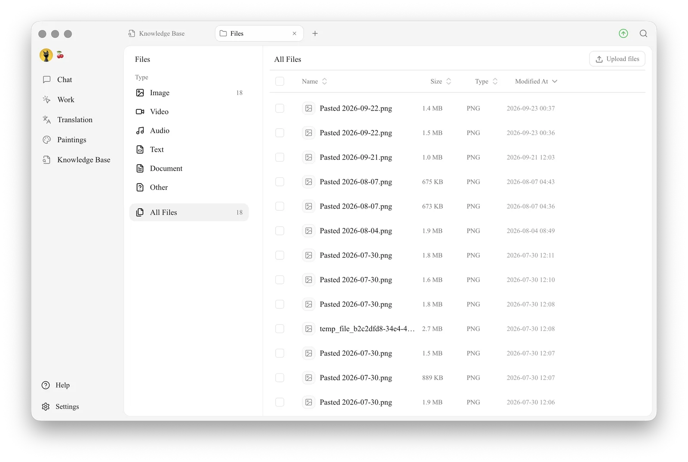
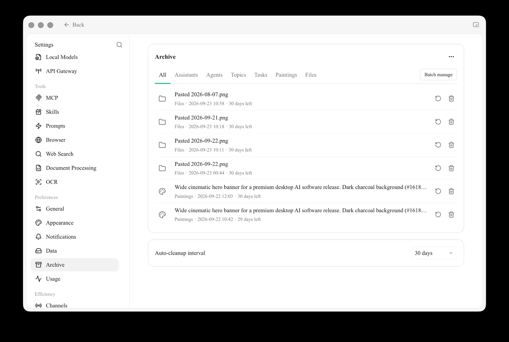

# Files

The Files page is Cherry Studio's **central attachment store**. Images, PDFs and documents you drag into chats, images generated in Paintings, and materials imported into knowledge bases can all be viewed and managed here in one place.

Think of it as the "My Computer" inside Cherry Studio.

## Open the Files Page

Click `+` in the top tab bar → **Launchpad** → **Files**.

<figure><figcaption>
The Files page: file types on the left; a sortable list with checkboxes and <strong>Upload files</strong> on the right
</figcaption></figure>

## What You Can Do Here

* **Filter by type**: the left side groups files by type — `Image`, `Video`, `Audio`, `Text`, `Document`, `Other` and `All Files`
* **Sort**: click a column header to sort by `Name`, `Size`, `Type` or `Modified At`
* **Batch actions**: tick the checkboxes next to files (or the one in the header to select all) to act on several files at once
* **Upload**: drag files straight onto the page, or click `Upload files` in the top right
* **Preview**: click a file to preview it (images, PDFs and other supported formats)
* **Rename**: right-click → Rename
* **Delete**: right-click → Delete. Deleted files are moved to the **Archive** first, and a notice with **Undo** appears (see below)
* **Show in folder**: right-click → **Open Containing Folder** (Finder on macOS, File Explorer on Windows)


If a file is marked as **Missing**, its original local file has been moved or deleted. For such files you can only locate them or remove the record from the library.


## Archive

A deleted file doesn't disappear right away — it is moved to the **Archive** in **Settings → Archive**. Right after deleting, you can also click **Undo** in the "Moved to Archive" notice.

The Archive keeps deleted assistants, agents, topics, tasks and paintings as well as files; use the tabs at the top (**All**, **Assistants**, **Agents**, **Topics**, **Tasks**, **Paintings**, **Files**) to filter. Each item shows where it came from, when it was archived and how many days are left. For each item you can:

* **Restore**: click the restore icon to put it back where it was
* **Delete permanently**: click the trash icon to remove it for good

Click **Batch manage** to act on several items at once. Archived items are removed automatically after the **Auto-cleanup interval** at the bottom of the page (30 days by default).

<figure><figcaption>
Settings → Archive: restore or permanently delete archived items; they are cleaned up automatically after the set interval
</figcaption></figure>


**Permanent deletion cannot be undone.** Deleting a file also removes its references from every related message, so double-check before you do it.


## Where Are Files Stored?

Cherry Studio stores all attachments in the local app data directory:

* **macOS**: `~/Library/Application Support/CherryStudio`
* **Windows**: `%APPDATA%\CherryStudio`
* **Linux**: `~/.config/CherryStudio`

Want to move it to another drive? See [Change Storage Location](../../../../pre-basic/personalization-settings/storage.md).

## Tips and Tricks

* Old conversations and knowledge bases accumulate files over time; clearing them out here now and then can free up a lot of disk space
* For important files, also back them up to cloud storage (WebDAV, S3, etc.) — see [Data Settings](../../../../pre-basic/data-settings)
* Garbled file names? This is usually an encoding issue when dragging files in from elsewhere; rename the file before using it

***

### Get Help and Submit Feedback

If you have any questions, bugs, or feature suggestions during configuration or use, please use the official channels listed in [Feedback and Suggestions](../../../../question-contact/suggestions.md).
