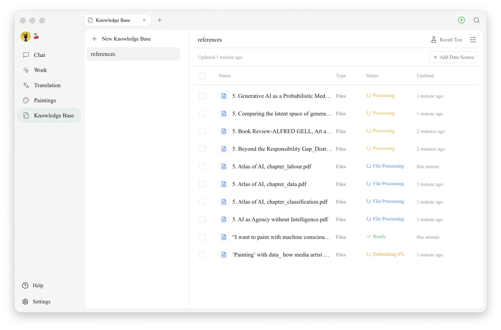

# Knowledge Base

A knowledge base is like giving the AI its own **reference book**: you put your documents, notes and web pages into it, and later, during chats, the AI looks things up in that book to answer your questions.

<figure><figcaption>
Knowledge Base: the left column lists your knowledge bases (with <code>+ New Knowledge Base</code> at the top); the right side shows the selected knowledge base's items and their processing status, with <strong>Add Data Source</strong> and <strong>Recall Test</strong> at the top
</figcaption></figure>

## What Can You Do With a Knowledge Base?

A few real-world scenarios:

* **Company knowledge assistant**: load product manuals, API docs and internal guidelines, and let the AI answer employees' questions automatically
* **Personal archive**: add years of work notes, reading excerpts and email archives, then ask the AI "which slide deck last year mentioned that analysis framework?"
* **Study partner**: add course slides and papers, and let the AI quiz you by chapter and answer your questions
* **Contract / regulation lookup**: add legal provisions and contract templates, and ask the AI how specific clauses apply

## Why Use a Knowledge Base Instead of Just Sending Files to the AI?

Limitations of sending files directly:

* You have to upload them again for every question
* A single conversation has a length limit, so long documents don't fit
* Files can't be reused across conversations

**A knowledge base solves all of these**: upload once, use it from any conversation afterwards, and it can "pick out the relevant passages" from large amounts of material to feed to the AI.

## How to Use It

* First time: read the [complete knowledge base tutorial](../../knowledge-base/knowledge-base.md)
* Adding images or scanned PDFs: read [Document Preprocessing](../../knowledge-base/document-preprocessing.md) first so the AI can "read" the text in images
* Choosing an embedding model: see the [embedding model reference](../../knowledge-base/emb-models-info.md)
* Want to work offline without a cloud embedding service? Use the built-in [local embedding models](../../pre-basic/settings/local-models.md) — the knowledge base can then be indexed and searched without an internet connection
* Where is the data stored? See [Knowledge Base Data](../../knowledge-base/data.md)

## Combining With Other Features

* **Knowledge base + assistant**: "attach" a knowledge base to an assistant to make it a specialist in that domain
* **Knowledge base +** [**Agent**](../../advanced-basic/agent.md): let an agent look things up in the knowledge base while it works on a task
* **Knowledge base +** [**Channels**](../../advanced-basic/automation/channels.md): station an agent that "knows the company docs" in a Feishu (Lark) group


We recommend reading the [Advanced Capability Map](../../advanced-basic/capability-map.md) first to see how knowledge bases work together with agents, MCP, channels and other features.


***

### Get Help and Submit Feedback

If you have any questions, bugs, or feature suggestions during configuration or use, please use the official channels listed in [Feedback and Suggestions](../../question-contact/suggestions.md).
