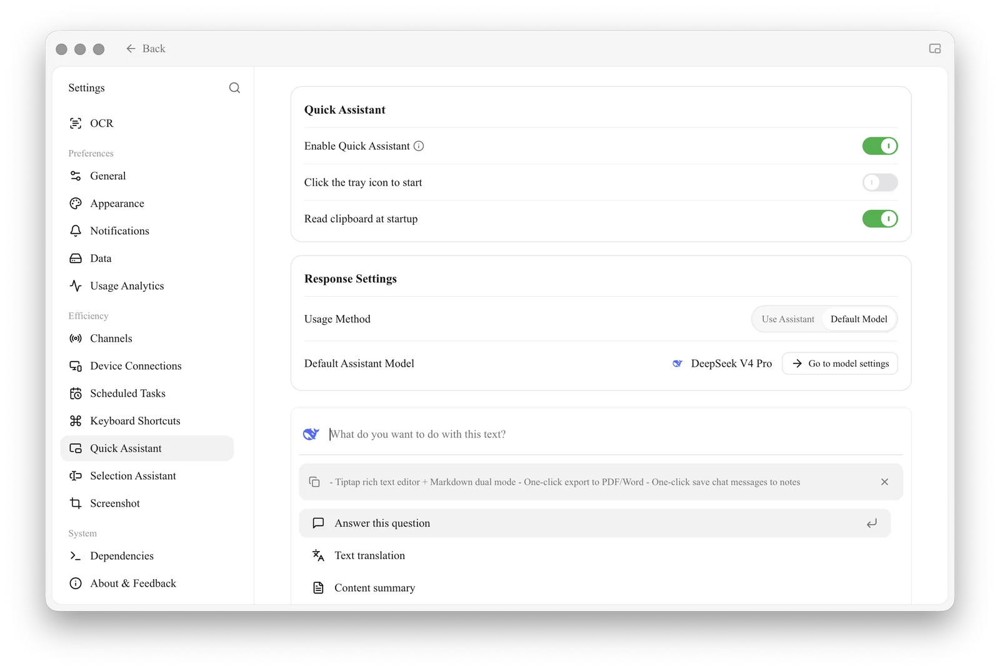
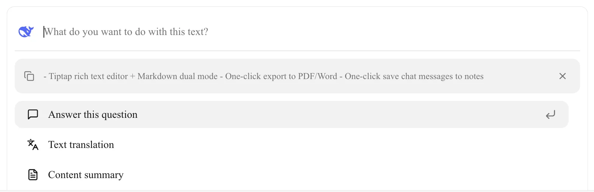

# Quick Assistant

The Quick Assistant is a small floating window that you can call up from any application with a global hotkey. Use it to ask a quick question, or to translate, summarize, or explain text, without switching back to the main Cherry Studio window.


**Quick Assistant vs. [Selection Assistant](selection-assistant.md)**: these are two separate features.

* **Quick Assistant**: Opens a mini window via a hotkey (or the tray icon) where you type a question or work with clipboard text. It does not depend on what you currently have selected.
* **Selection Assistant**: Shows a toolbar next to text you select in any application, and runs actions such as translate or explain on that selection.
* They are configured separately under **Settings → Quick Assistant** and **Settings → Selection Assistant**.


### Enable Quick Assistant

1. **Open Settings:** Go to **Settings → Quick Assistant** (under **Efficiency** in the left menu).
2. **Turn it on:** Toggle **Enable Quick Assistant**. Once enabled, the remaining options and a live preview of the Quick Assistant window appear on the same page.

<figure><figcaption>
Settings → Quick Assistant
</figcaption></figure>

#### Quick Assistant options

| Option | Description |
| --- | --- |
| **Enable Quick Assistant** | Master switch for the feature. |
| **Click the tray icon to start** | Opens the Quick Assistant when you click the Cherry Studio icon in the system tray / menu bar. |
| **Read clipboard at startup** | Each time the Quick Assistant opens, the current clipboard content is loaded automatically as the text to work with. |

#### Response Settings

| Option | Description |
| --- | --- |
| **Usage Method** | **Use Assistant**: replies are generated by one of your existing assistants, using its model and settings. **Default Model**: replies use the model set below. |
| **Default Assistant Model** | The model used when **Usage Method** is set to **Default Model**. Click **Go to model settings** to change it in [Default Model Settings](../../pre-basic/settings/default-models.md). |

### Set the Hotkey

The hotkey is not configured on the Quick Assistant page. Go to **Settings → Keyboard Shortcuts** to view or change it (see [Shortcut Settings](../../pre-basic/settings/key-shortcut.md)).

* Default on Windows: <kbd>Ctrl</kbd> + <kbd>E</kbd>
* Default on macOS: <kbd>⌘</kbd> + <kbd>E</kbd>

If the hotkey conflicts with another application, assign a different one.

### Use the Quick Assistant

1. **Open it:** In any application, press the hotkey (or click the tray icon if that option is on).
2. **Check the input:** If **Read clipboard at startup** is on, the copied text appears as a card under the input box. Click **×** on the card to discard it.
3. **Choose what to do:** Type your request in the **What do you want to do with this text?** box and press <kbd>Enter</kbd>, or pick one of the built-in actions:
   * **Answer this question**: Ask the AI about the text or your typed question.
   * **Text translation**: Translate the text.
   * **Content summary**: Summarize long text.
   * **Explanation**: Explain a concept, term, or passage.

<figure><figcaption>
The Quick Assistant window with clipboard text loaded
</figcaption></figure>

4. **Close it:** Press <kbd>Esc</kbd> or click anywhere outside the window.

### Tips and Tricks

* **Work on copied text:** Keep **Read clipboard at startup** on, copy some text, then press the hotkey to translate or summarize it right away.
* **Reuse an assistant's setup:** Set **Usage Method** to **Use Assistant** if you want the Quick Assistant to follow a particular assistant's prompt and model.
* **Hotkey does nothing?** Make sure **Enable Quick Assistant** is on, and check **Settings → Keyboard Shortcuts** for conflicts.

***

### Get Help and Submit Feedback

If you have any questions, bugs, or feature suggestions, please use the official channels listed in [Feedback and Suggestions](../../question-contact/suggestions.md).
