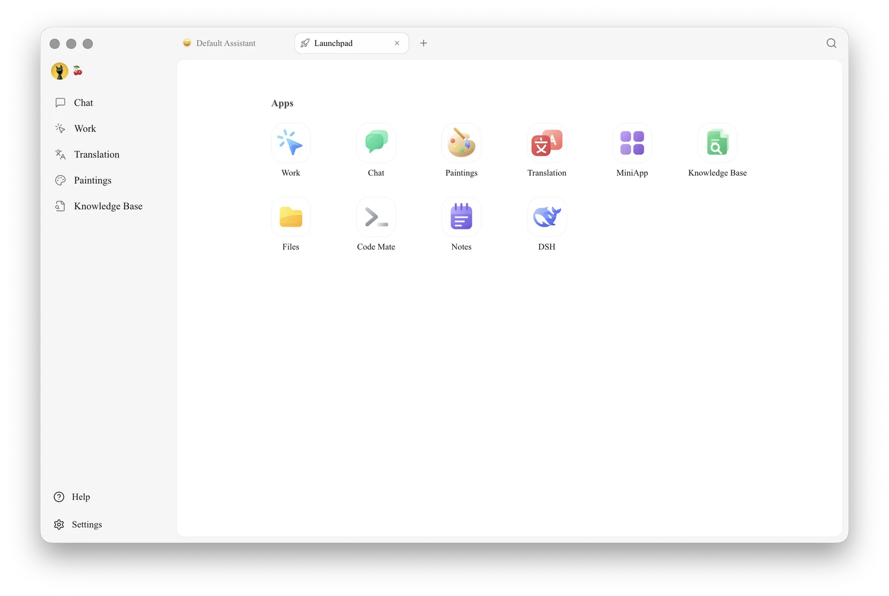

# Launchpad

The Launchpad provides centralized access to Cherry Studio's core features. Click the **+** button on the right side of the top tab bar to open a new Launchpad tab. Closing the last tab automatically returns you to the Launchpad.

## Default Apps

The Launchpad currently includes 9 built-in apps:

| App | Purpose |
| --------------------------------------- | ----------------------- |
| [Chat](chat.md) | Chat with models, manage assistants and conversation lists |
| [Work](../../advanced-basic/agent.md) | Enable agents to call tools and complete multi-step tasks |
| [Paintings](drawing.md) | Generate and manage images using image models |
| [Translation](translation.md) | Translate text and view source and target side-by-side |
| [MiniApp](../../cherry-studio/preview/app) | Use web applications within Cherry Studio |
| [Knowledge Base](knowledge-base.md) | Import documents for retrieval and Q&A |
| [Files](files.md) | View and manage files used within the app |
| [Code Mate](code-cli.md) | Install, configure, and launch AI coding CLI tools |
| [Notes](notes.md) | Create and organize Markdown notes |

## Reorder Apps

Drag and drop an app icon to a new position to change the order of built-in apps. Cherry Studio automatically saves the new order.

The Launchpad and the sidebar maintain separate app orders. Reordering apps in the Launchpad does not affect the sidebar layout.

## Pin to Sidebar

Frequently used apps can be pinned to the sidebar:

1. Right-click an app in the Launchpad.
2. Select **Add to Sidebar**.
3. To unpin, right-click again and select **Remove from Sidebar**.

> **Tip:** **Chat** is a required sidebar entry and cannot be removed. Other apps remain accessible from the Launchpad even if not pinned to the sidebar.

## Manage Mini Apps

After adding a web app to the Launchpad via the [Mini Apps](../../cherry-studio/preview/app) page, it appears in the "Mini Apps" section below the built-in apps.

* Drag Mini App icons to adjust their display order.
* Right-click a Mini App to add it to the sidebar or remove it from the Launchpad.
* Removing from the Launchpad only removes the shortcut; it does not delete the Mini App itself.

***

### Get Help and Submit Feedback

If you encounter issues or have feature suggestions, contact us through the official channels provided on the [Feedback and Suggestions](../../question-contact/suggestions.md) page.
