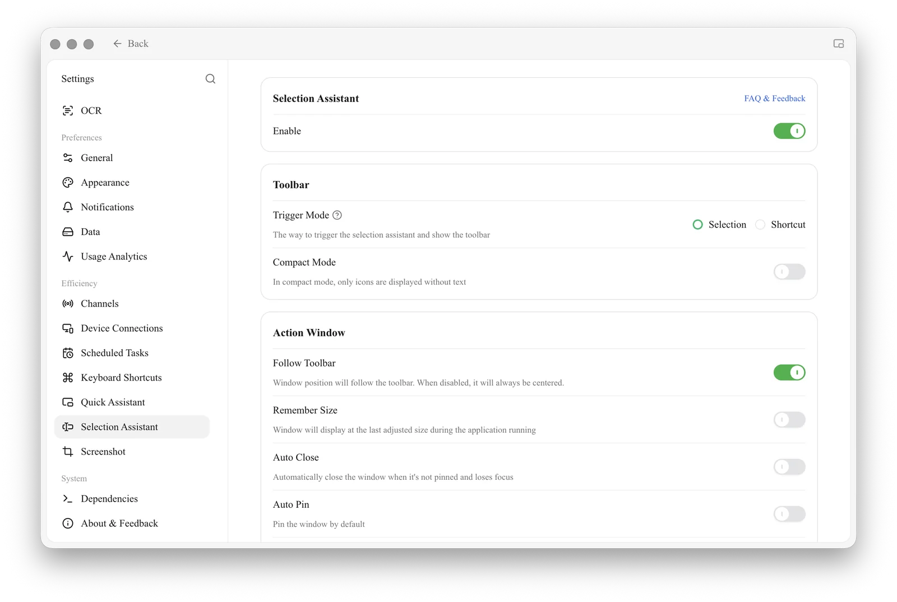
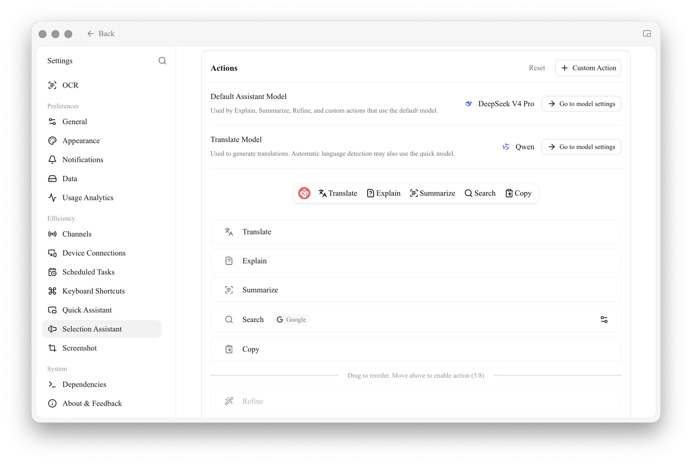

# Selection Assistant

The Selection Assistant allows you to **select text in any application** and invoke AI for translation, explanation, optimization, summarization, and other tasks via a floating toolbar, without pasting the content back into Cherry Studio.


**Difference from [Quick Assistant](quick-assistant.md)**:

* **Quick Assistant**: Invokes a **proactive input** window via a global hotkey, where you type your question
* **Selection Assistant**: Displays a toolbar **for the selected content** after text selection, allowing one-click execution of preset actions


### Platform Support

* ✅ **macOS**: Fully supported, but requires **Accessibility permissions** to be granted upon first enablement
* ✅ **Windows**: Fully supported, no special permissions required
* ⚠️ **Linux**: Fully supported only in **X11** mode; in Wayland mode, the toolbar may not follow the selected text position. Additionally, the current user must be added to the `input` group (`sudo usermod -aG input $USER`) to obtain key listening permissions

### Enable Selection Assistant

Open [Settings] → [Selection Assistant]:

<figure><figcaption>
Selection Assistant settings: Enable / Toolbar / Action Window
</figcaption></figure>

1. Toggle the **Enable** switch
2. **macOS** users will see a prompt requesting **Accessibility permissions** upon first enablement:

   <figure><figcaption>
Accessibility permission prompt on first enablement
</figcaption></figure>

   Click **Go to Settings** → In the opened [System Settings] → [Privacy & Security] → [Accessibility], find Cherry Studio and toggle the switch on → Return to Cherry Studio and enable it again.
3. (Optional) In [Toolbar] → [Trigger Mode], select the trigger method (options vary by platform):
   * **Selection**: Toolbar appears immediately after selecting text (default)
   * **Ctrl Key** (Windows only): Toolbar appears only after selecting text and **holding the Ctrl key** (prevents accidental triggers)
   * **Hotkey**: Toolbar appears after selecting text and pressing the hotkey; configure the hotkey in [Settings] → [Hotkeys]

### Built-in Actions

The Selection Assistant provides 7 built-in actions, with **5 enabled by default**: Translate / Explain / Summarize / Search / Copy. The **Cherry icon on the left side of the toolbar is not an action button**—it is merely the drag handle for the toolbar; hold it to move the entire toolbar.

| Action | Default Enabled | Purpose |
|---|---|---|
| **Translate** | ✅ | Smart translation: Prioritizes translation to the target language; if already in the target language, translates to the fallback language |
| **Explain** | ✅ | Lets AI explain the selected content |
| **Summarize** | ✅ | Lets AI summarize the selected content in one paragraph |
| **Search** | ✅ | Uses the selected text to query a search engine (default Google, changeable via the ⋯ icon on the right of each item) |
| **Copy** | ✅ | Copies the selected text |
| **Optimize** | To be enabled | Lets AI rewrite for better flow / professionalism; drag into the enabled area in settings to activate |
| **Quote** | To be enabled | Sends the selected text as a quote to the current conversation; drag into the enabled area in settings to activate |

<figure><figcaption>
[Actions] section in the settings panel: top area is enabled, bottom area is staging; drag from bottom to top to enable
</figcaption></figure>

### Custom Actions

In [Settings] → [Selection Assistant] → [Actions], you can:

* **Edit** the prompts for built-in actions
* **Add** custom actions via **+ Custom Action** (name + prompt + default model)
* **Drag** to adjust the order of actions in the toolbar
* Drag infrequently used actions to the bottom staging area to "disable" them

### Toolbar / Result Window Appearance

Toolbar:
* **Compact Mode**: Displays icons only, no text, saving screen space

Result Window ([Action Window] section):
* **Follow Toolbar**: Window pops up attached to the toolbar (default on); if off, it always centers
* **Remember Size**: Retains the manually adjusted window size for the next session
* **Auto Close**: Closes when clicking outside the window
* **Always on Top**: Always floats above other applications
* **Opacity**: Adjustable from 20%–100%

### Search Engine

The built-in [Search] action in the Selection Assistant allows selecting preset engines (Google, Bing, DuckDuckGo, etc.). Configuration is found in [Settings] → [Selection Assistant] → [Actions]: Locate the **Search** entry, click the gear icon on the far right of the row to open the [Configure Search Engine] dialog. You can choose from presets or add custom engines, using `{{queryString}}` in the URL to represent the search term position.

### Application Filtering (Advanced)

You can set a **Blacklist / Whitelist** in [Settings] → [Selection Assistant] → [Advanced] → [Application Filtering] to restrict the Selection Assistant to specific applications (Whitelist) or prevent it from appearing in specific applications (Blacklist).

* **macOS**: Enter the application's Bundle ID (e.g., `com.google.Chrome`, `com.apple.mail`)
* **Windows**: Enter the application's executable filename (e.g., `chrome.exe`, `Cherry Studio.exe`)

### Model Used

The Selection Assistant uses the [Global Default Chat Model](../../pre-basic/settings/default-models.md) by default, but you can specify a separate model for each action.

### Tips and Tricks

* If the toolbar does not appear on macOS, check if Cherry Studio is checked in [System Settings] → [Privacy & Security] → [Accessibility]
* Frequently triggering the toolbar by accidentally selecting text? Switch to **Ctrl Key** trigger mode
* Too many toolbar icons cluttering the screen? Enable **Compact Mode**
* Want to perform chained operations like "translate then read aloud"? Copy the "Translate" result and invoke [Quick Assistant](quick-assistant.md) to continue processing

***

### Get Help and Submit Feedback

If you have any questions, bugs, or feature improvement suggestions during configuration or usage, please refer to the official channels provided in [Feedback and Suggestions](../../question-contact/suggestions.md).
