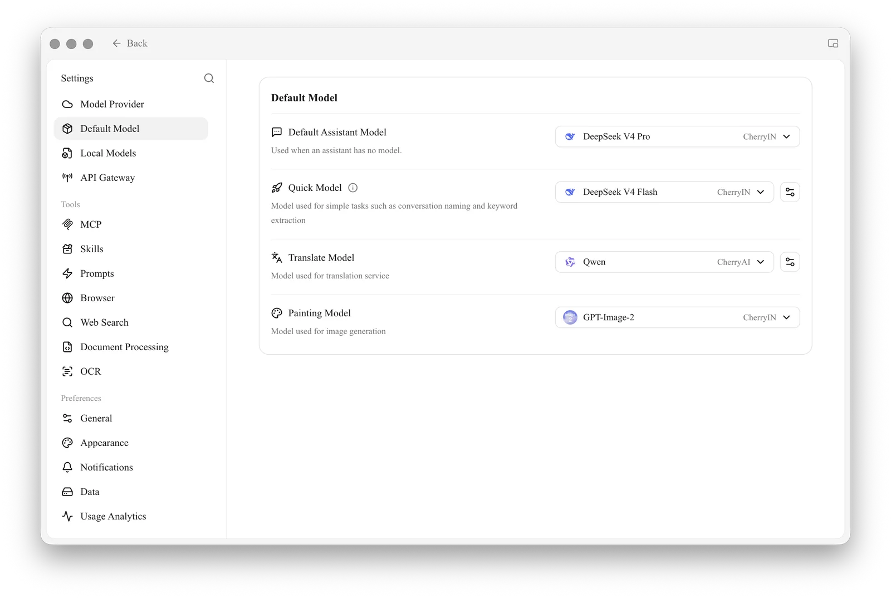

# Default Model Settings

In many situations Cherry Studio needs to "just pick a model" — for example, to name a conversation, refine a prompt, translate, or generate an image — and it can't ask you which model to use every time. **Default Model settings** tell Cherry Studio **which model to use when you haven't said otherwise**.

> Note: these are models for "behind-the-scenes helpers" and **can differ from the model you chat with**. The main chat model is set separately in each assistant.

<figure><figcaption>
Default Model (① is the section title): below it, choose one model each for Default Assistant, Fast, Translate and Painting
</figcaption></figure>

## What Each of the 4 Default Models Does

### Default Assistant Model

* **Used by**: any assistant that doesn't specify its own model automatically uses this one
* **How to choose**: pick a chat model you use often that is stable and reasonably priced

### Fast Model

* **Used by**: lightweight internal tasks that don't need top-tier intelligence, such as **naming conversations** and **extracting search keywords**
* **How to choose**: a **cheap and fast** model is enough. Choose a lightweight model; thinking models are not recommended

### Translate Model

* **Used by**: message translation in chats, the Translation page, and the translate action in the [Selection Assistant](../../../../../cherrystudio/preview/selection-assistant.md)
* **How to choose**: any ordinary chat model works. If you translate a lot between Chinese and English, the DeepSeek or Claude series do well

### Painting Model

* **Used by**: the default model for image generation (Paintings)
* **How to choose**: pick an image generation model you have already configured (such as the qwen-image series)

## Quick Recommendations

If you don't want to dig into it, fill them in like this:

| Field | Recommendation |
|---|---|
| Default Assistant Model | The chat model you use most |
| Fast Model | A cheap, fast lightweight model |
| Translate Model | Any chat model that follows instructions (or a dedicated translation model such as the qwen-mt series) |
| Painting Model | An image generation model you have configured |

If you're unsure, keep everything at the defaults and come back to adjust whichever one falls short after using it for a while.

***

### Get Help and Submit Feedback

If you have any questions, bugs, or feature suggestions during configuration or use, please use the official channels listed in [Feedback and Suggestions](../../../../../question-contact/suggestions.md).
