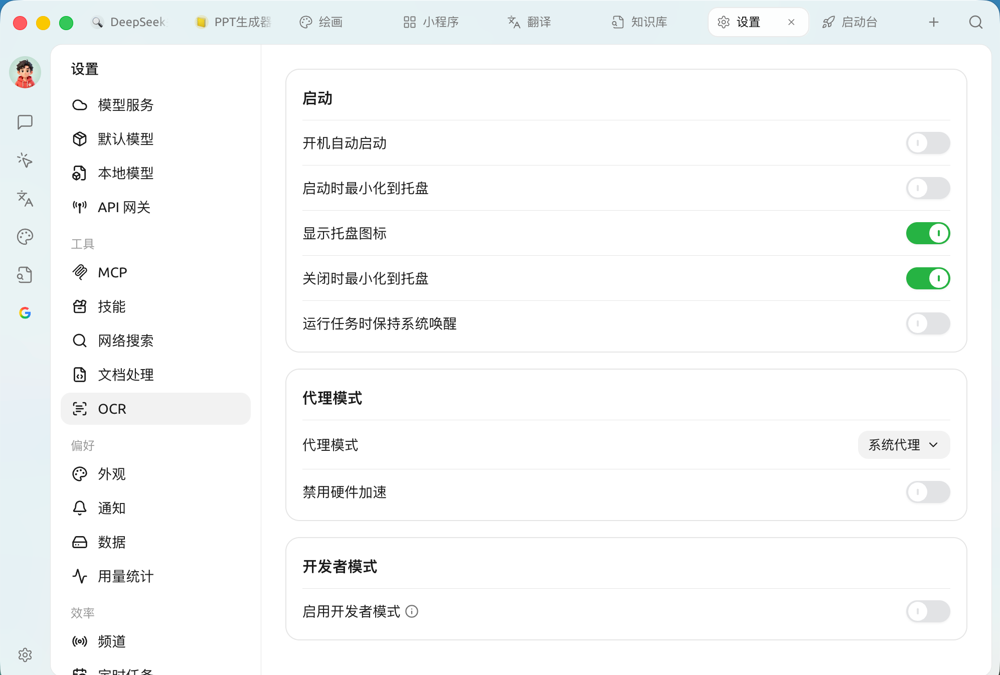

# General

These settings decide **how Cherry Studio starts with your computer, how it connects to the network, and whether debugging features are available**. Open `Settings → General`; it has three parts:

<figure><figcaption>
General settings: startup, proxy mode, developer mode
</figcaption></figure>

### Startup

Decide whether Cherry Studio stays running in the background like a messaging app, or behaves like a regular program you close when you're done.

| Setting | What it does | Recommendation |
| --- | --- | --- |
| **Launch at startup** | Starts Cherry Studio automatically when your computer boots | Turn it on if it's your main tool, so it's ready right away |
| **Minimize to tray on launch** | When launched at startup, goes straight to the background without showing the main window | Use together with "Launch at startup" to keep your desktop tidy |
| **Show tray icon** | Shows an icon in the system tray | Recommended, for quick access and status at a glance |
| **Minimize to tray on close** | Clicking `X` sends it to the tray instead of quitting | Strongly recommended: it reopens instantly next time and ongoing conversations aren't interrupted |
| **Keep system awake while running tasks** | Prevents the system from sleeping while background tasks (such as scheduled tasks or long replies) are running | Turn it on when you need tasks to run unattended for a long time |


With **Minimize to tray on close** turned off, clicking `X` quits the process completely. Only turn it off if you want the app to fully quit every time.


### Proxy Mode

Cherry Studio often calls model APIs hosted overseas; this setting decides how network traffic is routed.

| Option | Description |
| --- | --- |
| **System proxy** (default) | Follows the operating system's network / proxy settings, and automatically uses any global VPN or accelerator running on your computer |
| **Custom proxy** | Enter a proxy address manually (e.g. `http://127.0.0.1:7890`). You can also set **proxy bypass rules** — addresses that skip the proxy. The default is `localhost,127.0.0.1,::1`, and wildcard patterns such as `*.test.com` and `192.168.0.0/16` are supported |
| **No proxy** | Forces a direct connection |

* **Disable hardware acceleration**: normally keep this off. Only if the interface shows a **black screen, white screen, flickering, torn text** or obvious lag, turn it on and restart the app to troubleshoot (this forces CPU rendering).


When you see red errors such as "Connection timed out" or "API request failed", first make sure your VPN / accelerator is running and that this setting is **System proxy** — that's the most common cause.


### Developer Mode

* **Enable developer mode**: turns on the **trace** feature so you can view the data flow of model calls for troubleshooting. Changes take effect **after restarting the app**. Most users don't need to turn it on.


Interface language and spell check are set in [Appearance](../../../pre-basic/settings/display.md); message and backup alerts are set in [Notifications](../../../pre-basic/settings/notification.md).


***

### Get Help and Submit Feedback

If you have any questions, bugs, or feature suggestions during configuration or use, please use the official channels listed in [Feedback and Suggestions](../../../question-contact/suggestions.md).
