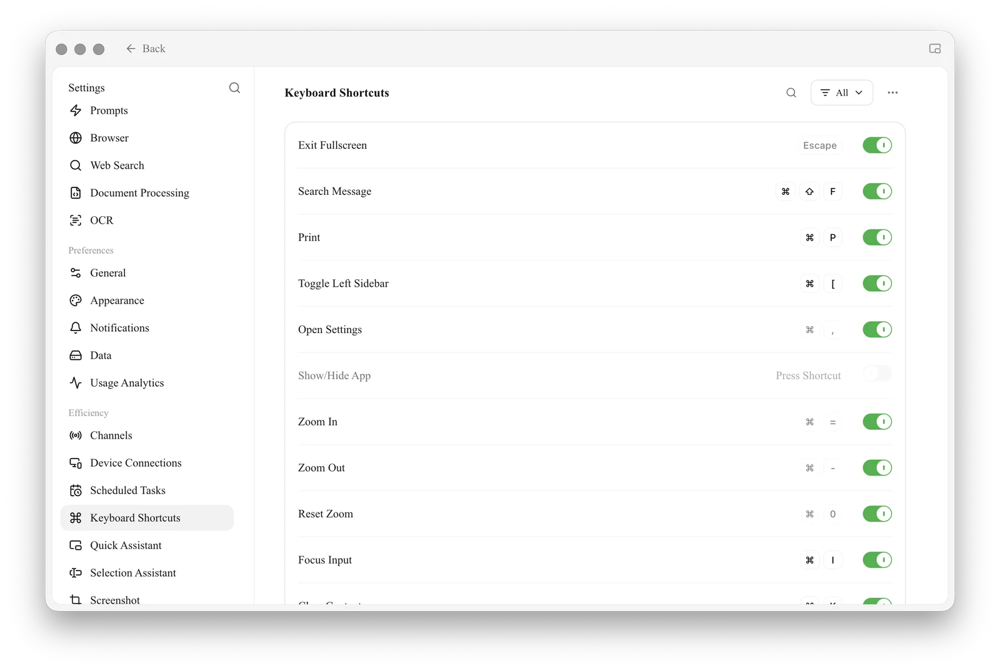

# Shortcut Settings

### 1. Open Shortcut Settings

* **Path:** `Settings` > `Keyboard Shortcuts` in the left navigation bar.
* **Purpose:** here you can filter shortcuts by category, search them, view the default keys, change key combinations, and enable or disable specific shortcuts.

<figure><figcaption></figcaption></figure>

### 2. How the Page Works

From top to bottom, the page has four parts:

#### 2.1 Top Toolbar

To the right of the title are a search icon, a category filter (**All**) and a **⋯** menu. **Enable All**, **Disable All** and **Reset** are in the **⋯** menu:

* **Enable All:** enables every shortcut in the current list (as filtered / searched) that has a key bound.
* **Disable All:** disables every shortcut in the current list.
* **Reset:** restores **all** shortcuts to their defaults. A "Reset all shortcuts?" confirmation appears first; it takes effect once you confirm.

> **Note:** "Enable All / Disable All" only affect the shortcuts currently **visible**. If you've narrowed the list with a filter or search, these two buttons only affect the filtered results.

#### 2.2 Search Box and Filter

* **Search:** click the search icon to filter by action name or key combination.
* **Filter (All):** opens a category menu so you can view shortcuts by group. The groups are **All**, **Global & Window**, **Message Interaction**, **Topics & Conversations** and **AI Assistant Tools**; each shows the number of shortcuts it contains.

#### 2.3 Shortcut List

Each row in the list has three parts, from left to right:

1. **Action name:** the operation the shortcut performs.
2. **Key combination (middle):** shows the currently bound keys. Click it to start recording — you'll see "Press shortcut" — then press the new combination you want to **customize** it.
   * If you've changed a shortcut, a **reset icon (↺)** appears to its left; click it to restore just that item to its default.
   * Some system-level shortcuts (such as Exit Full Screen, Open Settings and the zoom shortcuts) **can't be changed**; they appear grayed out and can't be clicked.
3. **Switch (right):** enables or disables the shortcut.
   * If an item **has no key bound yet**, the switch can't be toggled; hovering shows "Bind a shortcut first before changing its enabled state".

> **Conflict warnings:** if the combination you set is already used by another action, the page shows "Already used by 'xxx'"; if it's taken by the system or another app, it shows "This shortcut is already used by the system or another app".

***

### 3. Core Shortcuts

The default keys for each action are listed below by the **groups** shown on the page.

> **💡 Platform differences:** the tables use macOS keys (`⌘` = Command, `⇧` = Shift). **Windows / Linux users** can replace `⌘` with `Ctrl` and `⇧` with `Shift`.

#### 3.1 Global & Window

| Action | macOS | Windows / Linux | Default state | Notes |
| --- | --- | --- | --- | --- |
| Exit full screen | `Escape` | `Escape` | Enabled | Can't be changed |
| Search messages | `⌘ + ⇧ + F` | `Ctrl + Shift + F` | Enabled | Global search across all conversations |
| Print | `⌘ + P` | `Ctrl + P` | Enabled | Prints the current conversation |
| Open settings | `⌘ + ,` | `Ctrl + ,` | Enabled | Can't be changed |
| Show / hide app | Not set | Not set | **Off by default** | Global shortcut; bind it yourself |
| Zoom in | `⌘ + =` | `Ctrl + =` | Enabled | Numpad `+` also works; can't be changed |
| Zoom out | `⌘ + -` | `Ctrl + -` | Enabled | Numpad `-` also works; can't be changed |
| Reset zoom | `⌘ + 0` | `Ctrl + 0` | Enabled | Can't be changed |
| Focus input | `⌘ + I` | `Ctrl + I` | Enabled | Moves the cursor to the message input box |

> **Boss key:** "Show / hide app" is a **global** shortcut (unbound by default) that works even when Cherry Studio is in the background. Bind a convenient combination to it and you can bring up or hide the window with one keystroke.

#### 3.2 Message Interaction

| Action | macOS | Windows / Linux | Default state |
| --- | --- | --- | --- |
| Clear context | `⌘ + K` | `Ctrl + K` | Enabled |
| Copy last message | `⌘ + ⇧ + C` | `Ctrl + Shift + C` | **Off by default** |
| Edit last user message | `⌘ + ⇧ + E` | `Ctrl + Shift + E` | **Off by default** |
| Search messages in current conversation | `⌘ + F` | `Ctrl + F` | Enabled |
| Select model | `⌘ + ⇧ + M` | `Ctrl + Shift + M` | Enabled |

> **🔥 Clear context (`⌘ + K`):** it **doesn't delete** your chat history, but it makes the AI **"forget"** the earlier conversation. It's very useful when the AI gets stuck in a logic loop, or when you want to start an unrelated topic in the same window without the earlier content getting in the way.

#### 3.3 Topics & Conversations

| Action | macOS | Windows / Linux | Default state |
| --- | --- | --- | --- |
| Toggle left sidebar | `⌘ + [` | `Ctrl + [` | Enabled |
| New conversation | `⌘ + N` | `Ctrl + N` | Enabled |
| Rename conversation | `⌘ + T` | `Ctrl + T` | **Off by default** |
| Toggle right sidebar | `⌘ + ]` | `Ctrl + ]` | Enabled |

#### 3.4 AI Assistant Tools

| Action | macOS | Windows / Linux | Default state | Notes |
| --- | --- | --- | --- | --- |
| Quick Assistant | `⌘ + E` | `Ctrl + E` | **Off by default** | Global; enable the Quick Assistant feature first |
| Selection Assistant: get selection | Not set | Not set | **Off by default** | Global; enable the Selection Assistant feature first |
| Toggle Selection Assistant | Not set | Not set | **Off by default** | Global; enable the Selection Assistant feature first |

> **Note:** shortcuts in this group only appear in the list once the corresponding feature (Quick Assistant / Selection Assistant) is enabled; otherwise they aren't shown.

***

### Pro Tips

1. **Set up a "boss key":** bind a convenient global shortcut to **"Show / hide app"** so you can summon or hide the AI anytime without hunting for the icon in the taskbar.
2. **Know the difference between `⌘ + K` and `⌘ + N`:**
   * Want a completely fresh start? Use `⌘ + N` for a new conversation.
   * Want to keep the chat history as notes but have the AI start thinking afresh? Use `⌘ + K` to clear the context.
3. **Don't panic if you mess things up:** if one item goes wrong, click the reset icon (↺) on that row to restore it; if things are thoroughly scrambled or full of conflicts, use the **Reset** button at the top to restore all default keys at once.

***

### Get Help and Submit Feedback

If you have any questions, bugs, or feature suggestions during configuration or use, please use the official channels listed in [Feedback and Suggestions](../../../question-contact/suggestions.md).
