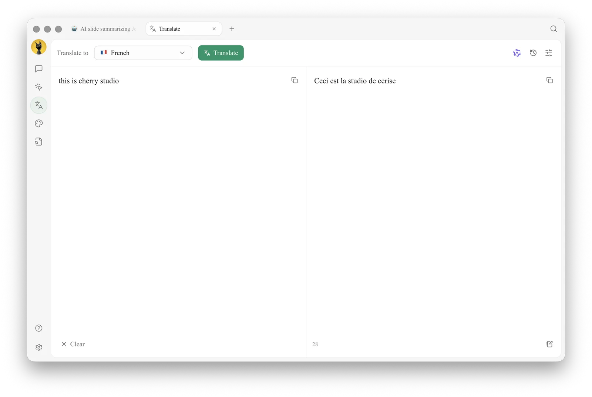

# Translation

Cherry Studio's translation feature provides you with fast and accurate text translation services, supporting mutual translation between multiple languages.

### Interface Overview

<figure><figcaption>
The Translation page: choose the target language at the top, type on the left, and read the result on the right
</figcaption></figure>

The translation page consists of the following parts:

1.  **Translate to (top left)**:
    *   Choose the language you want to translate into from the dropdown.
    *   There is no source-language selector — the source language is detected automatically.
2.  **Translate button**:
    *   Next to the language dropdown. Click it to start translating.
3.  **Top-right icons**:
    *   The model icon shows the translation model in use.
    *   The clock icon opens your translation history.
    *   The settings icon opens the translation settings.
4.  **Source text (left)**:
    *   Type or paste the text you want to translate.
    *   Click **Clear** at the bottom left to empty the box.
5.  **Translation result (right)**:
    *   Shows the translated text, with the character count at the bottom.
    *   Click the copy button in the top right of either box to copy its text.


The translation model is the **Translate Model** set in [Default Model Settings](../../pre-basic/settings/default-models.md).


### Usage Steps

1.  **Choose the target language**:
    *   Select the language to translate into from the **Translate to** dropdown.
2.  **Enter or paste text**:
    *   Type or paste the text into the left box.
3.  **Start translating**:
    *   Click the **Translate** button.
4.  **View and copy the result**:
    *   The translation appears in the right box.
    *   Click its copy button to copy the translation to the clipboard.

### Frequently Asked Questions (FAQ)

*   **Q: What if the translation is inaccurate?**
    *   A: While AI translation is powerful, it is not perfect. For texts in specialized fields or complex contexts, manual proofreading is recommended. You can also try switching to different models.
*   **Q: Which languages are supported?**
    *   A: Cherry Studio's translation feature supports various mainstream languages. Please refer to Cherry Studio's official website or in-app instructions for the specific list of supported languages.
*   **Q: Can I translate an entire file?**
    *   A: The current interface is mainly for text translation. For file translation, you might need to go to Cherry Studio's chat page and add the file for translation.
*   **Q: What if the translation speed is slow?**
    *   A: Translation speed may be affected by factors such as network connection, text length, and server load. Please ensure your network connection is stable and wait patiently.