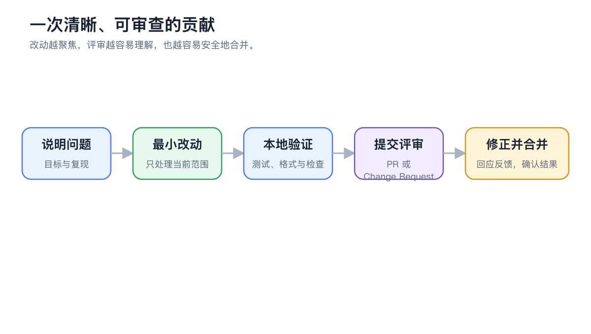

# Contributing Code

A code contribution starts with a clearly defined problem. Before fixing a bug, confirm you can reproduce it; before adding a feature, describe the user scenario and expected behavior. For larger changes, we recommend agreeing on the direction in a GitHub Issue or Discussion first.

<figure><figcaption>
Each contribution should solve one clear problem; verify locally first, then submit for review.
</figcaption></figure>

## Before You Start

<table data-view="cards"><thead><tr><th></th><th></th><th data-hidden data-card-target data-type="content-ref"></th></tr></thead><tbody><tr><td><strong>Cherry Studio repository</strong></td><td>Source code, README and development entry points</td><td><a href="https://github.com/CherryHQ/cherry-studio">https://github.com/CherryHQ/cherry-studio</a></td></tr><tr><td><strong>GitHub Issues</strong></td><td>Bugs, feature suggestions and open problems</td><td><a href="https://github.com/CherryHQ/cherry-studio/issues">https://github.com/CherryHQ/cherry-studio/issues</a></td></tr><tr><td><strong>Contributing guide</strong></td><td>Branch, testing, sign-off and review requirements</td><td><a href="https://github.com/CherryHQ/cherry-studio/blob/main/CONTRIBUTING.md">https://github.com/CherryHQ/cherry-studio/blob/main/CONTRIBUTING.md</a></td></tr><tr><td><strong>Code of Conduct</strong></td><td>Ground rules for community collaboration</td><td><a href="https://github.com/CherryHQ/cherry-studio/blob/main/CODE_OF_CONDUCT.md">https://github.com/CherryHQ/cherry-studio/blob/main/CODE_OF_CONDUCT.md</a></td></tr></tbody></table>

Good starter tasks can be found under the `good first issue`, `help wanted` and `kind/bug` labels. Before you begin, say in the Issue that you plan to work on it, so several people don't duplicate the effort.

## Choosing a Branch

Most current features, fixes, refactors and optimizations go to `main`. If the Issue, a maintainer or the contributing guide specifies a different target branch, follow the project's instructions at that time — don't decide based on old tutorials alone.


Don't pick the target branch based on old tutorials. Check the repository's current contributing guide and PR template again before opening a PR; if the branching strategy changes, the repository is the source of truth.


## When Contributing Code Makes Sense

| Situation | Recommended approach |
| ------------ | -------------------------- |
| A problem you can reproduce reliably | Submit a minimal fix with a matching check first |
| A small feature with clear boundaries | Confirm the requirement and target branch before implementing |
| Involves data migration, permissions or architecture | Agree on the approach in an Issue or Discussion first |
| Only the wording or screenshots need to change | Go through **Contributing Docs** — don't mix it into a code PR |


One PR should solve one clear problem. If a change mixes features, refactoring and unrelated formatting, reviewers find it hard to judge the risk, and it's harder to roll back.


## Submission Process



### 1. Fork and create a branch

Create a clearly scoped working branch from the correct target branch. One PR covers one topic — don't mix in opportunistic refactors or formatting changes.



### 2. Set up the development environment

Follow the repository's **Developer Guide** to install the specified Node.js and pnpm versions, then run `pnpm install`. Before changing anything, run the existing checks for the module you're working on to confirm the baseline passes.



### 3. Make and verify your changes

Bug fixes should add a test that reproduces the problem; new features should cover the key paths and failure cases. Before committing, run the formatting, static analysis, test and build checks the repository requires.



### 4. Commit and sign off

Write commit messages that state the type of change and the module, and add a DCO sign-off with `git commit --signoff`. Signing off means you have the right to submit this content under the project's license.



### 5. Open a PR

Fill in the template: before and after, why you chose this approach, trade-offs and alternatives, breaking changes, how you verified it, and the Release Note. Changes that still need discussion can start as a Draft PR.



## After Submitting a PR

PRs from new contributors start with the `needs-ok-to-test` label, and automated tests don't start right away. Once a repository member confirms, they use `/ok-to-test` to start the pipeline. Draft PRs aren't assigned regular reviewers and skip automated tests; mark them Ready for review when they're ready.

Address review comments with new commits to keep the discussion context. When there's a design disagreement, go back to the user problem and verifiable behavior rather than sidestepping a local issue with a large rewrite.

## Pre-Submission Checklist

* The target branch is correct;
* The scope of the change matches the Issue / PR description;
* New behavior has tests or repeatable manual verification steps;
* User-visible changes are reflected in the documentation;
* Data migration, upgrades and compatibility have been considered;
* No API keys, real user data or debug files are committed;
* Commits are signed off and the Release Note follows the template.

Do small changes need an Issue too?

Typos and obvious small fixes can be submitted directly; for anything touching product behavior, architecture or a larger amount of work, opening an Issue first makes it easier to confirm the direction. Whether an Issue is required follows the repository's current maintenance rules.

Why didn't CI run automatically?

First make sure the PR isn't a Draft. PRs from new contributors need a repository member to comment `/ok-to-test`; if you see `needs-ok-to-test`, just wait for confirmation on the PR.

