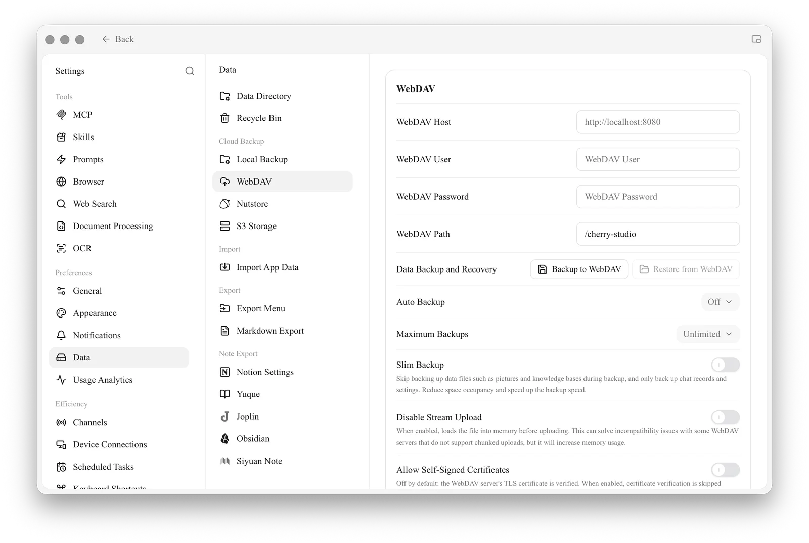

# WebDAV Backup

<figure><figcaption></figcaption></figure>

Cherry Studio supports data backup via WebDAV. You can choose a suitable WebDAV service for cloud backup.

Based on WebDAV, multi-device data synchronization can be achieved by `Computer A`  → (Backup) →  `WebDAV`  → (Restore) →  `Computer B`.

#### Taking Jianguoyun (Nutstore) as an example

1.  Log in to Jianguoyun, click on your username in the top right corner, and select "Account Info":

<figure><figcaption></figcaption></figure>

2.  Select "Security Options" and click "Add Application":

<figure><figcaption></figcaption></figure>

3.  Enter the application name and generate a random password;

<figure><figcaption></figcaption></figure>

4.  Copy and record the password;

<figure><figcaption></figcaption></figure>

5.  Obtain the server address, account, and password;

<figure><figcaption></figcaption></figure>

6.  In Cherry Studio, open **Settings → Data → WebDAV** and fill in the WebDAV information;

<figure><figcaption></figcaption></figure>

7.  Choose to back up or restore data, and set the automatic backup period.

<figure><figcaption></figcaption></figure>


WebDAV services with relatively low barriers are generally cloud storage drives:

- [Jianguoyun (Nutstore)](https://www.jianguoyun.com/)
- [123pan](https://www.123pan.com/) (requires membership)
- [Aliyun Drive](https://www.alipan.com/) (requires purchase)
- [Box](https://www.box.com/) (Free space is 10GB, single file size limit is 250MB.)
- [Dropbox](https://www.dropbox.com/) (Dropbox offers 2GB for free, can expand to 16GB by inviting friends.)
- [TeraCloud](https://teracloud.jp/en/) (Free space is 10GB, an additional 5GB can be obtained by invitation.)
- [Yandex Disk](https://disk.yandex.com/) (Free users get 10GB of storage.)

Next are some services that require self-deployment:

- [Alist](https://alist.nn.ci/zh/)
- [Cloudreve](https://cloudreve.org/)
- [sharelist](https://github.com/reruin/sharelist)
