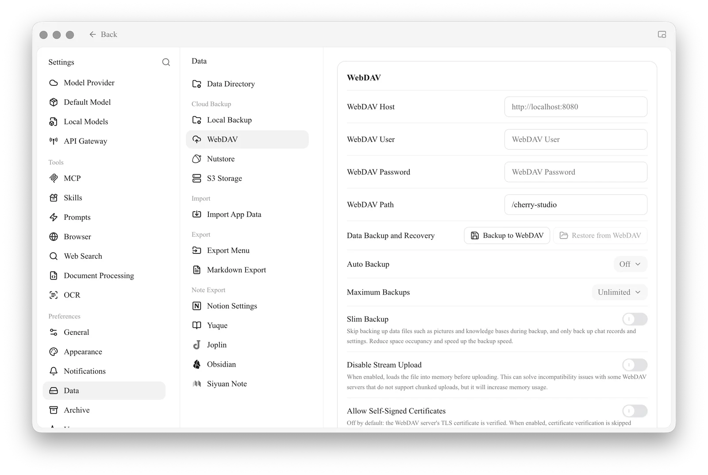

# WebDAV Backup

Cherry Studio can back up your data to any WebDAV service. Because the backup lives in the cloud, you can also use it to move data between computers: back up on `Computer A` → `WebDAV` → restore on `Computer B`.

## Configure WebDAV

Open **Settings → Data → WebDAV** and fill in the details from your WebDAV provider:

<figure><figcaption>
Settings → Data → WebDAV
</figcaption></figure>

| Setting | Description |
| --- | --- |
| **WebDAV Host** | The WebDAV server address from your provider |
| **WebDAV User** / **WebDAV Password** | Your WebDAV account. Many providers ask you to create a separate app password for WebDAV |
| **WebDAV Path** | The folder on the server where backups are stored (default `/cherry-studio`) |
| **Data Backup and Recovery** | **Backup to WebDAV** uploads a backup now; **Restore from WebDAV** restores from a backup on the server |
| **Auto Backup** | Back up automatically at the interval you choose (off by default) |
| **Maximum Backups** | How many backups to keep on the server (unlimited by default) |
| **Slim Backup** | Skips data files such as images and knowledge bases and backs up only chat history and settings — smaller and faster |
| **Disable Stream Upload** | Loads the file into memory before uploading. Turn it on if your WebDAV server doesn't support chunked uploads; it uses more memory |
| **Allow Self-Signed Certificates** | Skips TLS certificate verification. Only turn it on for a server you trust, such as your own |


Backups include sensitive data such as provider API keys. Only use a WebDAV service you trust. See [Data Settings](README.md) for what a backup contains.



Services that offer WebDAV include:

- [TeraCloud](https://teracloud.jp/en/) (10 GB free, plus 5 GB more by invitation)
- [Yandex Disk](https://disk.yandex.com/) (10 GB free)

You can also run your own WebDAV server:

- [Alist](https://alist.nn.ci/)
- [Cloudreve](https://cloudreve.org/)
- [sharelist](https://github.com/reruin/sharelist)

