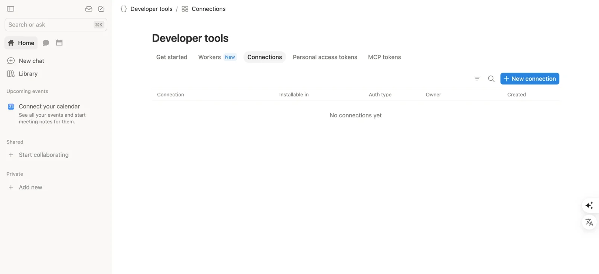
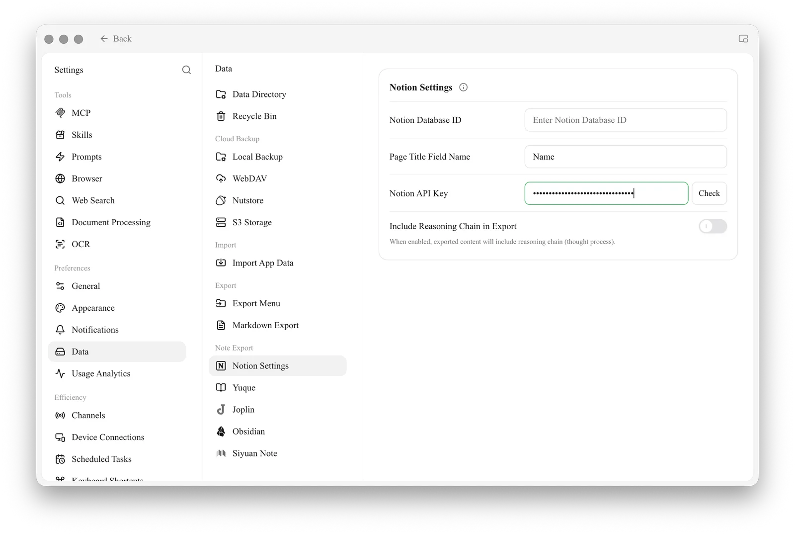
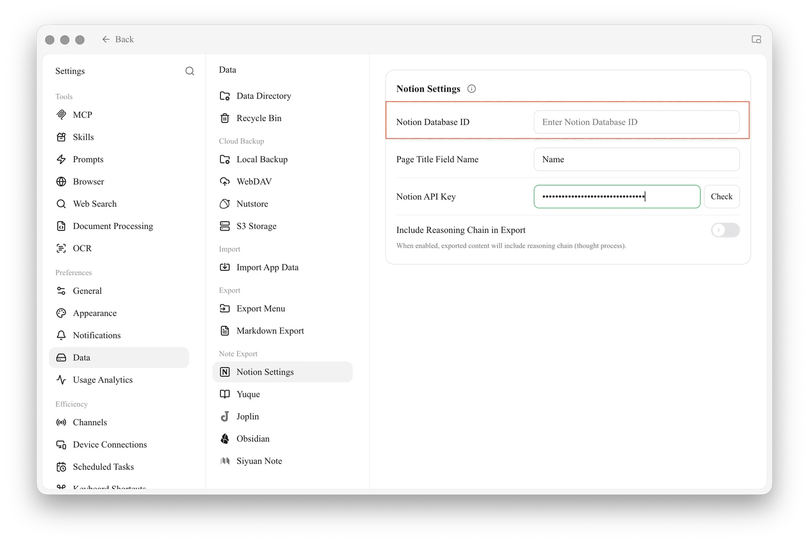
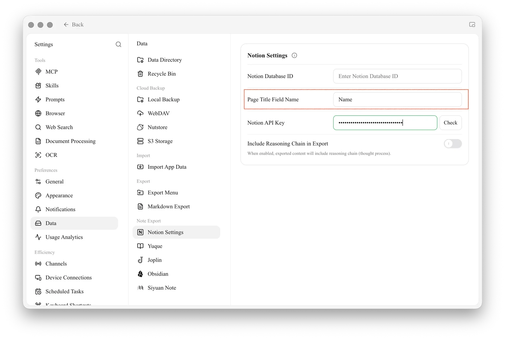
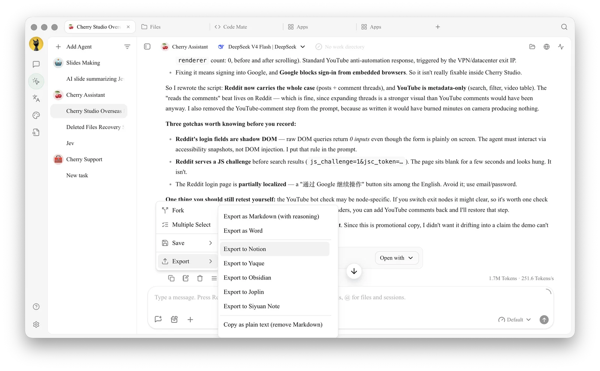
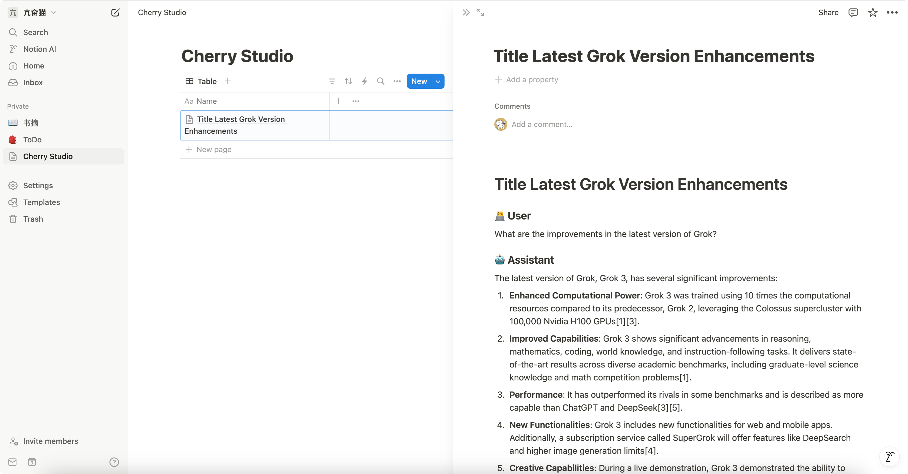

# Notion Configuration Tutorial

Cherry Studio supports importing topics into Notion databases.

## Step One: Create a Connection

Open Notion's [Developer tools → Connections](https://app.notion.com/developers/connections) page and click **New connection**. You need to be an owner of the workspace you connect.

<figure><figcaption>
Click New connection in Developer tools → Connections
</figcaption></figure>

## Step Two: Fill in the Connection Details

* **Name**: Cherry Studio
* **Workspace**: the workspace that holds the database you want to export to
* **Icon** (optional): you can use this image

<figure><figcaption></figcaption></figure>

## Step Three: Copy the API Token

Open the connection's **Configuration** tab, copy the **API token**, and paste it into Cherry Studio under **Settings → Data → Notion Settings**.

<figure><figcaption>
Paste the token into the data settings
</figcaption></figure>

## Step Four: Create a Database and Add the Connection

In [Notion](https://www.notion.so/), create a new page, choose **Database** as the page type, and name it Cherry Studio. Then click the **•••** menu at the top right of the page, choose **Add connections**, and select **Cherry Studio**. Cherry Studio can only write to pages that the connection has been added to.

## Step Five: Enter the Database ID

Open the database and copy its URL. If the URL looks like this:

`https://www.notion.so/<long_hash_1>?v=<long_hash_2>`

the database ID is the `<long_hash_1>` part. Enter it in Cherry Studio and click **Check**.

<figure><figcaption>
Enter the database ID and click Check
</figcaption></figure>

## Step Six: Set the Title Field

Enter the **Page Title Field Name**: the name of the database's title column. For a new database it is `Name`.

<figure><figcaption>
Enter Page Title Field Name
</figcaption></figure>

## Step Seven: Export

Congratulations, Notion configuration is complete ✅ You can now export Cherry Studio content to your Notion database.

<figure><figcaption>
Open the menu under a message, then choose Export → Export to Notion
</figcaption></figure>

<figure><figcaption>
View export result
</figcaption></figure>