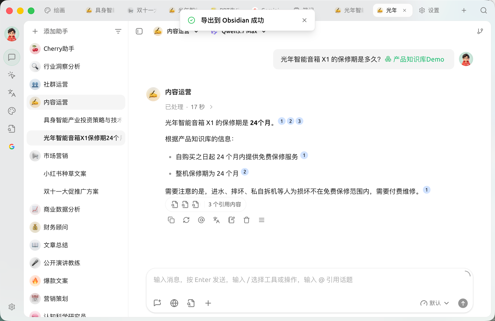

# Obsidian Configuration Tutorial

Cherry Studio supports integration with Obsidian, allowing you to export full conversations or single conversation entries to your Obsidian vault.


This process does not require installing additional Obsidian plugins. However, since Cherry Studio's import to Obsidian works similarly to Obsidian Web Clipper, it is recommended that users upgrade Obsidian to the latest version (current Obsidian version should be at least greater than **1.7.2**), to avoid [import failures if the conversation is too long](https://github.com/obsidianmd/obsidian-clipper/releases/tag/0.7.0).


## Latest Tutorial


Compared to the old version of exporting to Obsidian, the new export to Obsidian feature can automatically select the vault path, eliminating the need to manually enter the vault name and folder name.


### Step One: Configure Cherry Studio

Open Cherry Studio's _Settings_ → _Data Settings_ → _Obsidian Settings_ menu. The dropdown box will automatically display the names of Obsidian vaults opened on this machine. Select your target Obsidian vault:

<figure><figcaption></figcaption></figure>

### Step Two: Export Conversation

#### Export Full Conversation

Return to Cherry Studio's conversation interface, right-click on the conversation, select _Export_, and click _Export to Obsidian_:

<figure><figcaption></figcaption></figure>

At this point, a window will pop up, allowing you to adjust the **Properties** of the conversation note to be exported to Obsidian, the **folder location** within Obsidian, and the **processing method** for exporting to Obsidian:

*   **Vault**: Click the dropdown menu to select other Obsidian vaults
*   **Path**: Click the dropdown menu to select the folder for storing the exported conversation notes
*   As Obsidian note properties (Properties):
    *   Tags (tags)
    *   Created time (created)
    *   Source (source)
*   There are three available **processing methods** for exporting to Obsidian:
*   There are three available **processing methods** for exporting to Obsidian:
    *   **Create new (overwrite if exists)**: Create a new conversation note in the `folder` specified in the **Path**. If a note with the same name exists, it will overwrite the old note.
    *   **Prepend**: If a note with the same name already exists, export the selected conversation content and add it to the beginning of that note.
    *   **Append**: If a note with the same name already exists, export the selected conversation content and add it to the end of that note.


Only the first method includes Properties, while the latter two methods do not.


<figure><figcaption>
Configure note properties
</figcaption></figure>

<figure><figcaption>
Select path
</figcaption></figure>

<figure><figcaption>
Select processing method
</figcaption></figure>

After selecting all options, click OK to export the full conversation to the corresponding Obsidian vault's folder.

#### Export Single Conversation Entry

For exporting a single conversation entry, click the _three-bar menu_ below the conversation, select _Export_, and click _Export to Obsidian_:

<figure><figcaption>
Export single conversation entry
</figcaption></figure>

A window similar to the one for exporting a full conversation will then appear, asking you to configure the **note properties** and **note processing method**. Follow the [tutorial above](obsidian.md#dao-chu-wan-zheng-dui-hua) to complete it.

### Export Successful

🎉 Congratulations! You have now completed all configurations for Cherry Studio to integrate with Obsidian and have successfully gone through the export process. Enjoy yourselves!

<figure><figcaption>
Export to Obsidian
</figcaption></figure>

<figure><figcaption>
View export results
</figcaption></figure>

***

## Old Tutorial (for Cherry Studio < v1.1.13)

### Step One: Prepare Obsidian

Open your Obsidian vault and create a `folder` to save exported conversations (using 'Cherry Studio' folder as an example in the image):

<figure><figcaption></figcaption></figure>

Pay attention to the text highlighted in the bottom left corner; this is your `vault` name.

### Step Two: Configure Cherry Studio

In Cherry Studio's _Settings_ → _Data Settings_ → _Obsidian Settings_ menu, enter the `vault` name and `folder` name obtained in [Step One](obsidian.md#di-yi-bu):

<figure><figcaption></figcaption></figure>

`Global tags` is optional and can be set for all exported conversations in Obsidian. Fill it in as needed.

### Step Three: Export Conversation

#### Export Full Conversation

Return to Cherry Studio's conversation interface, right-click on the conversation, select _Export_, and click _Export to Obsidian_.

<figure><figcaption>
Export full conversation
</figcaption></figure>

At this point, a window will pop up, allowing you to adjust the **Properties** of the conversation note to be exported to Obsidian, as well as the **processing method** for exporting to Obsidian. There are three available **processing methods** for exporting to Obsidian:

*   **Create new (overwrite if exists)**: Create a new conversation note in the `folder` specified in [Step Two](obsidian.md#di-er-bu). If a note with the same name exists, it will overwrite the old note.
*   **Prepend**: If a note with the same name already exists, export the selected conversation content and add it to the beginning of that note.
*   **Append**: If a note with the same name already exists, export the selected conversation content and add it to the end of that note.

<figure><figcaption>
Configure note properties
</figcaption></figure>


Only the first method includes Properties, while the latter two methods do not.


#### Export Single Conversation Entry

For exporting a single conversation entry, click the _three-bar menu_ below the conversation, select _Export_, and click _Export to Obsidian_.

<figure><figcaption>
Export single conversation entry
</figcaption></figure>

A window similar to the one for exporting a full conversation will then appear, asking you to configure the **note properties** and **note processing method**. Follow the [tutorial above](obsidian.md#dao-chu-wan-zheng-dui-hua-old) to complete it.

### Export Successful

🎉 Congratulations! You have now completed all configurations for Cherry Studio to integrate with Obsidian and have successfully gone through the export process. Enjoy yourselves!

<figure><figcaption>
Export to Obsidian
</figcaption></figure>

<figure><figcaption>
View export results
</figcaption></figure>