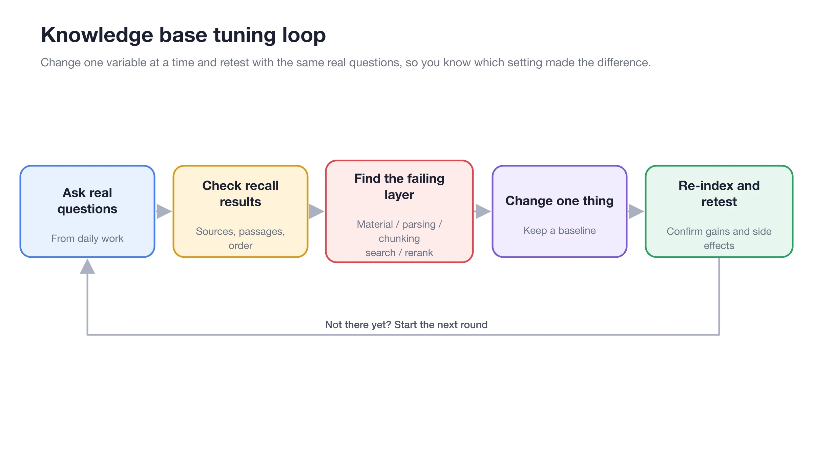
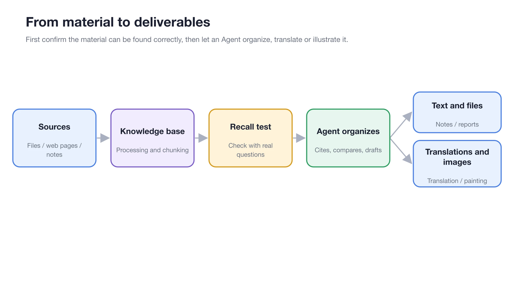

# Knowledge Base Application Cases

The reliability of a knowledge base depends not on the volume of materials, but on clear boundaries, maintainable sources, and the ability to consistently retrieve correct evidence for real-world questions.


The parameters below serve as starting points. First, run through import, retrieval, and usage with 3–10 representative documents, then expand based on a fixed set of test questions.


## Design with a Consistent Method



### 1. Define the Final Task

Clarify the judgment or deliverable the user needs, such as querying policies, troubleshooting faults, or generating research reports.



### 2. Define Material Boundaries

Only materials that should be retrieved together during use belong in the same knowledge base. Prioritize separating content with different permissions, lifecycles, product models, or versions.



### 3. Select Sources and Update Methods

Specify who maintains documents, notes, directories, and web pages, when they are replaced, and whether historical versions must be retained.



### 4. Prepare Acceptance Questions

Prepare 3–10 real-world questions covering precise facts, conditional rules, colloquial phrasing, and easily confused versions.



### 5. Adjust the Retrieval Strategy

Start with a simple configuration. Add embeddings if BM25 is insufficient for handling synonyms; add reranking if correct candidates appear but the order is unstable.



### 6. Integrate with Chat or Agent

Use standard chat for single-turn Q&A; bind an Agent when multi-step research, comparison, or file delivery is required. Verify sources item by item before launch.



## User Case 1: Employee Policy Q&A

### Goal

Enable employees to query travel approval, accommodation standards, and reimbursement exceptions, and allow them to open sources to verify the original text.

### Material Organization

* Knowledge Base: [Employee Travel Policy]
* Entry: [Business Trip Approval Process]
* Entry: [Accommodation Standards Quick Reference]
* Entry: [Travel FAQ]

<figure><figcaption>
Maintain policy clauses and FAQs separately so that updating one does not require redoing all materials. 
</figcaption></figure>

### Recommended Configuration

| Item | Starting Point | When to Adjust |
| ---- | ---------- | ----------------- |
| Retrieval | Start with BM25 | Add embeddings when employee phrasing differs significantly from policy wording |
| Reranking | Do not use initially | Enable when correct candidates appear but the order is unstable |
| Material Version | Keep only the current version | Include the year in the name if historical audits require coexistence |
| Answer Requirements | Separate conclusion, conditions, and sources | Explicitly mark when materials do not specify |

### Acceptance Questions

1. What is the maximum reimbursable amount for hotel stays on business trips?
2. Can overseas car rentals be reimbursed?
3. Who approves the total cost if it exceeds 5,000 CNY?
4. How is it handled if a hotel is booked without prior approval?

### Chat Prompt

> Answer only based on the "Employee Travel Policy." Provide the conclusion first, then list applicable conditions and sources; if the policy does not specify, write "Not specified in policy" and do not fill in with common sense.


Upon passing acceptance, the same policy should be hit by both original wording and colloquial phrasing, and the amounts, roles, and conditions in the answer should be directly supported by citations.


## User Case 2: Product After-Sales Assistant

### Goal

Organize official manuals, fault codes, and reviewed cases to enable customer service to provide safe, traceable troubleshooting advice first.

### Material Boundaries

| Knowledge Base or Material Group | Content | Maintenance Principle |
| ------- | ------------- | ------------- |
| Official Manuals | Specifications, warranty boundaries, standard steps | Retain model and document version |
| Fault Codes | One subsection per fault | Mark applicable firmware and device model |
| Reviewed Cases | Cases with confirmed causes and solutions | Do not directly import unreviewed chat logs |

When rules differ significantly between models, split them into independent knowledge bases by model to avoid competition between identical fault codes.

### Retrieval and Agent Configuration

* For PDFs, first spot-check the table of contents, tables, and two-column body text.
* Fault codes rely on precise terminology; retain BM25.
* Add an embedding model when customer descriptions are colloquial.
* Bind official manuals and reviewed cases to the after-sales Agent, enabling only [Knowledge Base Search].

> Troubleshoot in three steps based on device model, fault code, and symptoms. Indicate for each step whether the basis comes from the official manual or a reviewed case. When disassembly, electricity, or data clearing is involved, warn of risks first and wait for confirmation.

### Acceptance Criteria

* Do not apply steps from other models to the current model.
* Safety warnings appear before operational steps.
* Separate official rules from case-based suggestions.
* Escalate to human support when no material supports the answer; do not guess.

## User Case 3: Research Materials and Reports

### Goal

Extract verifiable evidence from papers, interview notes, and web snapshots, then have an Agent generate a comparative report with sources.

### Material Organization

* Create knowledge bases by research question; do not stuff all papers into one large base.
* Include author, year, and short title in filenames.
* Mark interview notes with the respondent's role, date, and whether they are citable.
* Record the crawl date for web materials, as the knowledge base stores imported snapshots.

<figure><figcaption>
First validate source coverage with fixed questions in the research base, then hand it over to the Agent for cross-document synthesis. 
</figcaption></figure>

### Agent Prompt

> Search the bound research knowledge base for evidence on "why users abandon initial configuration." First list original viewpoints and limitations by source, then synthesize consensus, disagreements, and hypotheses to be verified. Finally, generate a Markdown report; do not present inferences as direct quotes from respondents.

### From Evidence to Deliverable

<figure><figcaption>
Retain evidence and limitations first, then let the Agent organize them into a report; do not let the final product obscure the original sources. 
</figcaption></figure>

### Acceptance Criteria

* Consensus is supported by at least two independent sources.
* Disagreements retain their respective conditions; do not force a merger.
* Citations, inferences, and recommendations are clearly labeled.
* Web snapshots and paper versions are traceable.

## Configuration Notes: Reusable Design Table

| Item | Question to Answer |
| ---- | ---------------------- |
| Goal | What judgment must the user make or what result must be delivered? |
| Boundaries | Which materials should be retrieved together, and which must be separated? |
| Sources | How are files, notes, directories, and web pages updated? |
| Parsing | Which document types are most prone to OCR, table, or ordering issues? |
| Retrieval | Is BM25 sufficient? When are embeddings and reranking needed? |
| Acceptance Questions | Which 3–10 questions represent real-world usage? |
| Failure Handling | What to do when there are no results, conflicting versions, or no material support? |
| Maintenance | Who is responsible for replacing materials, re-indexing, and backups? |


Do not treat "importing many materials" as the completion standard. The more materials, the more explicit management is needed for duplicate versions, mixed permissions, and noise competition.


## FAQ

Should policies, manuals, and cases be placed in the same knowledge base? 

Check if they should be retrieved together for the same question and if permissions and update cycles are consistent. If differences are significant, splitting bases makes it easier to control source boundaries.

Can a case base directly import all customer service chats? 

Not recommended. First review causes, solutions, and privacy content, and only import confirmed, reusable cases.

What should be done before expanding materials? 

Keep a fixed set of acceptance questions, import in batches, and retest. If new materials degrade results, you can quickly locate which batch caused it.

## Continue Reading

<table data-view="cards"><thead><tr><th></th><th></th><th data-hidden data-card-target data-type="content-ref"></th></tr></thead><tbody><tr><td><strong>Knowledge Base Introduction </strong></td><td>First run through creation, import, retrieval, and usage. </td><td><a href="knowledge-base.md">knowledge-base.md </a></td></tr><tr><td><strong>Using with Agent </strong></td><td>Configure multi-step research and material permissions. </td><td><a href="agent.md">agent.md </a></td></tr><tr><td><strong>FAQ </strong></td><td>Locate issues with materials, retrieval, or answers from symptoms. </td><td><a href="troubleshooting.md">troubleshooting.md </a></td></tr></tbody></table>
