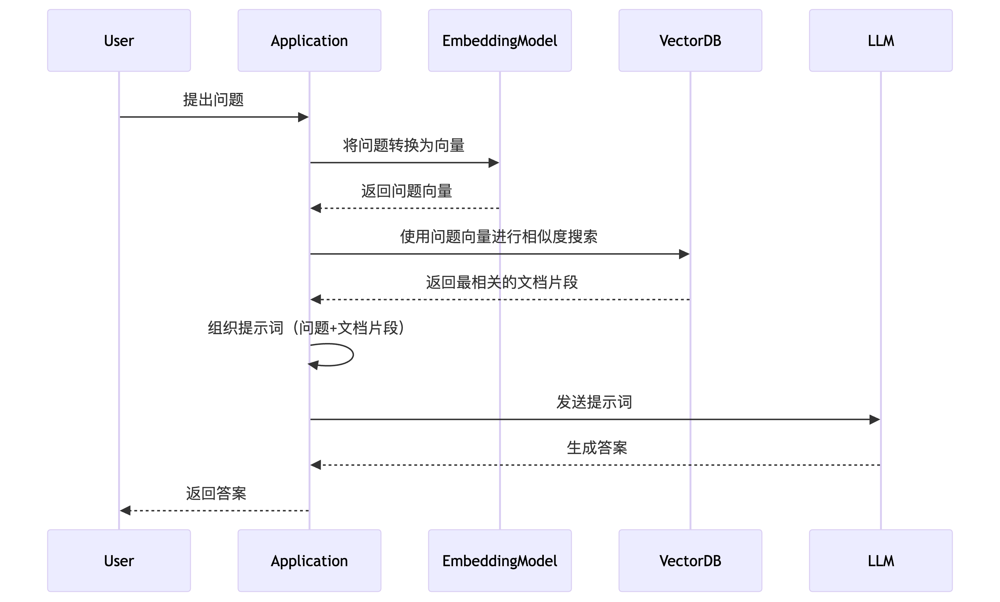

# Data Storage Instructions


This document was translated from Chinese by AI and has not yet been reviewed.


All data added to the Cherry Studio knowledge base is stored locally. During the adding process, a copy of the document will be placed in the Cherry Studio data storage directory.

<figure><figcaption>
Knowledge Base Processing Flowchart
</figcaption></figure>

Vector Database: [https://turso.tech/libsql](https://turso.tech/libsql)

After a document is added to the Cherry Studio knowledge base, the file will be split into several fragments, which will then be processed by the embedding model.

When using a large model for Q&A, text fragments related to the question will be queried and passed to the large language model for processing.

If you have data privacy requirements, it is recommended to use a local embedding database and a local large language model.