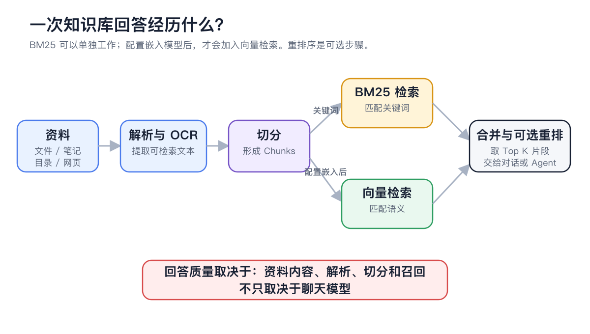

# Getting Started with Knowledge Bases

A knowledge base turns files, notes, folders or web pages into a collection of material you can search again and again. First use a recall test to confirm the system finds the right passages, then hand the knowledge base to a chat or an Agent.


If you only need to handle a short piece of text once, pasting it straight into the chat is faster. Build a knowledge base when the material will be reused and answers must be grounded in your internal documents.


## When to Use One

| Need | Recommended approach | Why |
| ---------------- | ----------- | ---------------------- |
| Look up staff policies, product manuals, project materials | Build a knowledge base | The material is reused and needs to be quoted reliably |
| Analyze one attachment once | Upload it directly in the chat | No long-term maintenance or indexing needed |
| The material is still being organized | Sort it out in **Notes** first | Keeps unconfirmed content from being treated as official answers |
| Process material automatically over the long term | Build the knowledge base, then bind it to an Agent | The Agent can keep using the same scope of material across tasks |

## What Happens in a Single Answer

<figure><figcaption>
Material is parsed and split first, then candidate passages are found by keyword or meaning; the chat model only composes the answer from what was recalled.
</figcaption></figure>

### Key Terms

| Term | What it means here |
| ----- | ------------------------------- |
| Knowledge base | A set of material and retrieval settings organized around one topic |
| Item | One imported file, note, file from a folder, or web page snapshot |
| Chunk | A small piece of the material, split off for retrieval |
| Recall | The process of finding relevant passages for a question |
| Embedding model | Converts text into vectors to match content that means the same thing but is worded differently; optional |
| Rerank model | Scores and reorders candidate passages a second time; also optional |


You can use a knowledge base without an embedding model; it then relies mainly on BM25 keyword search. For your first try, you can choose **None** and get the create → import → recall flow working first.


## Your First Knowledge Base in 5 Minutes



### 1. Create a knowledge base with a clear scope

Open **Knowledge Base** in the left navigation → click the add button above the knowledge base list. Name it "subject + purpose", for example **Employee Travel Policy**.



### 2. Choose how to search

For your first try, set **Embedding model** to **None**. Configure an embedding model later when you need to match conversational phrasing or synonyms.



### 3. Add material

Open the knowledge base, click the add material button, and choose **File**, **Note**, **Folder** or **Link**.

<figure><figcaption>
Choose the entry that matches the source; don't import unrelated folders just to save steps.
</figcaption></figure>



### 4. Wait until the material is ready

Once processing finishes, the material appears in the list. Spot-check the text and Chunks to make sure there's no garbled text, missing pages or obvious misordering.

<figure><figcaption>
Spot-check content even after it's ready — a finished import doesn't mean retrieval quality is good enough.
</figcaption></figure>



### 5. Run a recall test

Open **Recall Test**, enter a real question you already know the answer to, and check that the correct source appears among the top results.



### 6. Use it in a chat or bind it to an Agent

Once recall is stable, select the knowledge base in the chat input area; for long-running workflows, bind it on the Agent's edit page.



## Recommended Starting Point

| Setting | Product default | Suggested start | Purpose | When it applies | Caveats |
| ------ | ----- | ----------------- | -------------- | ----------- | ------------------ |
| Knowledge base scope | — | One clear topic | Controls which material is searched together | Policies, products, project material | Keep content with different permissions or lifecycles separate |
| Embedding model | None | Start without one | Decides whether vector search is added | When everyday phrasing differs a lot from the source text | Billing and data handling for cloud models depend on the provider |
| Test questions | — | 3–5 real questions | Establishes a long-term regression baseline | After every material or settings update | Don't test only with document titles and exact sentences |
| Going live | — | Material, Chunks and recall all pass | Keeps parsing or retrieval problems out of chats | Every knowledge base | The chat model can't make up for key information that wasn't recalled |

## How to Tell It's Ready

* All the material you need shows as available, with nothing stuck in processing or error for long.
* Open one or two items at random: the text and Chunks have no garbled text, missing pages or obvious misordering.
* A recall test with fixed questions consistently brings the correct source into the top results.

## Example

Lin wants colleagues to be able to look up the travel policy. He creates an **Employee Travel Policy** knowledge base, imports three documents covering accommodation, transport and approvals, and doesn't configure an embedding model yet. Once all three are ready, he tests with questions like "What's the hotel limit in Beijing?" and "Who approves expenses over 5,000 yuan?"

His bar for done: every question finds the correct policy source, and each passage contains both the conditions and the conclusion. Only once it meets that bar does he bind the knowledge base to the Agent that answers staff questions.

## FAQ

What's the difference between a knowledge base and the chat model?

The knowledge base finds passages in your material; the chat model understands the question and composes the answer. If key information isn't found during recall, simply switching chat models usually won't fix it.

Can I use material as soon as it's imported?

You still need to spot-check the text and Chunks and run a recall test. A successful import only means processing has finished, not that the result is complete or correctly ordered.

If I change the chunking settings, does existing material update automatically?

No. To apply new chunking settings to existing material, run **Re-index**, then test again with the same set of questions.

## Read Next

<table data-view="cards"><thead><tr><th></th><th></th><th data-hidden data-card-target data-type="content-ref"></th></tr></thead><tbody><tr><td><strong>Create a knowledge base</strong></td><td>Define the scope and search method.</td><td><a href="../../../knowledge-base/create.md">create.md</a></td></tr><tr><td><strong>Add and organize material</strong></td><td>Import files, notes, folders and web pages.</td><td><a href="../../../knowledge-base/sources.md">sources.md</a></td></tr><tr><td><strong>Check material and recall</strong></td><td>Verify retrieval quality with fixed questions.</td><td><a href="../../../knowledge-base/recall-test.md">recall-test.md</a></td></tr><tr><td><strong>Model and retrieval settings</strong></td><td>Tune embedding, reranking and chunking.</td><td><a href="../../../knowledge-base/emb-models-info.md">emb-models-info.md</a></td></tr></tbody></table>
