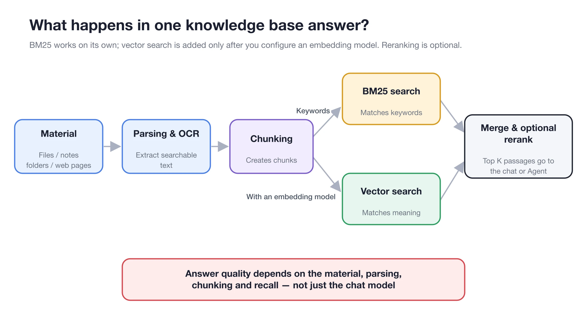
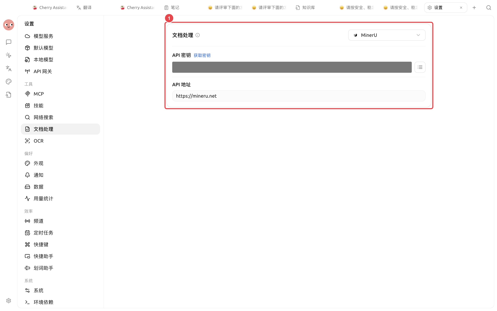

# Document Parsing and OCR

A knowledge base can only search text that has already been extracted. For scanned PDFs, two-column papers, complex tables and image-based pages, get the text parsed correctly first, then tune models and recall parameters.


Judge parsing quality not by the words "import succeeded" but by whether the text order, key tables, amounts and dates, and scanned text are read correctly.


## Start by Identifying the Material Type

| Material type | Recommended start | Must check |
| -------------------- | --------- | ------------- |
| Markdown, TXT, HTML | Default reading | Heading levels, encoding, line breaks |
| PDF with selectable text, DOCX, PPTX | Default processing first | Paragraph order, headers and footers, tables |
| Scanned PDFs, screenshots, image-based pages | Local or system OCR | Recognition language, amounts, dates, reference numbers |
| Multi-column, formula-heavy or complex-table PDFs | A dedicated document processor | Reading order, table structure, footnotes |

## Where Parsing Sits in the Retrieval Chain

<figure><figcaption>
Parsing errors carry through to chunking and recall; downstream models can't restore content already lost from the text.
</figcaption></figure>

## Configure and Verify With a Sample Document



### 1. Pick a representative sample

Don't import the whole batch first. Pick the document most likely to expose problems, such as a scanned PDF with tables or a two-column manual.



### 2. Configure processing

Open **Settings → Document Processing** and configure the document parsing service and OCR as needed. Cloud services usually need an API key or service URL; local options may need a model download first.

<figure><figcaption>
Get the service you'll use working first, then choose the processor back in the knowledge base.
</figcaption></figure>



### 3. Import and wait until ready

Add the sample document to the knowledge base. Once processing finishes, open the text and check the headings, paragraphs, page numbers, tables and OCR text.



### 4. Check the Chunks

Make sure key conditions and conclusions haven't been split apart, and that headers, footers and tables of contents aren't repeatedly filling up chunks.

<figure><figcaption>
Check chunking only after the text is correct — parsing errors can't be fixed by making chunks bigger.
</figcaption></figure>



### 5. Retest with a real question

In **Recall Test**, enter a question whose answer is in this document. The results should include the correct source, the complete conditions and the key numbers.



### 6. Lock in the setup, then import in bulk

Once the sample passes, import material of the same type in batches. If you change the processor, OCR or chunking settings, run **Re-index** on existing material and test again.




Switching processors or OCR doesn't automatically fix material that's already indexed. You must re-index the relevant items to compare old and new results.


## Choosing a Processor and OCR

| Option | When to use | Strengths | Caveats |
| ------------ | ------------ | ---------------- | ------------------ |
| Default reading | Common text-based formats | Little setup, fast | Complex layouts and scanned pages may lose content |
| System OCR | Supported by your OS and the images are clear | No extra API key, fast | Accuracy depends on the OS, language and image quality |
| Local PaddleOCR | You need offline recognition | Documents never leave your computer | A local model must be downloaded before first use |
| Cloud or self-hosted processors | Two-column layouts, complex tables, lots of formulas | Usually stronger layout analysis | Cloud options receive the document content for processing |


Before using a cloud document processor on sensitive material, check the terms of service, data retention policy and account permissions. Being fully offline requires local options for every step: parsing, OCR, embedding, reranking and chat.


## Diagnosing Common Problems

| Symptom | Check first | What to do |
| -------- | ------------- | --------------------------- |
| Text is empty or very short | Whether the file is a scan | Enable OCR or switch processors |
| Two columns interleaved | The reading order of the text | Use a processor that's good at layout analysis |
| Tables turned into scattered text | Headers and row/column relationships | Switch processors, or turn the key rules into a Markdown note |
| Headers and footers keep appearing | Repeated noise in Chunks | Clean up the source file or switch parsers — don't just raise Top K |
| OCR gets numbers wrong | Amounts, dates, reference numbers | Improve image clarity and manually check high-risk fields |

## Settings Reference

| Setting | Recommended start | When to change it | What to do after |
| ----------- | -------------- | --------------- | ----------- |
| File processor | Default processing first | Misordered text, missing tables, empty scanned pages | Re-index the sample document |
| OCR | Prefer local or system options for clear scans | Image-based pages have no text or many errors | Re-index and check key fields |
| Chunk size and overlap | Keep the knowledge base defaults at first | Conditions and conclusions are split apart | Change one thing per round and re-index |
| Test questions | 3–5 real questions | After changing the processor, OCR or chunking | Compare using the same question set |

## Example

Lin imports a two-column travel policy PDF. Its status shows ready, but the text interleaves the left and right columns, and the approval conditions in the recall results are incomplete. Instead of raising Top K first, he switches to a processor better suited to layout analysis, re-indexes the same file, and checks the text and Chunks again.

His bar for done: the approval conditions read in their original order, amounts and dates are correct, and the fixed questions recall passages containing the complete conditions.

## FAQ

If the text is correct, do I still need to look at the Chunks?

Yes. Correct text only means parsing passed; conditions and conclusions can still be split apart during chunking.

Can raising Top K fix parsing problems?

No. Top K only controls how many passages are returned; it can't restore content that was lost or misordered in the text.

Why didn't the results change after I switched processors?

Existing material is still using the old index. Run **Re-index** on the relevant items, then retest with the same questions.

## Read Next

<table data-view="cards"><thead><tr><th></th><th></th><th data-hidden data-card-target data-type="content-ref"></th></tr></thead><tbody><tr><td><strong>Add and organize material</strong></td><td>Choose sources and check processing status.</td><td><a href="sources.md">sources.md</a></td></tr><tr><td><strong>Check material and recall</strong></td><td>Verify parsing and chunking with fixed questions.</td><td><a href="recall-test.md">recall-test.md</a></td></tr><tr><td><strong>Data, privacy and maintenance</strong></td><td>Understand the boundary between local and cloud data.</td><td><a href="data.md">data.md</a></td></tr></tbody></table>
