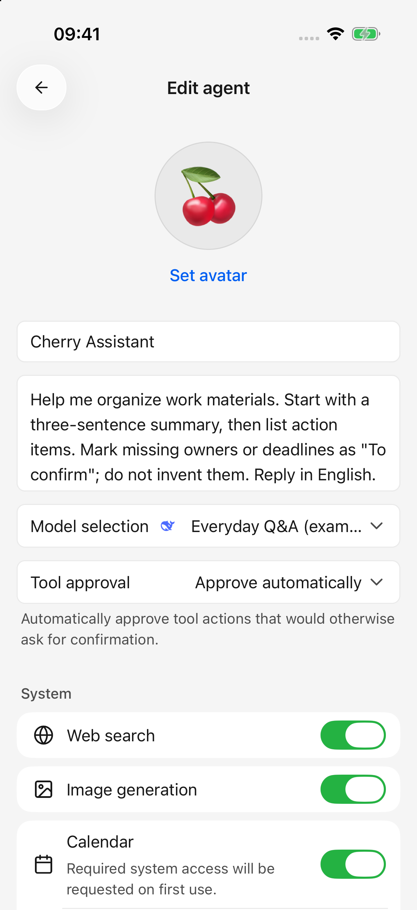
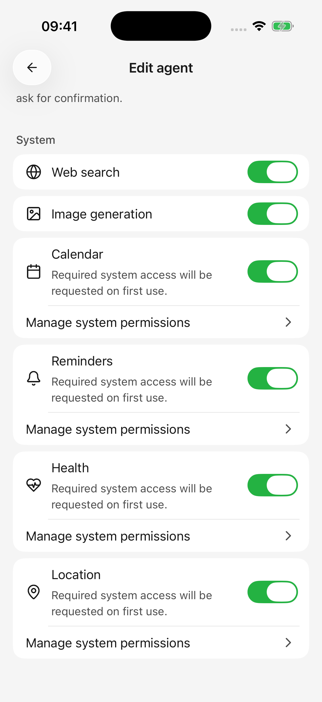

# Agents and tools

An agent saves a name, avatar, instructions, model, and tool-approval preference. Create separate agents for writing, learning, or work, then start independent conversations for individual topics.

<figure data-mobile-shot="phone"><figcaption>
<strong>iPhone</strong> · Save recurring instructions and choose a model and approval mode; example agent shown
</figcaption></figure>

## Create a reusable agent

1. Open the agent list and tap add, or create one from the conversation header's agent picker.
2. Enter a name, choose an avatar, and describe how it should work.
3. Select its model. Search, plugins, and calendar actions need a text model supporting tool calling.
4. Choose tool approval and enable the required capabilities under System. Add custom tools after saving if needed.
5. Tap **Save**. Creating from the chat picker opens a new conversation; creating from the management list returns there.

Example instructions:

> Help organize my work materials. Start with a three-sentence summary, then list action items. Mark missing owners and deadlines as “To confirm” instead of inventing them. Answer in English.

Save recurring rules in instructions; attach the current task and documents in chat. Do not store keys or passwords in agent instructions.

## Do edits need saving?

**Creating an agent requires Save. Editing an existing agent saves automatically.**

Name and instructions save after a short typing pause; avatar, model, and approval changes save immediately. A failed save retains the draft on the open editor and offers Retry. Resolve the error before leaving.

An agent can be saved without a model, but cannot start a conversation until you choose an available model.

## Approval modes

| Mode | Behavior |
| --- | --- |
| Confirm when needed | Asks only when a tool's rules require it; some reads can proceed directly |
| Automatic approval | Approves eligible operations, while preserving system permissions, disabled-tool restrictions, and accessible-data limits |

New agents, including the initial Cherry agent, currently default to **Automatic approval**. Existing agents keep their setting. Choose Confirm when needed if you want confirmation for calendar changes, reminder deletion, or external tool actions that require approval.

Approval cannot make an unavailable tool usable. The **image-generation tool called by a text model still requires confirmation each time**, because it consumes provider credits. Directly selecting an image model and pressing Generate is a separate workflow.

When an approval appears, inspect the action and allow or deny it. Denied tools do not execute; the agent may answer from existing information. An operating-system permission prompt can still follow app approval.

## System tools on your device

Use the agent editor’s **System** section to choose its capabilities: web search, image generation, calendar, reminders, health, and location. Only capabilities supported by the platform and device appear.

* Agents created through the editor start with calendar, reminders, health, and location disabled. Enable them as needed; existing agents retain their settings.
* These switches affect the current agent. Disabling Web search removes built-in search and page-reading tools; disabling Image generation removes the built-in drawing tool used by text conversations. Manage plugins and custom MCP tools separately in their own settings.
* Enabling a switch does not grant system permission. Approve access when requested, use **Manage system permissions**, or open **Settings → System permissions**.
* Existing-agent changes save automatically and apply to subsequent requests. They do not undo an operation already in progress.

| Capability | Example | Availability |
| --- | --- | --- |
| Calendar | “List tomorrow's events”; “Create a 30-minute meeting tomorrow at 3 pm” | iOS and Android, subject to read/write access and system support |
| Reminders | “Remind me tomorrow at 9 am to mail the parcel” | iOS reminder permissions; not currently offered on Android |
| Health records | “Summarize recorded steps and workouts this week” | iOS, for individually authorized data types; not currently offered on Android |
| Current location | “Get my current location, then help plan a route” | iOS and Android, with location permission |
| App files | “Save that summary as a file” | Attachments and generated files accessible to the conversation |

Some Android calendar writes open a system form that you must finish. Opening it does not mean an event was saved. Empty health results can mean no records or missing permission for that data type.

Tools cannot freely inspect every phone file, take over other apps, or remotely operate your computer.

<figure data-mobile-shot="phone"><figcaption>
<strong>iPhone</strong> · Enable capabilities for this agent and manage system permissions when needed
</figcaption></figure>

## Where do I configure other tools?

* **Web search:** configure search/page-reading services in Settings, then ask to search in chat. See [web search](web-search.md).
* **Plugins:** connect accounts such as Feishu or Notion in the sidebar. Connected plugins are available in conversations; **＋ → Plugins** can explicitly name one. See [plugins](plugins.md).
* **Custom MCP:** MCP connects additional tool services. Add a server in Settings, then enable it in the saved agent’s editor. See [custom tools](plugins.md).
* **Drawing:** choose a drawing model in **Settings → Default model** and enable **Image generation** for the agent to supply its drawing tool. You can also select an image model directly.

## Why does a tool remain unavailable after authorization?

Check model tool-calling support, the agent’s capability switches, the connection, server/tool enablement, and system permissions. Plugin accounts can also be limited by organization policy or resource access.

Give a clear target: a document link, date range, or calendar name. Start by asking the agent to read and list the relevant items, then request changes once the target is clear.

For practical steps and example requests, see [Let AI Use Tools](using-tools.md), [Calendar and Reminders](calendar-and-reminders.md), [Location and Health Records](location-and-health.md), and [Create and Edit Files](file-generation.md).
