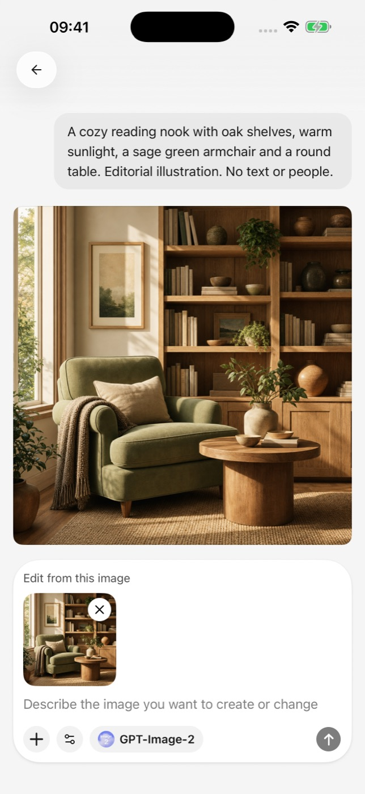
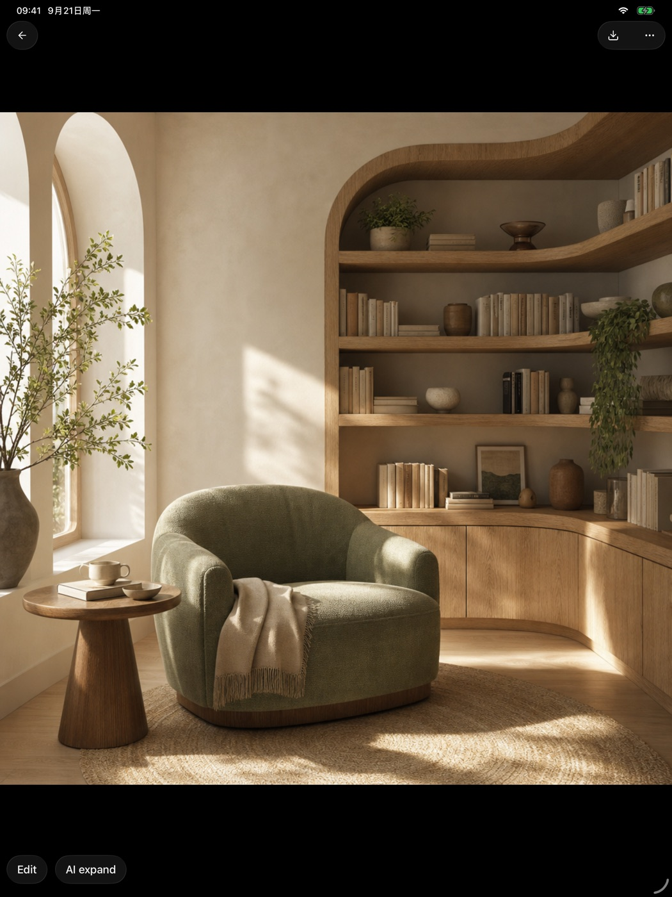

# Image generation

The mobile app can call a configured image model, turn a written prompt into an image, and preview the result.

<figure data-mobile-shot="phone"><figcaption>
<strong>Generate</strong> · Write a prompt and call a configured image model
</figcaption></figure>
<figure data-mobile-shot="tablet"><figcaption>
<strong>Preview</strong> · Inspect, download, or continue editing a real result
</figcaption></figure>

## Generate an image

1. Add a model that supports image generation in provider settings.
2. Open image generation and select the model.
3. Describe the subject, setting, style, and composition.
4. Submit the task and wait for the provider to return the result.

Image models are commonly billed separately from chat models. Generation speed, available sizes, content restrictions, and retry rules are controlled by the provider.

## Prompt tips

Describe the subject and intended use first. Then add the environment, lighting, viewpoint, materials, palette, and aspect ratio. For repeatable results, keep a successful prompt and change one variable at a time.

## A generation fails

Confirm that the selected model supports image generation, then check balance, network access, and the provider’s content policy. After a timeout, wait for the task status to settle before submitting the same request repeatedly.
